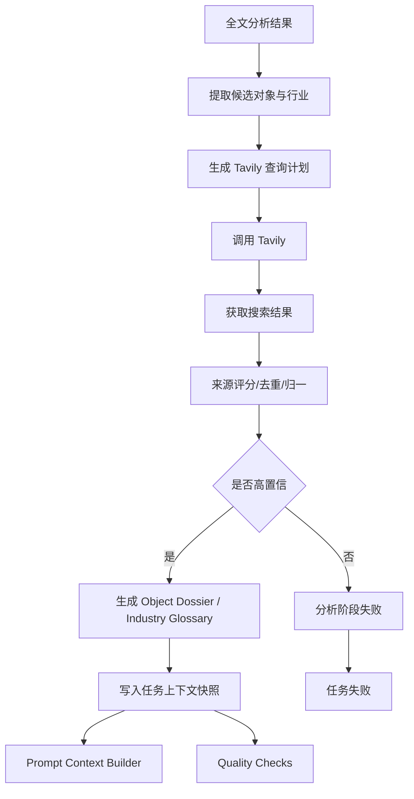
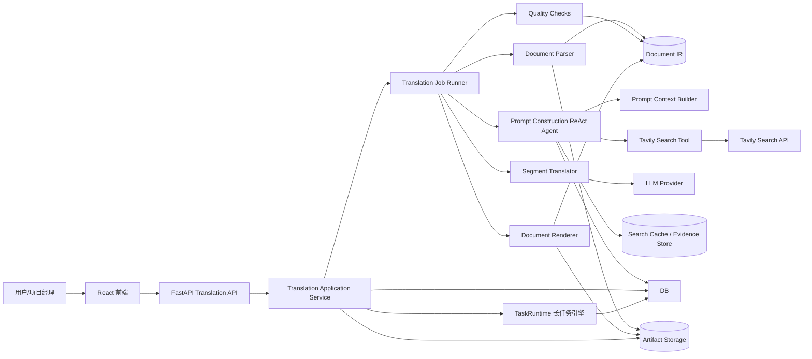
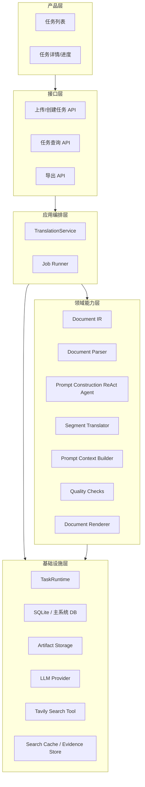
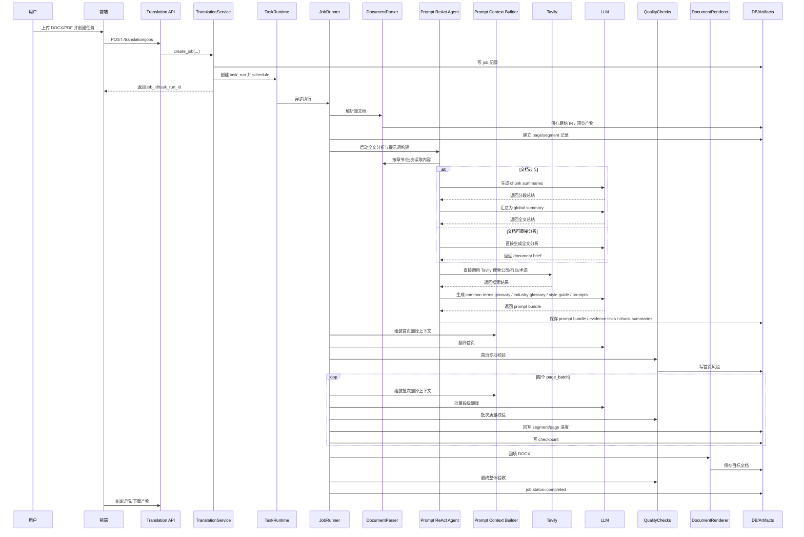
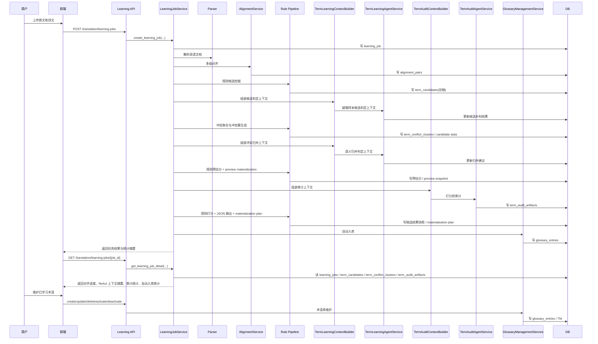
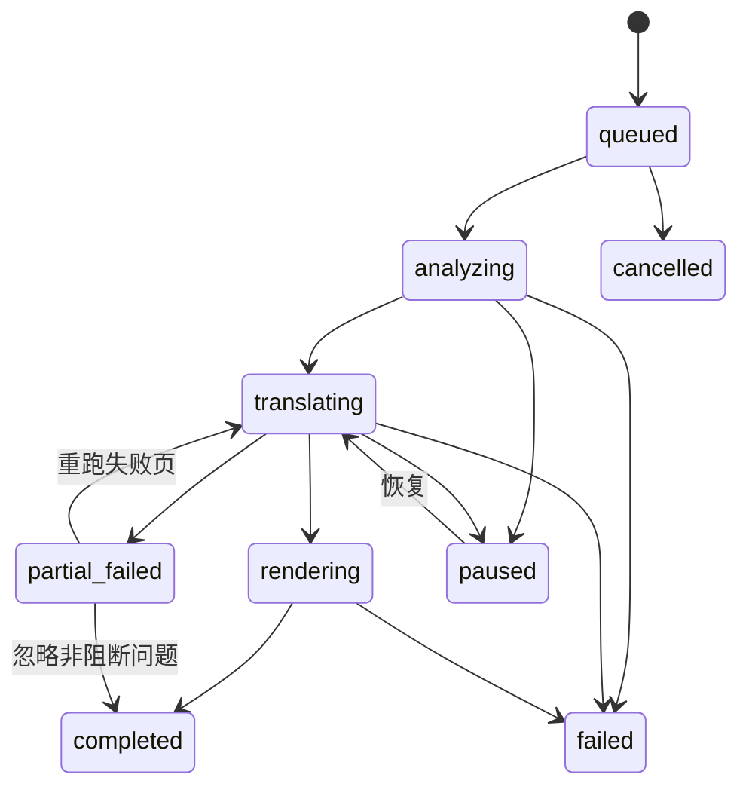
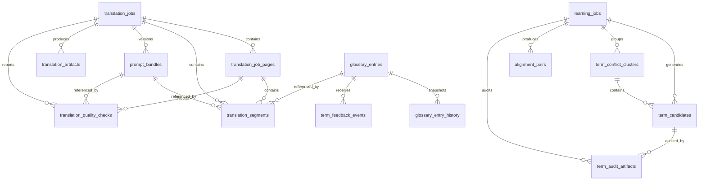

# 大体量文档翻译系统设计

## 1. 背景与目标

当前仓库已经有一个 `translate` 原型模块，具备以下基础能力：

- 翻译任务与分段任务的 SQLite 持久化
- 术语学习任务、候选术语抽取、自动入库原型
- FastAPI 后端、React 前端、认证体系、任务运行时 `TaskRuntime`
- 基础文档读写能力，支持 `pdf/docx/xlsx/md/txt`

但现状仍然是“文本翻译原型”，还远未达到“几百页专业文档、长时间执行、版式强保真、可学习、可追踪、可审计”的生产级能力。

本设计文档目标是：在现有代码基础上，设计一个适用于 100 页以上文档翻译任务的可靠系统，并明确还需要完成哪些工作。

## 2. 现状评估

### 2.1 已有能力

`translate` 目录当前已有：

- `translation_service.py`
  - 已有翻译任务、片段、状态管理
  - 已可作为翻译任务服务入口
- `job_runner.py`
  - 已有翻译任务执行主循环
- `document_ir.py`
  - 已有文档中间表示基础结构
- `docx_parser.py`
  - 已支持正文段落、标题、表格、分页符、页眉、页脚解析
  - 已支持首页、首页不同页眉页脚、奇偶页页眉页脚的基础识别
- `pdf_parser.py`
  - 已有数字 PDF 解析原型
  - 在 `PyMuPDF` 可用时，已支持文本块、基础标题样式、列表、表格、图片抽取
- `docx_renderer.py`
  - 已支持 DOCX 基于源文档的结构化回填
  - 已支持段落样式、对齐、缩进、行距等基础格式回填
  - 已支持部分 PDF 到 DOCX 的段落、表格、图片回填
- `quality_checks.py`
  - 已有基础质量校验
- `learning_service.py`
  - 已有从原文/译文对照中学习术语的基本流程
- `term_alignment.py`、`term_extraction.py`
  - 已有启发式术语对齐和候选评分原型
- `database.py`、`repositories.py`
  - 已有 SQLite 表结构和仓储层
- `test_basic.py`
  - 已覆盖 DOCX 表格、页眉、页脚与 PDF 基础链路回归样例

主系统当前可复用能力：

- `src/agent_system/agent/task_runtime.py`
  - 已支持长时后台任务、检查点、恢复执行
- `src/agent_system/api/__init__.py`
  - 已有统一 API 入口、认证、文件上传模式
- `frontend/src`
  - 已有 React 单页应用、页面路由、通用表格/进度条/UI 组件
- `src/agent_system/tools/document_io.py`
  - 已支持基础文档读写

### 2.2 明显缺口

现有实现与目标需求的主要差距：

1. 已有 `Document IR`、解析器、回填器和执行器原型，但能力仍不完整，尚未形成稳定的生产级翻译主链路
2. 现有 `prompt_context_builder.py` 仍是轻量级摘要与 prompt 组装，无法支撑全文分析、分批总结、Tavily 搜索增强和文档级 Prompt Bundle 生成
3. 翻译专用 ReAct agent 尚未实现，当前还没有稳定的 `document_analysis_brief`、`object_dossier`、`industry_glossary`、`style_guide` 产物
4. `document_io.py` 当前提取的是纯文本，会丢失：
   - run 级样式
   - 精细表格结构语义
   - 页内坐标
   - 正文图片锚点
   - 文本框、批注、脚注等复杂对象
5. PDF 仍以“数字 PDF -> 结构化抽取 -> DOCX 导出”为主，距离高保真版式保留仍有明显差距
6. 术语学习还是启发式原型，术语表整理统一放到二期学习系统，一期不从原文直接整理全文术语对照表
7. 质量校验已存在基础实现，但术语一致性、结构一致性、首页专项校验仍需增强
8. 翻译任务 UI、学习 UI、进度展示 UI 仍不完整
9. 和主系统 `TaskRuntime`、主系统 migration、主系统 API 的集成仍需继续收口
10. 失败恢复、人工复核、关键页优先策略仍需增强

结论：现有代码已经具备“文档 IR + 解析/回填原型 + 任务执行基础 + 基础质量校验”的起点，但文档级分析、搜索增强、术语资产、主系统集成和产品化部分仍需要系统性补齐。

## 3. 需求拆解

结合需求，系统必须同时满足 6 类能力：

1. 长时任务能力
   - 一个任务可能几百页，运行数十分钟到数小时
   - 支持暂停、恢复、失败重试、断点续跑

2. 版式保真能力
   - Word / PDF
   - 保持段落、表格、图片、页眉、页脚、首页布局
   - 保持页内对齐

3. 术语与学习能力
   - 存在大量专有名词
   - 没有完整术语表，但有大量双语对照
   - 系统能持续学习并沉淀术语资产

4. 专业与严谨能力
   - 翻译要专业
   - 术语前后一致
   - 风格统一
   - 首页最严格

5. 可靠性能力
   - 任务状态可靠
   - 输出文档可靠
   - 可审计、可回放、可追踪

6. 产品能力
   - 任务界面
   - 二期学习界面
   - 进度展示

## 4. 设计原则

### 4.1 先保结构，再做翻译

对于大文档翻译，真正难点不是“把句子翻出来”，而是“在不破坏结构的前提下完成翻译”。因此系统必须以布局结构为主线，而不是以纯文本为主线。

### 4.2 翻译和渲染分离

系统内部必须分成两条链路：

- 内容链路：抽取可翻译单元、翻译、校验
- 版式链路：保持原结构、样式、坐标、锚点，最后回填

### 4.3 学习闭环必须“自动学习 -> 人工维护 -> 规则化”

不能直接把历史双语对照全部当成真理。系统需要先自动学习和聚合术语，再由人通过术语库管理能力做增删改和启停，最终进入“强约束术语表”。

### 4.4 首页单独处理

首页通常包含封面、标题、副标题、版本、公司名、法律文本、排版更复杂，必须单独走更严格的质检流程。

### 4.5 可靠优先于极致自动化

对外输出的译文要可交付，因此必须允许：

- 自动质量校验阻断
- 失败页局部重跑
- 导出前最终校验

## 5. 总体架构

当前设计基于现有 `translate` 子系统继续增强，总体分为 8 层。

### 5.1 文档接入层

负责上传、识别文档类型、抽取结构化内容。

- Word:
  - 当前已解析段落、标题、表格、分页符、页眉、页脚
  - 当前可识别首页、首页不同页眉页脚、奇偶页页眉页脚
  - run 级、正文图片锚点、文本框属于后续增强项
- PDF:
  - 区分数字 PDF 与扫描 PDF
  - 当前优先支持数字 PDF
  - 提取页面块、表格、图片、坐标、基础字体样式
  - 已有基础标题推断、列表识别、跨页表格拼接原型
  - 扫描 PDF 后续需要 OCR 支持

输出统一的中间表示 `Document IR`。

### 5.2 布局中间表示层

定义统一的 `Document IR`，作为翻译系统的核心。

当前实现采用“`Document -> Page -> Node`”的扁平模型，优先保证翻译主链路可用；后续再逐步增强为更细粒度结构。

当前 `Node` 已覆盖的主类型：

- `paragraph`
- `heading`
- `header`
- `footer`
- `table_cell`
- `image`

后续增强目标：

- `section`
- `table` / `table_row`
- `inline_run`
- `image_anchor`
- `textbox`

节点最少需要带：

- `node_id`
- `page_no`
- `source_text`
- `translatable`
- `block_type`
- `location`
- `metadata`

当前实现重点是“段落/单元格级翻译 + 基础样式保留”；更细粒度的 run 级样式与锚点级布局留到后续增强。

### 5.2.1 外部搜索增强能力

仅靠文档内上下文不足以确认公司名称、产品名称、行业术语和缩写的标准写法，必须明确引入“外部搜索引擎调用”能力。

该能力在一期由 `Prompt Construction ReAct Agent` 直接通过 `tavily_search` 工具执行，不再单独抽象一层统一搜索网关。

该能力职责：

- 直接调用 Tavily 搜索
- 查询公司、产品、模块、标准、法规、行业术语
- 返回结构化结果而非原始网页文本
- 对结果做来源可信度评分、去重、归一和缓存
- 为术语决策、公司名翻译确认和质量校验提供证据

一期固定使用 Tavily：

- 与仓库现有 `TavilySearchTool` 一致
- 便于直接挂接到翻译专用 ReAct agent
- 返回结构化搜索结果，适合做对象确认和术语整理

设计原则：

- 搜索增强必须是显式调用的外部工具，不是“让模型自己猜”
- 一期搜索工具固定为 Tavily
- 搜索结果只作为事实确认和术语证据，不直接拼接整页网页进 prompt

### 5.3 术语学习与知识层（Phase 2）

负责从历史原文/译文对照中学习术语，并对翻译过程提供约束。

该层整体属于 Phase 2，不纳入一期翻译主链路。

建议拆成四类资产：

1. 强制术语表
   - 已启用
   - 必须使用

2. 自学习术语表
   - 机器学习生成
   - 允许人工增删改和启停

3. 翻译记忆库 TM
   - 句段级双语对照
   - 用于召回相似表达

4. 风格规则库
   - 数字格式
   - 缩写策略
   - 标题大小写规则
   - 公司/产品名保留规则
   - 公司名翻译确认规则

### 5.4 翻译编排层

负责把 `Document IR` 中可翻译节点切成可执行任务，并用现有 `TaskRuntime` 执行长时任务。

建议任务层级：

- `DocumentJob`
  - 一个文档翻译任务
- `PageBatchTask`
  - 一批页面，便于并发和恢复
- `SegmentTask`
  - 一个可翻译单元
- `QualityCheckTask`
  - 批次级质量校验与阻断判定任务

### 5.4.1 全文分析与提示词构建 ReAct Agent

“全文阅读分析 + 搜索增强 + 提示词整理”不建议写成一串固定脚本，更合适的形态是一个专用 `ReAct agent`。

建议新增模块：

- `translation_prompt_react_agent.py`
  - 翻译专用 ReAct agent，独立实现全文分析与提示词构建流程
- `translation_prompt_agent_prompts.py`
  - 存放该 agent 的 system prompt、tool prompt、final synthesis prompt
- `translation_prompt_react_runtime.py`
  - 翻译专用 ReAct 循环与状态管理，不复用主系统通用 ReAct 执行器

该 agent 的目标不是直接翻译段落，而是产出稳定的 `Prompt Bundle`：

- `document_analysis_brief.json`
- `chunk_summaries.json`
- `global_summary.json`
- `object_dossier.json`
- `industry_glossary.json`
- `style_guide.json`
- `translation_task_prompt.txt`

实现原则：

- 不复用现有通用 `SingleAgentReActExecutor`
- 不复用现有通用 `ReActPlanner`
- 单独实现翻译场景所需的轻量 ReAct 循环、状态控制和输出契约
- 工具层可以复用，优先复用 `TavilySearchTool`

该 agent 的可用动作应收敛为少量高价值工具：

- `read_document_chunk`
  - 读取当前批次文档内容
- `extract_outline`
  - 提取标题层级和结构锚点
- `tavily_search`
  - 对公司、产品、行业、术语做外部检索
- `persist_prompt_artifact`
  - 落盘分析结果和 prompt bundle

agent 工作原则：

- 先读全文结构，再决定是否继续分批阅读
- 先形成 chunk 级理解，再汇总为全文理解
- 先检索描述对象与行业术语，再整理翻译约束
- 最终输出结构化产物，而不是只有自然语言总结
- agent 实现独立于主系统通用 ReAct，避免被通用规划逻辑干扰

#### 5.4.1.1 ReAct Agent 工作流

建议把该 agent 的运行流程固定为：

1. `Observe`
   - 读取文档元数据、页数、章节、格式信息
2. `Plan`
   - 判断能否一次性分析全文
   - 若过长，则制定分批阅读计划
3. `Act`
   - 分批读取内容
   - 生成 chunk summary
   - 提取候选对象、行业、术语和同义异名
   - 调用 Tavily 搜索验证对象和行业信息
4. `Reflect`
   - 检查摘要是否覆盖所有主要章节
   - 检查对象是否已消歧
   - 检查关键术语和对象信息是否仍有待确认项
5. `Synthesize`
   - 汇总为 `Document Analysis Brief`
   - 生成 `Industry Glossary`
   - 生成 `Style Guide`
   - 生成面向翻译的 prompt

实现约束：

- 该工作流由翻译专用 agent 独立实现
- 不挂接主系统面向通用任务的 ReAct 执行入口
- 只复用底层工具注册、LLM 调用和持久化能力

#### 5.4.1.2 长文档分批总结策略

若文档内容过长，不应强行单次喂给模型。建议采用层级总结：

1. 结构切分
   - 优先按 H1/H2/H3、页范围、章节块切分
2. chunk 总结
   - 每个 chunk 提取：
     - 章节主题
     - 关键对象
     - 行业线索
     - 高价值术语
     - 同义异名候选
     - 风格特征
3. batch 汇总
   - 将多个 chunk summary 合并成 section summary
4. 全文汇总
   - 基于 section summary 生成 global summary
5. 最终校正
   - 对 global summary 中的行业、对象、受众、结构进行一致性检查

这样可以避免：

- 长文档上下文超限
- 后半部分信息丢失
- 只靠前几页误判全文行业和受众

#### 5.4.1.3 Tavily 作为唯一外部搜索工具

本 agent 的外部搜索工具统一使用 Tavily。

原因：

- 当前仓库已有 `TavilySearchTool`
- Tavily 返回结构化搜索结果，适合 ReAct agent 消费
- 支持控制 `max_results`、`search_depth`
- 可以把搜索作为“按需动作”，而不是预先拉一堆网页

建议默认调用参数：

- `search_depth="advanced"`
- `max_results=5`
- `include_answer=false`

建议在现有 `TavilySearchTool` 基础上扩展以下可选参数：

- `include_domains`
  - 优先限制到官网、监管站点、标准组织站点
- `exclude_domains`
  - 排除低质量聚合站点
- `include_raw_content`
  - 在高精度模式下获取更完整上下文
- `topic`
  - 区分 `general`、`news`、`finance`
- `country`
  - 对公司中文名或地区化资料检索时提升相关性

针对不同任务的查询模板建议：

- 公司确认：
  - `"{company_name} official company profile"`
  - `"{company_name} 中文 官方"`
- 产品/平台确认：
  - `"{product_name} official documentation"`
  - `"{product_name} platform module official"`
- 行业术语：
  - `"{industry} glossary official"`
  - `"{term} full name official"`

#### 5.4.1.4 ReAct Agent 输出契约

agent 最终必须输出 JSON 结构，而不是自由文本：

```json
{
  "document_analysis_brief": {},
  "chunk_summaries": [],
  "global_summary": {},
  "object_dossier": [],
  "industry_glossary": [],
  "style_guide": {},
  "translation_prompt": ""
}
```

### 5.5 翻译执行层

建议采用多阶段翻译，而不是单次大模型直出。

文档级预处理流程：

1. 运行全文分析与提示词构建 ReAct Agent
   - 由专用 `ReAct agent` 完成全文阅读分析、分批总结、Tavily 搜索增强和 prompt 整理
   - agent 产出结构化 `Document Analysis Brief`
   - 必须覆盖以下字段：
     - `document_type`: API 文档、产品白皮书、用户手册、法律条款、营销文案等
     - `content_summary`: 全文内容总结，约束后续翻译不偏题
     - `industry`: 文档所处行业，例如安全、保险、医疗、云计算
     - `document_style`: 文档风格与语气，例如正式、客观、简洁、营销化、法务化
     - `structure_outline`: H1/H2/H3 层级与章节主线
     - `described_objects`: 文中反复出现的“该系统”“it”“平台”“产品”等具体指代对象
     - `target_audience`: 普通用户、开发者、运维、管理层、法务、采购等
     - `source_language` / `target_language`
     - `do_not_translate`: 公司名、产品名、代码、路径、命令、法规编号等不可翻译项
   - `writing_constraints`: 标点、数字、日期、单位、语态、首现规则等
   - 对长文档采用“分块摘要 -> 章节摘要 -> 全文摘要”的层级总结，不要求逐字通读一次完成
   - 若文档存在明显多主题冲突，应允许输出 `industry_candidates` 与 `audience_candidates`
   - 一期不从翻译原文中直接整理全文术语对照表

2. 搜索增强
   - 由 ReAct agent 对 `described_objects` 和 `industry` 生成检索计划，并调用 `tavily_search`
   - 搜索目标包括：
     - 描述对象官方名称、产品定位、模块命名、官方中文写法
     - 所属行业常用术语、监管/标准名称、主流译法、缩写全称
     - 文中高频专有名词的官方站点写法或行业通行写法
     - 公司法定名称、常用中文名称、证券简称、品牌名与产品名的区别
   - 查询构造建议优先组合：
     - `对象名 + 官方`
     - `对象名 + 产品/平台/系统`
     - `行业名 + glossary/术语表`
     - `缩写 + full name`
     - `标准编号 + official`
   - 搜索结果应优先采用：
     - 官方网站、产品文档、开发者文档
     - 行业协会、监管机构、标准组织
     - 权威媒体或研究机构的背景材料
   - 运行产物必须沉淀为：
     - `Object Dossier`: 描述对象信息卡，包含名称、别名、官方写法、产品定位、核心模块、常见简称、来源链接
     - `Industry Glossary`: 行业术语表，包含术语、定义、推荐译法、禁用译法、来源链接
   - Tavily 调用失败、超时、鉴权失败或返回不可用结果时，整个翻译任务直接失败

3. 术语表策略
   - 一期术语表只有通过搜索建立的 `Industry Glossary`
   - 不通过 ReAct 从翻译原文整理全文术语对照表
   - 术语表整理统一放到 Phase 2 学习系统，通过英汉对照文档学习生成
   - 二期学习输入可结合原文文档、已翻译文档、历史双语段落和人工导入词表
   - 一期仅保留 `do_not_translate`、`Industry Glossary` 和必要的写作约束

4. 生成文档级翻译提示词
   - 基于 `Document Analysis Brief + Object Dossier + Industry Glossary + Style Guide`
   - 生成本任务专用 prompt bundle，而不是一段不可追踪的自由文本
   - 形成可复用的翻译约束，供首页和后续段落统一使用

5. 固化到任务上下文
   - 将文档摘要、翻译注意事项、搜索结果、最终 prompt 写入任务元数据
   - 后续段级翻译默认继承，不再为每段重复生成整套提示词

#### 5.5.0 ReAct Agent 提示词职责

该 agent 的 system prompt 必须明确要求它完成以下工作：

1. 阅读全文或分批阅读全文
2. 梳理全文逻辑与结构
3. 判断文档类型、行业、目标受众、描述对象
4. 调用 Tavily 搜索描述对象和行业术语，并建立 `Industry Glossary`
5. 识别保留不译项与关键翻译风险
6. 生成面向翻译任务的 `translation_prompt`
7. 将分析结果、搜索结果和 prompt 固化到任务上下文

建议 system prompt 骨架：

```text
你是一个专业的文档分析与提示词构建 ReAct agent。
你的目标不是直接翻译文档，而是为后续翻译任务构建高质量 Prompt Bundle。

你必须完成以下事项：
1. 阅读全文；若文档过长，则分批阅读并先生成分段总结，最后生成全文总结。
2. 提取文档类型、内容总结、所处行业、文档风格、文档结构、描述对象、目标受众、源语言、目标语言。
3. 使用 Tavily 搜索工具检索描述对象和行业信息，整理出对象信息卡和行业术语表。
4. 识别公司名、产品名、代码、路径、法规编号等保留不译项，并标记关键翻译风险。
5. 输出风格指南，并生成翻译 prompt。

约束：
- 不得凭空编造公司、产品、行业背景。
- 公司名、产品名、标准名优先依据 Tavily 搜索结果确认。
- 如果文档过长，必须先输出 chunk summaries，再输出 global summary。
- 不得从翻译原文直接整理全文术语对照表；术语表整理统一放到学习系统。
- Tavily 调用失败时，整个翻译任务必须失败。
- 最终输出必须是结构化 JSON。
```

#### 5.5.0.1 术语表整理通过学习系统

一期不要求 ReAct agent 从翻译原文中整理“通用术语表”或“全文术语对照表”。

术语表整理统一放到 Phase 2 学习系统，通过英汉对照文档统一学习，输入来源包括：

1. 原文文档 + 已翻译文档
2. 历史双语段落
3. 人工导入词表
4. 任务执行中沉淀的高置信双语片段

一期仍需保留的最小约束包括：

- 文档背景
  - 类型、受众、行业、任务目标
- 保留不译规则
  - 公司名、产品名、代码、路径、命令、法规编号
- 写作约束
  - 首次出现规则、标点规则、数字单位规则

#### 5.5.1 Document Analysis Brief 结构

建议将全文分析结果标准化为 JSON，避免后续靠 prompt 字符串再解析：

```json
{
  "document_type": "user_manual",
  "content_summary": "介绍某安全平台的部署、巡检与漏洞处置流程。",
  "industry": "cybersecurity",
  "document_style": {
    "tone": ["formal", "objective", "concise"],
    "punctuation": {
      "source": "half_width",
      "target": "full_width_zh"
    },
    "voice": {
      "source": "mixed",
      "target": "prefer_active_zh"
    }
  },
  "structure_outline": [
    {"level": 1, "title": "Overview"},
    {"level": 2, "title": "Deployment"},
    {"level": 2, "title": "Operation"}
  ],
  "described_objects": [
    {
      "name": "Qualys VMDR",
      "aliases": ["the platform", "VMDR", "the solution"],
      "type": "product"
    }
  ],
  "target_audience": ["security_engineers", "ops"],
  "source_language": "en",
  "target_language": "zh",
  "do_not_translate": ["CVE", "Qualys VMDR", "/etc/nginx/nginx.conf"],
  "writing_constraints": [
    "Preserve version numbers and commands.",
    "Keep heading hierarchy unchanged."
  ]
}
```

#### 5.5.2 搜索增强策略

搜索增强不是可选锦上添花，而是术语稳定性的前置步骤。建议流程如下：

1. 从全文分析中提取候选检索对象
   - 公司名、产品名、系统名、模块名、标准名、行业缩写
2. 自动生成 3 类查询
   - `官方事实查询`: 验证描述对象是什么、官方如何命名
   - `行业术语查询`: 确认行业常用译法和定义
   - `消歧查询`: 解决同名产品、缩写多义、历史旧称
3. 对搜索结果打分
   - 官方来源 > 标准/监管来源 > 权威研究来源 > 一般网页
   - 新近版本 > 陈旧资料
   - 与本文年份/版本一致的资料优先
4. 产出结构化结果
   - `object_profile[]`
   - `industry_terms[]`
   - `evidence_links[]`
5. 把带来源的结果写入任务上下文
   - 供翻译约束与质量校验复用

#### 5.5.2.1 外部搜索引擎调用要求

系统必须显式调用 Tavily，不能只让 LLM 凭经验猜测公司名和行业术语。

搜索不通过统一函数入口封装，由 ReAct agent 在执行过程中直接调用 `tavily_search` 工具。

建议工具动作模式如下：

- agent 先生成查询语句
- 再直接发起 `tavily_search`
- 根据返回结果继续决定是否追加搜索、是否消歧、是否形成行业术语表

设计要求：

- Tavily 调用必须支持 query、结果标题、摘要、URL、抓取时间
- 支持结果缓存，避免同一任务反复检索
- 支持项目级域名白名单和黑名单
- 支持来源可信度评分
- Tavily 调用失败时必须终止分析阶段，并将整个翻译任务标记为 `failed`

#### 5.5.2.2 公司名翻译确认规则

公司名不是一律“保留英文”。在很多商业、行业研究、招投标、保险、金融和安全文档中，公司名可以翻译，但必须先确认。

建议采用以下决策顺序：

1. 官方中文名称
   - 若公司官网、年报、监管披露、证券交易所公告存在官方中文名称，优先采用
2. 行业通行译名
   - 若无官方中文名，但行业媒体、研究报告、监管材料长期使用同一译名，可作为候选标准译名
3. 保留原文并首次注释
   - 若译名不稳定或歧义大，采用 `keep_original_once_with_translation`
4. 完全保留原文
   - 对品牌强、法定名称敏感或不宜本地化的公司名，采用 `keep_original`

必须记录：

- `official_name`
- `official_name_zh`
- `legal_name`
- `aliases`
- `evidence_links`
- `translation_policy`
- `confidence`

#### 5.5.2.3 搜索结果可信度评分

为避免把搜索引擎上的偶然写法错误升级为全局术语，建议对每个结果打分：

- `source_type_score`
  - 官网、监管、标准组织、交易所、官方文档优先
- `consistency_score`
  - 多来源是否一致
- `freshness_score`
  - 是否与文档年份、版本相近
- `context_relevance_score`
  - 是否与本文所述行业和对象一致

当总分低于阈值时：

- 不得写入 `Industry Glossary`
- 不得自动覆盖已有高优先级译法
- 若关键对象或关键行业术语无法形成可用结果，应终止分析阶段并使任务失败

#### 5.5.2.4 搜索增强流程图



#### 5.5.3 术语表整理策略

一期不通过 ReAct 从翻译原文中整理全文术语对照表。

术语表整理统一放到 Phase 2，通过英汉对照文档统一学习，再沉淀为可复用术语资产。二期建议：

1. 基于原文文档与译文文档做页/段/句级对齐
2. 从英汉对照内容中挖掘候选术语、固定译法和同义冲突
3. 将学习结果直接写入可维护术语表，并保留来源证据、置信度和冲突信息
4. 人工通过术语库管理页对已学习术语做增删改、启停和版本维护
5. 再将已启用术语资产回注到翻译主链路和质量校验

一期仅保留以下与术语相关的最小能力：

- `do_not_translate`
  - 公司名、产品名、代码、路径、命令、法规编号等不可翻译项
- `Industry Glossary`
  - 仅允许通过 Tavily 搜索和来源评分建立的行业术语表
- `writing_constraints`
  - 首次出现规则、缩写规则、数字单位规则、标点规则

#### 5.5.4 文档级 Style Guide

文档级 style guide 不应只是一组松散 notes，建议至少包含：

- `tone`
  - 正式、客观、简洁
- `punctuation`
  - 中文使用全角标点，英文使用半角标点
- `voice`
  - 技术文档默认优先中文主动语态；法律/合规文本保留约束性表达
- `term_rules`
  - `fixed_translation`、`keep_original`、`translate_once_with_original`
- `format_rules`
  - 标题层级、列表、表格、编号、日期、单位、货币
- `audience_rules`
  - 面向开发者保留必要术语深度；面向普通用户时减少生硬行话

#### 5.5.5 Prompt Bundle 设计

运行时不建议只保留一段最终 prompt，建议将 `Prompt Bundle` 设计成独立持久化对象，而不是塞进 `translation_jobs` 的零散 JSON 字段。

建议 `Prompt Bundle` 至少包含以下对象：

- `analysis_brief.json`
- `object_dossier.json`
- `industry_glossary.json`
- `style_guide.json`
- `task_prompt.txt`
- `review_prompt.txt`

这样后续才能支持：

- 失败重跑时复用同一上下文快照
- 术语争议时回溯证据
- 人工维护术语时查看“为什么这样译”
- 同一 job 在不同阶段引用同一版本的 Prompt Bundle

建议运行时引用方式：

- `translation_jobs.current_prompt_bundle_id`
  - 指向当前 job 使用的 Prompt Bundle
- `translation_segments.prompt_bundle_id`
  - 固定记录该 segment 翻译时引用的 Prompt Bundle 版本
- `translation_quality_checks.prompt_bundle_id`
  - 固定记录校验时引用的 Prompt Bundle 版本

单个可翻译单元执行流程：

1. 预处理
   - 识别数字、日期、缩写、占位符
   - 锁定不可翻译 token
   - 注入文档级摘要、行业信息、描述对象信息、翻译注意事项和任务 prompt
   - 若已存在已启用的自学习术语表或 TM 命中，必须一并注入本段翻译上下文

2. 初译
   - 低温度
   - 使用文档级翻译提示词
   - 明确保留格式占位符

3. 术语一致性重写
   - 已启用自学习术语表优先命中
   - 其次命中 `Industry Glossary`
   - 标题/正文风格对齐

4. 结构校验
   - 占位符是否丢失
   - 换行/编号/列表结构是否破坏

5. 质量复核
   - 用复核提示词检查专业性、严谨性、语义偏差
   - 发现高风险问题时回退重译或标记自动失败
   - 整个翻译主链路不引入人工确认节点

6. 自动校验
   - 校验术语命中、数字单位、占位符、结构完整性
   - 输出 warning / blocking issue，不引入独立 review agent

7. 回填
   - 将译文回填到 IR 节点

### 5.6 质量与可靠性层

必须有自动校验，不允许直接把模型输出原样导出。

建议校验器至少包含：

- 术语一致性校验
- 数字/单位一致性校验
- 否定词、条件句、责任主体保真校验
- 漏译/增译风险校验
- 标点与括号配对校验
- 表格结构校验
- 页眉页脚完整性校验
- 首页重点校验
- 溢出风险校验
  - 翻译后长度导致表格/文本框溢出
- 双语抽样比对校验

### 5.7 导出渲染层

将已翻译的 `Document IR` 渲染成目标文档。

- Word：
  - 基于原始结构复制并替换文本
  - 尽量保留 run 样式、表格样式、节设置、页眉页脚
- PDF：
  - 数字 PDF 建议纳入 Phase 1 主链路
  - 解析页面块后回填到目标 DOCX
  - 图片原样保留
  - 一期不生成目标 PDF，统一输出 DOCX

### 5.8 产品与操作层

面向用户提供：

- 任务创建界面
- 二期学习界面
- 二期术语库管理界面
- 任务详情与进度界面
- 页级问题列表

### 5.9 总体组件架构图

下面的组件图描述一期推荐实现，重点是单编排器架构，不把翻译主链路设计成多 agent 协作。



### 5.10 运行时分层图

下面的分层图只描述一期翻译主链路；学习、术语库管理和 TM 沉淀属于二期扩展，不放入一期主架构。



### 5.11 核心模块职责

推荐将翻译子系统拆成下面几个核心模块，每个模块只负责一层职责。

#### `Translation Application Service`

职责：

- 创建翻译任务
- 校验输入文件和选项
- 生成任务记录
- 将任务提交到 `TaskRuntime`
- 对外提供任务查询、暂停、恢复、导出入口

不负责：

- 文档解析细节
- 术语候选抽取
- 逐段翻译

#### `Translation Job Runner`

职责：

- 执行一个文档翻译任务
- 驱动“解析 -> 首页 -> 批量翻译 -> 质检 -> 导出”
- 维护 checkpoint
- 控制页批次和段批次执行

这是整个系统的主编排器。

#### `Document Parser`

职责：

- 读取 Word/PDF
- 抽取页面、段落、表格、页眉页脚和已支持的图片节点
- 生成 `Document IR`

#### `Prompt Construction ReAct Agent` 的搜索动作

职责：

- 基于全文分析结果生成检索计划
- 直接调用 `tavily_search`
- 拉取公司、产品、模块、法规、行业术语的候选证据
- 对来源进行可信度打分和去重
- 生成 `object_dossier`、`industry_glossary`、`evidence_links`
- 将搜索证据缓存到任务或项目级存储

不负责：

- 直接决定最终译文
- 把整页搜索结果灌入 LLM prompt
- 替代人工处理高冲突术语

#### `Prompt Bundle Store`

职责：

- 持久化 `analysis_brief`、`object_dossier`、`industry_glossary`、`style_guide`、`task_prompt`
- 为 job、segment、quality_check 提供版本引用
- 支持 checkpoint 恢复时读取同一版本 Prompt Bundle
- 支持问题追溯时查看某次翻译到底用了哪套上下文

#### `Segment Translator`

职责：

- 接收单个段或单元格的翻译请求
- 组装 prompt
- 注入任务级摘要、翻译注意事项、搜索证据和上下文
- 执行初译、重试和结构保护

#### `Quality Checks`

职责：

- 结构完整性校验
- 术语一致性校验
- 数字与单位校验
- 表格/首页/页眉页脚专项校验

#### `Document Renderer`

职责：

- 将翻译后的 `Document IR` 回填到原始文档结构
- 输出最终 DOCX
- 生成预览产物

#### 二期扩展模块（不纳入一期翻译主链路）

`Learning Application Service` 仍保留为二期模块，职责包括：

- 创建学习任务
- 驱动文档对齐、术语抽取、聚合和入库流
- 将自动学习结果写入 glossary，并保留人工维护入口

### 5.12 关键数据流

系统存在三条主数据流。

#### 翻译数据流

```text
源文档 -> 结构化解析 -> Document IR -> 全文分析 -> 外部搜索增强 -> 可翻译节点切分 -> 提示词上下文构建
-> 段级翻译 -> 质量校验 -> IR 回填 -> 导出文档 -> 产物归档
```

#### 搜索增强数据流

```text
Document Analysis Brief -> Tavily Queries -> tavily_search
-> 搜索结果 -> 来源评分/去重/归一 -> Object Dossier / Industry Glossary / Evidence Links
-> Prompt Context Builder / Quality Checks / Term Decision
```

#### 学习数据流

```text
原文/译文对照 -> 对齐 -> 规则抽取 -> 疑难样本 ReAct 判定 -> 聚合冲突 -> 审计 -> 打分 -> 自动入库
-> glossary_entries / translation_memory_entries -> 翻译时召回
```

#### 任务控制流

```text
创建任务 -> 提交 TaskRuntime -> 后台执行 -> 心跳/进度回写
-> 暂停/恢复/重试 -> 完成/失败 -> 导出/归档
```

### 5.13 与现有系统的边界

这个翻译系统不是一个独立新平台，而是当前仓库里的一个业务子系统。边界建议如下：

- 主系统负责：
  - 认证
  - API 容器
  - 长任务运行时
  - 前端壳与基础 UI
  - 文件上传基础能力

- 翻译子系统负责：
  - 翻译领域数据模型
  - 文档结构化
  - 术语学习
  - 翻译编排
  - 质量校验
  - 文档导出

- LLM 只是翻译与审校的执行依赖，不是任务编排中心

### 5.14 非多 Agent 主架构说明

当前设计默认不是多 agent 翻译架构，而是“单编排器 + 可恢复后台任务 + 若干确定性子流水线”。

原因：

- 专业翻译最怕术语漂移
- 版式保真需要强结构控制
- 长文档需要严格 checkpoint
- 多 agent 协作会增加上下文同步和一致性成本

因此推荐：

- 一期：单编排器架构
- 后续可选扩展：
  - 高风险页诊断工具
  - 术语冲突分析模块
  - 批量质量问题聚类
  - 但仍不建议让多个执行单元并行独立翻完整个文档

## 6. 关键能力设计

### 6.1 长时间执行任务

直接复用现有 `TaskRuntime` 的能力，但需要为翻译任务补一层领域编排。

设计建议：

- 一个文档任务拆成多个 `page_batch`
- 每个 `page_batch` 再拆成多个 `segment`
- 每个批次处理完立即写入数据库和中间产物
- 每个批次完成后写 checkpoint
- 支持以下状态：
  - `queued`
  - `analyzing`
  - `translating`
  - `rendering`
  - `completed`
  - `partial_failed`
  - `failed`
  - `paused`

恢复策略：

- 任务级恢复：恢复到最近成功批次
- 页级恢复：重跑失败页
- 段级恢复：只重跑失败段

### 6.2 Word 保真翻译

Word 是最适合优先落地的格式。

当前实现策略：

1. 使用 `python-docx` 读取原文档结构
2. 以 paragraph / table cell 为主生成可翻译节点
3. 对 paragraph / cell 内文本做逻辑拼接后翻译
4. 回填时直接在原 DOCX 上做原位替换，保留原有段落、表格和页眉页脚容器
5. 当前已稳定保留：
   - 标题样式
   - 段落对齐、缩进、段前段后、行距
   - 表格结构和单元格容器
   - 页眉页脚
   - 首页不同页眉页脚
   - 奇偶页页眉页脚
6. 正文图片当前通过“复用原 DOCX”方式被动保留，不单独进入翻译节点

后续增强项：

- 建立 run 级 IR
- 按原 run 分布做更细粒度回填
- 正文图片锚点建模
- 文本框、批注、脚注、超链接等复杂对象建模

注意：

- Word 中一段可能由多个 run 组成，不能逐 run 翻译，否则译文会碎裂
- 当前实现还没有 run 级切分回填，因此对混合样式 run 的精细保真仍有限

### 6.3 PDF 保真翻译

PDF 必须区分两类：

1. 数字 PDF
   - 有可提取文本和布局对象
   - 一期以页面级解析和结构保持为目标，最终输出 DOCX

2. 扫描 PDF
   - 本质是图片
   - Phase 1 不建议承诺完全保真
   - 需要 OCR + 布局重建，复杂度显著更高

当前实现策略：

1. 优先使用 `PyMuPDF` 提取页面块、坐标、字体、表格、图片
2. 如果 `PyMuPDF` 不可用，则退化为 `pypdf` 文本段落抽取
3. 文本块翻译后映射到目标 DOCX 的段落、表格和图片区块
4. 表格按单元格翻译，并支持基础跨页表头去重与合并单元格回填
5. 图片提取后二次嵌入到目标 DOCX
6. 当前以页面级主要结构保留为目标，不承诺 PDF 坐标级复刻

后续增强项：

- 页眉页脚固定区域识别
- 文本框、图表、注释框抽取
- 更强的版面阅读顺序恢复
- 坐标级 PDF 回填

PDF 的现实判断：

- 如果要求“几乎和原 PDF 一样”，必须做坐标级 PDF 回填，这不在一期范围
- 仅靠当前 `pypdf` 文本提取远远不够

### 6.4 表格翻译与对齐

表格必须作为一级对象处理，不能当纯文本。

当前实现：

- DOCX:
  - 直接复用原表格容器
  - 单元格文本独立翻译并原位替换
  - 支持保留单元格内多段落拆分
- PDF:
  - 表格单元格作为独立节点抽取
  - 支持基础合并单元格回填
  - 支持跨页表头识别与拼接
  - 当前使用通用 `Table Grid` 样式生成目标 DOCX 表格

补充设计：

- 对超长译文执行表格风险检测
- 在质量校验中增加单元格长度、空单元格和数字保真检查
- 二期再考虑字号微调、列宽重算和更细的边框样式恢复

### 6.5 图片处理

当前实现分两类：

- DOCX:
  - 不把正文图片解析为独立翻译节点
  - 通过复用原始 DOCX 保留图片资源和大体位置
- PDF:
  - 将图片提取为独立 `image` 节点
  - 在输出 DOCX 时重新嵌入，保留基础尺寸与对齐

补充设计：

- DOCX 正文图片锚点、环绕方式、题注关系建模
- 图片与邻近标题/段落的语义绑定
- 图表类对象与位图图片区分处理

如果图片中有 OCR 文本，不进入 Phase 1 翻译范围，避免破坏版式。

### 6.6 页眉、页脚、首页

这是必须单独建模的区域。

当前实现：

- DOCX 已将 `header`、`footer` 节点独立解析
- 已支持首页、首页不同页眉页脚、奇偶页页眉页脚
- 首页通过 `is_cover_page` 标记识别
- `job_runner.py` 当前会将首页 segment 标为 `cover_profile`
- `quality_checks.py` 已有首页标题基础风险提示

待补设计：

- 首页优先预翻译和阻断式质检
- 页眉页脚专门提示词和更强一致性校验
- PDF 页眉页脚区域识别
- 首页独立预览产物

### 6.6.1 建议补充的文档格式设计

即使当前标题、表格、页眉页脚、图片已经部分实现，仍建议在设计上补齐下面几项，否则后续会反复返工：

1. DOCX run 级样式回填
   - 当前按段落/单元格翻译是合理主线，但混合粗体、超链接、内嵌代码样式仍会损失细节

2. DOCX 正文图片与题注关系
   - 需要显式区分图片、题注、图片前后说明文字，避免后续图文错位

3. 文本框、形状、SmartArt、批注、脚注、尾注
   - 这些对象在企业文档里很常见，建议尽早定义是否支持、如何降级

4. PDF 阅读顺序与页眉页脚区域识别
   - 多栏排版、浮动图表、重复页眉页脚会直接影响翻译顺序和重复内容控制

5. 目录、书签、交叉引用与超链接
   - 一期可以先不翻目录域，但需要明确导出时是否保留、是否需要二次刷新目录

6. 表格溢出治理
   - 需要预留单元格长度告警、列宽重算、人工复核标记，不然复杂表格会成为主要返工点

### 6.7 翻译任务详细时序图

下面的时序图描述一个典型的 DOCX / 数字 PDF 翻译任务。



### 6.8 学习任务详细时序图



### 6.9 翻译任务状态机



### 6.10 故障恢复设计

长任务场景下，恢复机制必须在设计里明确，不应只停留在“支持 checkpoint”的抽象表述。

#### 恢复粒度

- 文档级：
  - 整个任务重入
- 页批次级：
  - 从最近成功 `page_batch` 继续
- 页级：
  - 只重跑失败页
- 段级：
  - 只重跑失败段

#### checkpoint 内容

每次批次完成后，至少保存：

- 当前阶段
- 已完成页集合
- 已完成段集合
- 待处理失败页
- 当前 `prompt_bundle_id`
- 最近一次质量摘要
- 当前导出产物路径

#### 恢复原则

- 已完成且校验通过的页不重复翻译
- 首页结果不被重复覆盖
- 上下文构建读取最近稳定版本
- 失败原因若来自模型临时波动，允许页级重试
- 失败原因若来自结构异常，直接标记失败并保留诊断信息

### 6.11 并发模型

一期不建议做“多 agent 分布式翻译”，但建议做受控并发。

推荐并发层次：

- 文档级：
  - 默认串行，避免资源争抢
- 页批次级：
  - 允许 1-3 个 batch 并行
- 段级：
  - 单 batch 内可并发 5-20 个段

并发约束：

- 页眉页脚与首页优先串行
- 同一页面的表格与正文分开队列，避免结构回填冲突
- 统一 context snapshot，避免不同批次使用不同提示词上下文

### 6.12 Prompt Profile 设计

翻译系统不应只有一个 prompt。建议建立 prompt profile。

一期建议采用“两层提示词”：

- 文档级 task prompt
  - 由全文预读后生成
  - 包含文档类型、文章意图、行业领域、目标读者、语气要求、保留规则、翻译注意事项
  - 同时引用 `object_dossier`、`industry_glossary`、`style_guide`
  - 一期不注入由原文整理出的全文术语对照表
- 段级 profile
  - 只负责不同内容类型的局部约束
  - 每段翻译时始终叠加文档级 task prompt

建议每次段级组装都采用固定顺序，避免上下文漂移：

1. `Document Analysis Brief`
2. `Object Dossier`
3. `Industry Glossary`
4. `Style Guide`
5. `Profile Rules`
6. 当前段原文与少量邻近上下文

注意：

- 搜索结果不能整页原样拼进 prompt，必须先抽取事实卡片和行业术语约束
- 只下发与当前段相关的最小必要术语，避免 token 膨胀
- profile 只补充局部规则，不能覆盖文档级翻译约束

局部上下文强制规则：

- 标题节点
  - 必须携带完整 heading path 和所属章节摘要
- 表格单元格
  - 必须携带表标题、列头、行头、单位信息
- 页眉页脚
  - 必须携带 section 类型、首页/奇偶页标记
- 正文段落
  - 必须携带前后兄弟段、当前页标题锚点、描述对象命中信息

#### `cover_profile`

适用：

- 首页标题
- 封面副标题
- 公司名、文档名、版本号

要求：

- 译法正式
- 不夸张
- 品牌名遵守保留规则
- 重点检查对齐和长度

#### `header_footer_profile`

适用：

- 页眉
- 页脚
- 版权、版本、章节短标题

要求：

- 极短文本
- 高一致性
- 和正文术语保持同源

#### `body_profile`

适用：

- 正文段落

要求：

- 专业、自然、严谨
- 不遗漏限定词
- 数字单位严格保真

#### `normalization_profile`

该 profile 属于 Phase 2 扩展能力，不纳入一期交付范围。

适用：

- 中文转中文术语统一
- 已有译文的母语化润色
- 交付前统一“系统 / 平台 / 后台”一类同义词

要求：

- 严格遵守已启用术语资产
- 不改变事实含义
- 不擅自扩写、删减、总结
- 对法定名称、产品名称、缩写规则保持稳定

该 profile 对应的任务不是“翻译”，而是“统一术语 + 润色表达”。适合在以下场景复用：

- 源文已是中文，但术语混乱
- 机器初译完成后做全书术语统一
- 导出前做一轮文风收敛

#### Prompt 模板约束

建议把最终提示词模板也设计成结构化槽位，而不是手写大段自然语言：

- `role`
  - 你是专业技术/行业翻译引擎，或术语统一编辑器
- `task`
  - 当前是 `translate`、`review` 还是 `normalize`
- `document_context`
  - 文档类型、摘要、行业、对象、受众、语言方向
- `term_constraints`
  - 强制术语、保留不译项、同义统一规则
- `style_constraints`
  - 语气、标点、语态、格式规则
- `segment_payload`
  - 当前段原文、上下文、结构元数据
- `output_contract`
  - 只输出当前段结果，不附加解释，不重排结构

如果是中文到中文术语统一任务，提示词应显式写明：

- 这是术语统一和润色任务，不是自由改写任务
- 原文中出现的禁用词必须替换为标准词
- 仅在术语表允许范围内做替换，不做事实增删
- 若术语冲突无法确定，保留原文并输出待审标记

#### `table_profile`

适用：

- 表格单元格

要求：

- 更关注简洁性
- 避免过长译文破坏布局
- 单位、枚举、缩写优先对齐

## 7. 学习系统设计

本章描述的是后续阶段能力，不纳入 Phase 1 的交付范围。Phase 1 只建设翻译主链路，并为术语资产接入预留数据结构和接口位置。

### 7.1 输入来源

学习系统的输入不应只是一份术语表，而应支持：

- 原文文档 + 已翻译文档
- 历史双语段落
- 人工导入词表
- 任务执行中沉淀的高置信片段

### 7.2 学习流程

建议流程：

1. 文档对齐
   - 页/段/句/表格单元格多级对齐

2. 候选挖掘
   - 规则优先抽取专有名词、缩写、产品名、机构名、固定短语
   - 仅疑难样本交给 `ReAct` 做语义判定

3. 候选聚合
   - 规则优先做频次统计、上下文聚类、多译法冲突发现
   - 仅语义归并问题交给 `ReAct`

4. 审计
   - 在打分前增加一轮独立审计 `ReAct agent`
   - 负责证据完整性检查、候选合理性检查、冲突解释和高风险标注

5. 候选打分
   - 对齐置信度
   - 频次
   - 跨文档稳定性
   - 在标题/表格中的权重
   - 审计风险扣分

6. JSON 输出
   - 由规则层按固定 schema 组装
   - 不由 `ReAct` 直接输出最终落库格式

7. 自动入库
   - 由规则层负责去重、版本推进、证据落盘和生效状态写入

8. 人工维护
   - 不设置独立审核关卡，不进入翻译主链路人工确认
   - 支持新增
   - 支持删除
   - 支持编辑译法、策略、优先级
   - 支持启用/停用与备注维护

9. 投入生产
   - 进入术语表和翻译记忆库
   - 仅已启用、处于生效状态的资产允许进入生产翻译

#### 7.2.1 ReAct 介入边界

学习链路不应被设计成“全流程 ReAct”。推荐边界如下：

- `对齐`
  - 完全不使用 `ReAct`
  - 必须使用确定性层级对齐算法，保证吞吐、幂等和可回放
- `候选挖掘`
  - 规则优先
  - 仅将规则无法稳定判断的疑难样本交给 `ReAct`
- `聚合冲突`
  - 规则优先
  - 仅将“是否属于同一术语”这类语义归并问题交给 `ReAct`
- `审计`
  - 使用独立审计 `ReAct agent`
  - 但它只输出风险判断和审计意见，不直接改分、不直接入库
- `打分`
  - 完全不使用 `ReAct`
  - 分数必须由固定公式计算
- `JSON 输出`
  - 完全不使用 `ReAct`
  - 必须由规则层输出符合 schema 的结构化结果
- `自动入库`
  - 完全不使用 `ReAct`
  - 必须由规则层负责去重、upsert、版本递增和生效状态控制
  - 自动流程不做 glossary 物理删除；单条 glossary 物理删除只允许人工在管理页执行
  - `translation_memory_entries` 继续采用逻辑删除/停用语义

一句话原则：

- 真正需要 `ReAct` 的只有三处
  - 候选挖掘中的疑难样本判定
  - 冲突归并中的语义判断
  - 打分前的独立审计

#### 7.2.1.1 ReAct 上下文通用设计原则

无论是候选判定、冲突归并还是审计 agent，都必须遵守同一套上下文组装原则：

- 最小必要上下文
  - 只下发当前决策所需的 job、候选、证据和约束
- 分层上下文
  - `job_context`、`record_context`、`evidence_context`、`constraint_context`
- 证据优先
  - 每个判断都要能回指到页码、段号、表格位置和对齐切片
- 资产隔离
  - 只下发与当前项目/领域/文档类型相关的 glossary / TM 命中摘要
- token 可控
  - 不允许把整篇文档或整批候选一次性喂给 agent
- 输出收口
  - agent 只能输出当前决策需要的结构化字段，不能跨阶段决定入库与分数

#### 7.2.2 候选挖掘规则

候选挖掘应先通过确定性规则形成“疑似术语集合”，再决定是否需要 `ReAct` 补判。

规则建议分 6 组：

1. 形态规则
   - Title Case 连续词组
   - 全大写缩写
   - 驼峰、蛇形、路径、命令、配置键
   - 带版本号、型号、协议号的短语
   - 连字符技术短语

2. 结构规则
   - 标题中的名词短语优先抽取
   - 表格表头、行头、短单元格优先抽取
   - 括号对照项优先抽取
   - 引号、书名号、强调样式中的短语优先抽取
   - 首次出现后被重复引用的短语优先抽取

3. 词性与长度规则
   - 优先抽名词、名词短语、专有名词
   - 默认抽取 1-6 个 token 的短语
   - 过滤纯功能词、泛动词、泛形容词
   - 过滤无领域意义的短单词
   - 超长短语优先转为 TM 候选，而非术语候选

4. 双语对照规则
   - 同一对齐片段内重复共现的词对优先
   - 括号映射、定义句映射优先
   - 标题与正文同时出现且译法一致的词对优先
   - 表格与正文同时出现且译法一致的词对优先

5. 频次与分布规则
   - 默认最小频次为 2
   - 跨页出现比单页重复更可信
   - 同时出现在标题、表格、正文的词优先
   - 首次出现后持续复现的词优先

6. 噪声过滤规则
   - 过滤纯数字、日期、页码、章节号
   - 过滤纯格式词
   - 过滤低质量对齐产生的孤立词对
   - 过滤已知 `do_not_translate` 项

#### 7.2.3 疑难样本进入 ReAct 的条件

不是所有候选都应进入 `ReAct`。建议只将以下样本送入候选判定 `ReAct agent`：

- 英文短语在多个中文片段中表现为意译，规则无法稳定配对
- 同时像普通词又像产品名/机构名
- 缩写与全称关系不清
- 相邻多个短语边界不清，无法判断术语 span
- 规则层给出的候选在标题和正文中语义不一致

规则层在送审前应先生成统一候选 schema，建议至少包含：

```json
{
  "candidate_id": "cand_001",
  "learning_job_id": "learning_job_xxx",
  "source_term": "Security Operations Center",
  "target_term": "安全运营中心",
  "source_variants": ["SOC", "Security Operations Center"],
  "target_variants": ["安全运营中心", "安全运营平台"],
  "category": "organization",
  "policy": "must_use",
  "frequency": 7,
  "page_spread": 4,
  "table_hits": 1,
  "heading_hits": 2,
  "body_hits": 4,
  "alignment_confidence": 0.88,
  "consistency_score": 0.91,
  "term_shape_flags": ["title_case", "abbreviation_pair"],
  "source_refs": [
    {
      "page_no": 3,
      "segment_id": "seg_12",
      "source_excerpt": "The Security Operations Center...",
      "target_excerpt": "安全运营中心..."
    }
  ],
  "needs_react_review": true,
  "react_review_reason": "abbreviation_mapping_unclear"
}
```

`needs_react_review` 建议由规则层直接计算，避免在运行时重复判断。

#### 7.2.3.1 候选判定 ReAct 的上下文设计

候选判定 `ReAct agent` 不应直接读取整篇文档，而应只读取“疑难样本最小必要上下文”。

建议上下文分 4 层：

1. 任务级上下文
   - `learning_job_id`
   - `source_lang` / `target_lang`
   - `project_id`
   - `domain`
   - `document_type`
   - 当前启用 glossary / TM 的命中摘要

2. 候选级上下文
   - `source_term`
   - `target_term`
   - `source_variants`
   - `target_variants`
   - `category`
   - `policy`
   - `frequency`
   - `alignment_confidence`
   - `consistency_score`
   - `term_shape_flags`
   - `react_review_reason`

3. 证据级上下文
   - top-N 对齐证据切片
   - 每个切片的页码、段号、表格位置
   - 左右邻近原文/译文窗口
   - 标题路径、表格表头、节标题

4. 约束级上下文
   - `do_not_translate` 命中
   - 已有 glossary 冲突摘要
   - 不允许编造证据之外译法

输入建议结构：

```json
{
  "job_context": {},
  "candidate": {},
  "evidence_slices": [],
  "existing_asset_hits": [],
  "constraints": {
    "must_ground_to_evidence": true,
    "max_new_term_span_tokens": 6
  }
}
```

建议批次大小：

- 单次只送 5-20 个疑难候选
- 每个候选只带 3-8 个证据切片

输出建议只包含补判结果，不包含最终入库动作：

- `react_decision`
- `normalized_source_term`
- `normalized_target_term`
- `span_adjustment`
- `category_adjustment`
- `reason`
- `evidence_refs`

#### 7.2.4 冲突归并规则与 ReAct 介入条件

冲突发现必须先由规则层完成：

- 同一 `source_term` 对应多个 `target_term`
- 多个 `source_term` 对应同一 `target_term`
- 同一短语在不同章节中类别不一致
- 同一术语在标题、表格、正文的译法不一致

规则层负责：

- 统计频次
- 输出冲突簇
- 计算每个冲突簇的分布特征
- 标记高冲突词条

仅以下问题交给冲突归并 `ReAct agent`：

- 两个 source 变体是否本质上属于同一术语
- 两个 target 变体是否只是风格差异而非不同译法
- 某个冲突是否来自章节语境变化，而不是术语不一致

规则层输出的冲突簇建议结构：

```json
{
  "conflict_cluster_id": "cluster_001",
  "cluster_type": "one_to_many",
  "source_term": "session manager",
  "candidate_targets": [
    {"target_term": "会话管理器", "frequency": 8},
    {"target_term": "会话管理", "frequency": 3}
  ],
  "page_distribution": [2, 5, 9],
  "section_distribution": ["overview", "deployment"],
  "has_heading_conflict": true,
  "has_table_conflict": false,
  "needs_react_merge": true,
  "react_merge_reason": "semantic_variant_or_style_variant"
}
```

#### 7.2.4.1 冲突归并 ReAct 的上下文设计

冲突归并 `ReAct agent` 的上下文必须围绕“一个冲突簇”，而不是整批候选。

建议上下文分 3 层：

1. 冲突簇上下文
   - `conflict_cluster_id`
   - `cluster_type`
   - `source_term`
   - `candidate_targets`
   - `page_distribution`
   - `section_distribution`
   - `has_heading_conflict`
   - `has_table_conflict`
   - `react_merge_reason`

2. 候选对比上下文
   - 每个 target 变体的频次
   - 各自证据切片
   - 各自出现的章节、标题、表格位置
   - 与现有 glossary 的命中关系

3. 决策约束
   - 不得做频次统计
   - 不得做最终打分
   - 只判断是否应合并、保留分叉或标记语境依赖

输入建议结构：

```json
{
  "job_context": {},
  "conflict_cluster": {},
  "candidate_evidence_map": [],
  "existing_asset_hits": [],
  "constraints": {
    "only_decide_merge_semantics": true
  }
}
```

输出建议：

- `merge_decision`
  - `merge`
  - `keep_split`
  - `context_dependent`
- `canonical_source_term`
- `canonical_target_term`
- `merge_reason`
- `risk_flags`
- `evidence_refs`

#### 7.2.5 审计 Agent 设计

打分前必须增加独立的审计 `ReAct agent`。它不是抽取 agent 的延伸，而是第二视角的质量关卡。

职责边界：

- 输入
  - 对齐证据切片
  - 规则层抽取结果
  - 规则层冲突聚合结果
  - 疑难样本判定结果
  - 冲突归并建议
- 输出
  - 每个候选的审计结论
  - 风险级别
  - 是否建议降权、阻断自动入库或转人工维护关注
  - 证据完整性检查结果
- 禁止事项
  - 不直接写库
  - 不直接给最终分数
  - 不直接修改规则层结果

审计重点：

1. 证据完整性
   - 是否有足够原文/译文上下文
   - 是否覆盖多个出现位置
   - 是否能追溯到页码、段号、表格位置

2. 术语合理性
   - 是否真的是术语，而不是普通短语
   - 是否被错误切分
   - 是否与 `do_not_translate` 冲突

3. 冲突解释质量
   - 冲突是否真冲突
   - 冲突是否可归因为语境差异
   - 规则层归并是否过度

4. 入库风险
   - 是否容易污染生产术语表
   - 是否应默认停用入库
   - 是否应仅进入观察态

#### 7.2.5.1 审计 ReAct 的上下文设计

审计 `ReAct agent` 的上下文必须比前两个 agent 更完整，但仍然不能退化成“整 job 全量上下文”。

建议上下文由 5 部分构成：

1. 任务级上下文
   - `learning_job_id`
   - `project_id`
   - `domain`
   - `document_type`
   - `source_lang` / `target_lang`
   - 当前 job 的阶段统计和冲突概览

2. 候选级上下文
   - 规则层候选完整记录
   - 候选判定 ReAct 的补判结果
   - 冲突归并 ReAct 的归并建议

3. 证据级上下文
   - top-N 对齐证据切片
   - 邻近上下文窗口
   - 标题路径、表格头、章节路径
   - 现有 glossary / TM 命中摘要

4. 决策级上下文
   - 当前 materialization preview
   - 规则层预估分
   - 是否计划启用入库

这里的 `materialization preview` 和“规则层预估分”必须由规则层在审计前先行生成，审计 agent 只能读取，不能在审计阶段临时推导。

推荐顺序：

1. 规则层先生成 `pre_audit_score`
2. 规则层先生成 `pre_audit_materialization_preview_json`
3. 审计 agent 读取 preview 做风险审计
4. 审计结束后，规则层再结合审计结果输出最终 score 和 materialization plan

5. 审计约束
   - 不能修改候选内容
   - 不能直接写库
   - 只能输出审计意见和风险标记

输入建议结构：

```json
{
  "job_context": {},
  "candidate_record": {},
  "react_review_result": {},
  "merge_review_result": {},
  "evidence_slices": [],
  "existing_asset_hits": [],
  "materialization_preview": {},
  "constraints": {
    "audit_only": true
  }
}
```

建议批次大小：

- 单次审计 20-50 个候选
- 高风险候选可拆小批次复审

#### 7.2.6 审计 Agent 输出契约

审计 agent 必须输出结构化 JSON，不得直接返回自然语言结论。

建议结构：

```json
{
  "audited_terms": [
    {
      "candidate_id": "cand_001",
      "audit_decision": "pass",
      "risk_level": "low",
      "risk_flags": [],
      "evidence_completeness": 0.92,
      "should_block_materialization": false,
      "should_reduce_score": false,
      "recommended_actions": [],
      "reason": "多处证据一致，术语边界清晰"
    }
  ],
  "audit_summary": {
    "total_terms": 120,
    "passed_terms": 95,
    "flagged_terms": 20,
    "blocked_terms": 5
  }
}
```

#### 7.2.6.1 `risk_flags` 枚举建议

建议将审计风险标记标准化，避免后续前端和自动入库逻辑各自解释。

推荐枚举：

- `insufficient_evidence`
  - 证据片段过少，无法支撑自动入库
- `single_occurrence_only`
  - 仅出现一次，缺乏稳定性
- `low_alignment_confidence`
  - 基础对齐置信度过低
- `span_boundary_unclear`
  - 术语边界不清，存在切分错误风险
- `not_a_term_suspected`
  - 更像普通短语而非术语
- `do_not_translate_conflict`
  - 与保留不译项冲突
- `existing_glossary_conflict`
  - 与现有术语库已启用条目冲突
- `semantic_merge_uncertain`
  - 冲突归并不确定
- `context_dependent_translation`
  - 译法高度依赖章节语境，不适合直接沉淀为全局术语
- `format_token_pollution`
  - 含章节号、页码、格式噪声或占位符污染
- `tm_better_than_term`
  - 更适合作为 TM 而不是术语

#### 7.2.6.2 审计结论枚举建议

`audit_decision` 建议限制为：

- `pass`
- `pass_with_warning`
- `manual_attention`
- `block`

解释：

- `pass`
  - 正常进入打分和自动入库
- `pass_with_warning`
  - 允许入库，但会带风险标记和降权
- `manual_attention`
  - 允许落审计产物，但默认不自动启用
- `block`
  - 不得自动入库

#### 7.2.7 审计 Agent 提示词设计

建议新增独立文件：

- `translate/term_audit_react_agent.py`
  - 术语学习审计 agent
- `translate/term_audit_agent_prompts.py`
  - 审计 agent 的 system prompt、tool prompt、synthesis prompt

建议 system prompt 骨架：

```text
你是一个术语学习审计 ReAct agent。
你的目标不是提取术语，也不是直接修改术语库，而是在打分前审计规则层产出的术语候选是否可信、可追溯、可自动入库。

你必须完成以下事项：
1. 检查候选是否具有足够双语证据。
2. 检查候选是否真的是术语，而不是普通短语、格式词或噪声。
3. 检查冲突聚合是否合理，是否存在过度归并或错误归并。
4. 识别高风险候选，并给出 risk flags。
5. 输出结构化 JSON 审计结果。

约束：
- 不得直接修改候选内容。
- 不得直接给最终分数。
- 不得直接决定数据库写入逻辑。
- 审计意见必须引用证据，而不是凭常识猜测。
```

tool prompt 建议约束：

- `get_alignment_slices`
  - 获取更大上下文证据
- `get_candidate_cluster`
  - 获取候选聚合簇和冲突簇
- `get_existing_glossary_hits`
  - 查询现有术语库命中，判断是否与已有资产冲突

约束补充：

- 审计 agent 只能使用只读工具获取补充证据
- 审计产物必须由 `TermAuditAgentService` 在输出校验后统一写入 `term_audit_artifacts`

最终 synthesis prompt 要求：

- 输出固定 JSON schema
- 对每个候选给出 `audit_decision`
- 对高风险候选输出 `risk_flags`
- 对需阻断自动入库的候选显式返回 `should_block_materialization=true`

#### 7.2.8 规则打分如何消费审计结果

打分仍由规则层完成，但必须消费审计结果：

- `should_block_materialization=true`
  - 不进入自动入库
- `should_reduce_score=true`
  - 按固定系数降权
- `risk_level=high`
  - 默认以停用状态写入，或仅写审计产物不写 glossary
- `risk_flags` 为空且证据完整
  - 按正常公式打分

#### 7.2.9 规则打分公式

候选最终分数必须由规则层计算，不能交给 `ReAct` 决定。

建议基础公式：

```text
final_score =
  alignment_score * 0.30 +
  frequency_score * 0.20 +
  consistency_score * 0.20 +
  distribution_score * 0.10 +
  structure_bonus * 0.10 +
  existing_glossary_agreement * 0.10
  - audit_penalty
```

各项定义建议：

- `alignment_score`
  - 对齐质量的归一化分值
- `frequency_score`
  - `min(log(freq + 1) / log(10), 1.0)`
- `consistency_score`
  - 同一 source_term 对应同一 target_term 的稳定程度
- `distribution_score`
  - 跨页、跨章节分布稳定度
- `structure_bonus`
  - 标题、表格、正文多位置同时出现时加权
- `existing_glossary_agreement`
  - 与现有已启用术语资产一致时加分；冲突时降为 0
- `audit_penalty`
  - 由审计风险映射到固定扣分

`audit_penalty` 建议：

- `risk_level=low`
  - `0.00`
- `risk_level=medium`
  - `0.10`
- `risk_level=high`
  - `0.25`
- `audit_decision=block`
  - 不计算最终入库分，直接阻断

建议分档：

- `score >= 0.85`
  - 高可信
- `0.70 <= score < 0.85`
  - 中可信
- `0.55 <= score < 0.70`
  - 低可信，默认停用入库或仅保留审计产物
- `score < 0.55`
  - 不自动入库

#### 7.2.10 自动入库决策表

自动入库应由规则层根据分数和审计结果执行固定决策。

| 条件 | 动作 |
| --- | --- |
| `audit_decision=block` | 不自动入库，仅保存审计产物 |
| `audit_decision=manual_attention` | 可写候选快照，但 glossary 默认 `is_active=false` |
| `score >= 0.85` 且 `risk_flags=[]` | 自动入库且默认启用 |
| `score >= 0.70` 且无高风险 flag | 自动入库但可按策略默认启用 |
| `score >= 0.55` 且存在风险 flag | 自动入库但默认停用 |
| `score < 0.55` | 不写 glossary，仅保留候选与审计结果 |

#### 7.2.11 JSON 输出与 materialization schema

规则层最终输出建议拆成两份 JSON：

1. 候选结果 JSON
   - 给后续入库和前端详情页使用
2. materialization plan JSON
   - 明确每条候选如何写库

materialization plan 建议结构：

```json
{
  "job_id": "learning_job_xxx",
  "actions": [
    {
      "candidate_id": "cand_001",
      "action": "upsert_glossary",
      "entry_source": "self_learning",
      "target_table": "glossary_entries",
      "is_active": true,
      "version_bump": "minor",
      "supersedes_entry_id": "glossary_042",
      "reason": "high_score_low_risk"
    },
    {
      "candidate_id": "cand_009",
      "action": "store_audit_only",
      "target_table": "term_audit_artifacts",
      "is_active": false,
      "reason": "blocked_by_audit"
    }
  ]
}
```

补充约束：

- `materialization_preview` 必须在审计阶段随 `term_audit_artifacts` 一并持久化
- 这样即使后续单条 glossary entry 被人工物理删除，学习证据、审计结论和当时的入库计划仍可追溯

实现形态建议：

- 自学习术语表采用“规则主线 + 两处 `ReAct` 判定 + 一处审计 `ReAct`”的混合流水线
- 候选判定 `ReAct agent` 只处理疑难样本，不处理全量候选
- 冲突归并 `ReAct agent` 只处理语义归并，不处理频次统计和聚类
- 审计 `ReAct agent` 只做风险审计，不直接入库
- 人工仅参与术语表维护，不参与翻译主链路

### 7.3 与当前代码的衔接

当前 `learning_service.py` 可以保留为雏形，但必须升级：

- 作为学习任务编排层，负责驱动规则流水线、疑难样本 `ReAct` 判定和审计 agent
- 从启发式对齐升级为层级对齐
- 新增术语冲突处理
- 新增打分前审计环节
- 新增术语版本
- 新增术语来源追踪
- 新增人工维护闭环
- 新增 TM 召回

建议二期新增：

- `translate/term_learning_react_agent.py`
  - 候选判定与冲突归并专用 ReAct agent，只处理规则层无法稳定判断的样本
- `translate/term_learning_react_runtime.py`
  - 学习场景的 ReAct 循环、状态机和输出契约
- `translate/term_learning_agent_prompts.py`
  - 学习 ReAct agent 的 system prompt、tool prompt、synthesis prompt
- `translate/term_learning_context_builder.py`
  - 为候选判定和冲突归并 ReAct agent 组装最小必要上下文
- `translate/term_audit_react_agent.py`
  - 打分前审计 ReAct agent，只输出审计意见和风险标记
- `translate/term_audit_agent_prompts.py`
  - 审计 agent 的 system prompt、tool prompt、synthesis prompt
- `translate/term_audit_context_builder.py`
  - 为审计 ReAct agent 组装候选、证据、入库预览和资产命中上下文

### 7.4 学习后的使用方式

翻译时每个段落都应检索：

- 强制术语
- 相似历史译文
- 文档级上下文
- 项目级风格规则

若已存在已启用的自学习术语表，翻译流程必须使用，不能只依赖 `Industry Glossary`。

推荐优先级：

1. `do_not_translate`
2. 已启用自学习术语表 `glossary_entries`
3. 任务级 `Industry Glossary`
4. 写作与风格约束

翻译 prompt 不应只拿“当前一句话”，而应拿“当前句 + 术语约束 + 相似样本 + 文档位置”。

## 8. 专业性与严谨性设计

要做到“非常专业”和“严谨”，不能只靠一个 prompt。

建议采用 4 道约束：

1. 术语约束
   - 强制术语必须命中

2. 风格约束
   - 标题、正文、法律表述、技术说明分别使用不同模板

3. 结构约束
   - 占位符、数字、编号、项目符号不能错

4. 审校约束
   - 通过自动审校检查专业性和歧义

针对不同内容类型定义不同 prompt profile：

- 封面/首页
- 标题
- 正文
- 表格
- 页眉页脚
- 法务/免责声明
- 技术说明

## 9. 可靠性设计

### 9.1 可靠性目标

系统需要达到：

- 任务可恢复
- 结果可追踪
- 错误可定位
- 输出可复核

### 9.2 机制

建议新增以下可靠性机制：

1. 幂等任务执行
   - 同一个段落多次执行不会生成冲突状态

2. 分层检查点
   - 文档级
   - 页级
   - 批次级

3. 中间产物持久化
   - 原始 IR
   - 翻译后 IR
   - 校验报告
   - 导出日志

4. 多级重试
   - API 调用重试
   - 段落重试
   - 页级重试

5. 风险隔离
   - 首页单独自动阻断校验
   - 失败页不影响已完成页

6. 外部搜索可靠性
   - Tavily 固定超时、固定重试次数、指数退避
   - 同一 job 优先复用已成功缓存的搜索证据
   - resume 后优先复用上一次稳定 `Prompt Bundle`
   - 搜索失败原因必须写入任务诊断并暴露到任务详情页

6. 输出前验收
   - 未通过校验不允许导出最终版本

### 9.3 审计信息

每个翻译节点至少记录：

- 原文
- 译文
- 使用的术语
- 使用的参考记忆
- 模型版本
- prompt profile
- 处理时间
- 校验结果
- 人工修改记录

## 10. 界面设计

### 10.1 任务界面

任务界面建议包含：

- 新建任务
  - 上传文件
  - 选择源语言/目标语言
  - 选择术语策略
  - 选择是否启用已学习术语表
- 任务列表
  - 状态
  - 页数
  - 进度
  - 预计剩余时间
  - 最近更新时间
- 任务详情
  - 总进度
  - 当前阶段
  - 页级进度
  - 失败页
  - 告警项
  - 导出按钮

### 10.2 进度展示

进度至少要展示 4 层：

1. 文档总进度
   - 例如 `54 / 100 页`

2. 阶段进度
   - 解析
   - 分析/搜索
   - 翻译
   - 审校
   - 渲染

3. 页级进度
   - 每页状态

4. 问题进度
   - 多少页存在高风险问题
   - 多少处术语冲突

建议给出 ETA 和吞吐指标：

- pages/min
- segments/min
- 当前批次耗时

### 10.3 学习界面

本节对应 Phase 2，不属于一期交付。

学习界面建议包含：

- 创建学习任务
  - 上传原文和译文
- 学习结果概览
  - 生成术语数
  - 高置信术语数
  - 冲突术语数
  - 最近同步时间
- 术语库维护动作
  - 新增术语
  - 删除术语
  - 编辑译法
  - 编辑策略
  - 启用/停用
- 术语库浏览
  - 搜索
  - 分类
  - 来源文档
  - 最近使用情况

#### 10.3.1 页面拆分

- 学习任务列表页
  - 展示学习任务状态、源文档、目标文档、生成术语数、同步状态、最近更新时间
- 学习任务详情页
  - 展示对齐进度、ReAct agent 阶段、上下文摘要、术语统计、冲突分布、审计摘要、自动入库结果
- 术语库管理页
  - 展示已学习术语、版本、作用域、生效状态、最近命中情况
- TM 管理页
  - 展示高质量双语句对、质量分、来源文档、启用状态

#### 10.3.2 术语库管理交互设计

术语库管理页至少需要展示：

- 源术语 / 当前译法
- 术语类型
  - 专有名词、产品名、缩写、固定短语、法务表达
- 置信度、频次、冲突数
- 来源证据
  - 原文片段、译文片段、页码、段号、表格位置
- agent 归纳结论
  - 推荐译法、冲突说明、适用范围、风险说明
- 维护动作
  - 手工新增
  - 编辑后保存
  - 删除
  - 启用
  - 停用
  - 追加备注

批量维护能力建议包括：

- 按领域、文档类型、冲突数、置信度筛选
- 批量启用高置信术语
- 批量停用低置信术语
- 批量设置作用域与生效策略

#### 10.3.3 后台服务设计

学习后台建议拆成 5 个服务：

1. `LearningJobService`
   - 创建学习任务
   - 保存原文/译文文件
   - 驱动对齐、规则抽取、ReAct 判定、审计和自动入库流
   - 维护任务状态、统计和中间产物

2. `AlignmentService`
   - 执行页/段/句/表格单元格对齐
   - 产出结构化对齐结果
   - 为 ReAct agent 提供可消费的证据切片

3. `TermLearningAgentService`
   - 调用候选判定与冲突归并专用 ReAct agent
   - 只处理规则层无法稳定判断的疑难样本
   - 管理 agent prompt、tool 调用、重试、输出校验
   - 返回候选补判结果和语义归并建议

4. `TermAuditAgentService`
   - 调用打分前审计 ReAct agent
   - 生成风险标记、阻断建议和审计产物
   - 不直接入库、不直接给最终分数

5. `GlossaryManagementService`
   - 处理术语表新增、单条术语删除、修改、启停动作
   - 将自动学习结果写入 `glossary_entries`
   - 自动学习流程只执行 upsert/启停，不执行 glossary 物理删除
   - 维护版本、生效状态、替代关系和审计日志

#### 10.3.4 学习任务状态机

建议状态：

- `queued`
- `aligning`
- `extracting`
- `auditing`
- `materializing`
- `completed`
- `failed`
- `cancelled`

其中：

- `aligning`
  - 运行文档对齐
- `extracting`
  - 运行规则抽取、疑难样本 ReAct 判定和冲突归并
- `auditing`
  - 运行打分前审计 ReAct agent
- `materializing`
  - 将学习结果写入术语表与证据存储

#### 10.3.5 学习结果的生产接入

学习完成并写入术语表后，后台服务必须执行：

- 写入 `glossary_entries`
- 生成新版本号
- 标记作用域
  - 项目级、领域级、文档类型级
- 更新生效状态
- 记录来源任务、最后修改人和最近同步时间
- 触发翻译侧缓存失效或版本刷新

约束说明：

- 当前“自学习术语任务”只产出 glossary 资产，不在该任务内直接生成新的 `translation_memory_entries`
- TM 继续作为翻译侧可检索资产保留；若后续要做双语长句对学习，应单独设计句对学习任务和数据模型

### 10.4 首页预览

首页应该有单独预览面板：

- 原文截图 / 预览
- 译文预览
- 高风险提示
- 自动校验结果

## 11. 数据模型设计

建议在当前 `translate` 数据表基础上扩展为以下实体。

### 11.0 实体关系图



### 11.1 任务实体

- `translation_jobs`
  - 文档级任务
- `translation_job_pages`
  - 每页状态、页级进度、首页标记
- `translation_segments`
  - 具体可翻译节点
- `prompt_bundles`
  - 文档级提示词资产快照
- `translation_artifacts`
  - IR、校验报告、导出文件

### 11.2 学习实体

- `learning_jobs`
- `alignment_pairs`
- `term_candidates`
- `term_conflict_clusters`
- `term_audit_artifacts`
- `glossary_entry_history`
- `glossary_entries`
- `translation_memory_entries`
- `term_feedback_events`

注意：当前代码里还没有独立的 `glossary_entries` 表，术语库建模需要补正，不能继续混用 `alignment_pairs`。
另：`translation_memory_entries` 属于翻译资产实体，但当前自学习术语任务不直接写入。

### 11.3 质量实体

- `translation_quality_checks`
- `quality_issues`
- `review_actions`

### 11.4 关键表字段详细说明

下面给出建议的关键字段，不要求一次性全量实现，但字段语义需要从一开始定义清楚。

#### `translation_jobs`

核心字段建议：

- `id`
- `session_id`
- `task_run_id`
- `source_file_name`
- `source_file_path`
- `target_file_path`
- `source_format`
- `source_lang`
- `target_lang`
- `status`
- `stage`
- `current_prompt_bundle_id`
- `page_count`
- `total_segments`
- `completed_segments`
- `failed_segments`
- `progress_percent`
- `options_json`
- `error_message`
- `created_at`
- `updated_at`
- `started_at`
- `completed_at`

#### `translation_job_pages`

核心字段建议：

- `id`
- `job_id`
- `page_no`
- `is_cover_page`
- `status`
- `total_segments`
- `completed_segments`
- `quality_status`
- `preview_artifact_path`
- `error_message`
- `created_at`
- `updated_at`

#### `translation_segments`

核心字段建议：

- `id`
- `job_id`
- `page_id`
- `node_id`
- `segment_index`
- `segment_type`
- `source_text`
- `translated_text`
- `status`
- `retry_count`
- `prompt_bundle_id`
- `context_hits_json`
- `prompt_profile`
- `resolved_prompt_text`
- `model_name`
- `latency_ms`
- `input_tokens`
- `output_tokens`
- `error_message`
- `created_at`
- `updated_at`

#### `prompt_bundles`

核心字段建议：

- `id`
- `job_id`
- `bundle_version`
- `analysis_brief_json`
- `object_dossier_json`
- `industry_glossary_json`
- `style_guide_json`
- `task_prompt_text`
- `review_prompt_text`
- `evidence_links_json`
- `created_at`

#### `translation_artifacts`

核心字段建议：

- `id`
- `job_id`
- `page_id`
- `artifact_type`
- `artifact_path`
- `artifact_meta_json`
- `created_at`

#### `translation_quality_checks`

核心字段建议：

- `id`
- `job_id`
- `page_id`
- `segment_id`
- `prompt_bundle_id`
- `check_type`
- `severity`
- `status`
- `detail`
- `created_at`

#### `learning_jobs`

核心字段建议：

- `id`
- `source_file_name`
- `source_file_path`
- `translated_file_path`
- `source_lang`
- `target_lang`
- `project_id`
- `domain`
- `document_type`
- `status`
- `stage`
- `total_candidates`
- `react_review_candidates`
- `conflict_clusters`
- `audited_candidates`
- `blocked_candidates`
- `materialized_terms`
- `inactive_materialized_terms`
- `manual_changes`
- `alignment_progress_json`
- `stage_progress_json`
- `stage_context_summary_json`
- `audit_summary_json`
- `materialization_summary_json`
- `error_message`
- `created_at`
- `updated_at`
- `completed_at`

#### `term_candidates`

核心字段建议：

- `id`
- `learning_job_id`
- `source_term`
- `target_term`
- `source_variants_json`
- `target_variants_json`
- `category`
- `policy`
- `confidence_score`
- `frequency`
- `conflict_count`
- `page_spread`
- `table_hits`
- `heading_hits`
- `body_hits`
- `alignment_confidence`
- `consistency_score`
- `term_shape_flags_json`
- `context_sample`
- `source_refs_json`
- `conflict_cluster_id`
- `pre_audit_score`
- `pre_audit_materialization_preview_json`
- `status`
- `needs_react_review`
- `react_review_reason`
- `react_review_result_json`
- `materialized_entry_id`
- `resolution_note`
- `created_at`
- `updated_at`

#### `term_conflict_clusters`

核心字段建议：

- `id`
- `learning_job_id`
- `cluster_type`
- `source_term`
- `candidate_targets_json`
- `page_distribution_json`
- `section_distribution_json`
- `has_heading_conflict`
- `has_table_conflict`
- `needs_react_merge`
- `react_merge_reason`
- `react_merge_result_json`
- `created_at`
- `updated_at`

#### `glossary_entries`

核心字段建议：

- `id`
- `source_lang`
- `target_lang`
- `source_term`
- `target_term`
- `project_id`
- `domain`
- `document_type`
- `policy`
- `category`
- `status`
- `is_active`
- `priority`
- `lineage_root_id`
- `version`
- `source_count`
- `source_refs_json`
- `audit_flags_json`
- `audit_score`
- `entry_source`
- `learning_job_id`
- `last_modified_by`
- `last_modified_at`
- `effective_from`
- `effective_to`
- `supersedes_entry_id`
- `notes`
- `created_at`
- `updated_at`

#### `glossary_entry_history`

核心字段建议：

- `id`
- `entry_id`
- `lineage_root_id`
- `version`
- `action`
  - `create`
  - `update`
  - `activate`
  - `deactivate`
  - `delete`
- `snapshot_json`
- `operator`
- `source_learning_job_id`
- `created_at`

#### `translation_memory_entries`

核心字段建议：

- `id`
- `source_lang`
- `target_lang`
- `source_text`
- `target_text`
- `project_id`
- `domain`
- `document_type`
- `quality_score`
- `source_ref`
- `status`
- `audit_flags_json`
- `entry_source`
- `last_modified_by`
- `last_modified_at`
- `is_active`
- `deleted_at`
- `version`
- `created_at`
- `updated_at`

#### `term_audit_artifacts`

核心字段建议：

- `id`
- `learning_job_id`
- `candidate_id`
- `audit_decision`
- `risk_level`
- `risk_flags_json`
- `evidence_completeness`
- `should_block_materialization`
- `should_reduce_score`
- `recommended_actions_json`
- `evidence_refs_json`
- `materialization_preview_json`
- `audit_reason`
- `agent_version`
- `created_at`

删除语义建议区分两层：

- 单条 `glossary_entries`
  - 页面管理允许物理删除
  - 物理删除前必须先写入 `glossary_entry_history(action=delete)` tombstone 快照
  - 删除前必须确保学习证据、审计产物和翻译命中快照已独立保存
  - 自动学习 materialization 不得主动触发 glossary 物理删除
  - 版本链查询以 `glossary_entry_history` 为准，`supersedes_entry_id` 只作为弱引用，不应设计成阻塞物理删除的强 FK
- 单条 `translation_memory_entries`
  - 建议继续采用逻辑删除/停用语义
  - 通过 `is_active=false` 和可选 `deleted_at` 控制生产可见性
- 术语库整体、学习任务、审计产物、历史翻译引用
  - 不允许通过产品页面物理删除
  - 必须保留可追溯链路

### 11.5 Document IR 结构建议

当前实现优先使用页面级扁平节点模型；后续如果要增强 run 级保真，再向树状结构扩展。

```json
{
  "source_path": "demo.docx",
  "source_format": "docx",
  "metadata": {
    "source_type": "docx",
    "page_count": 128,
    "has_distinct_first_page_header_footer": true
  },
  "pages": [
    {
      "page_no": 1,
      "is_cover_page": true,
      "metadata": {},
      "nodes": [
        {
          "node_id": "body:p:0",
          "block_type": "heading",
          "page_no": 1,
          "source_text": "Executive Summary",
          "translated_text": null,
          "translatable": true,
          "location": {
            "scope": "body_paragraph",
            "paragraph_index": 0
          },
          "metadata": {
            "format_meta": {
              "source_style": "Heading 1",
              "is_heading": true,
              "heading_level": 1,
              "alignment": "left"
            }
          }
        }
      ]
    }
  ]
}
```

推荐实现方式：

- 当前优先使用 `page -> nodes` 扁平结构，降低解析和回填复杂度
- `node_id -> node` 映射仍建议在运行时构建，便于快速检索和更新
- 原始样式保留在 `metadata.format_meta`
- 不可翻译节点仍保留在 IR 中，保证渲染完整
- run 级、section 级和锚点级结构作为后续增强目标

### 11.6 术语与 TM 的引用关系

翻译时不应把 glossary 和 TM 简单拼接进 prompt，而应先做检索和筛选。

推荐引用方式：

- 段级输入
  - 当前段文本
  - 页面号
  - 节点类型
- 检索输出
  - 已启用自学习术语表 top-N
  - 已启用 TM top-N
  - `Industry Glossary` top-N
  - context top-N
  - 文档局部上下文
- 翻译记录
  - 将实际命中的上下文记录到 `translation_segments.context_hits_json`
  - 记录命中的 `glossary_entries` / `translation_memory_entries` 版本和 ID

强制规则：

- 若存在命中的已启用自学习术语表，翻译时必须使用
- 学习资产只允许使用 `is_active=true` 的条目
- 已停用术语不得进入生产 prompt

这样后续可以做：

- 审计
- 上下文命中率统计
- 提示词上下文收益分析

## 12. 与现有代码的落地映射

### 12.1 可以直接复用

- `translate/translation_service.py`
  - 继续作为翻译任务服务入口，但要扩展为“文档级任务服务”
- `translate/learning_service.py`
  - 二期继续作为学习任务编排入口
- `src/agent_system/agent/task_runtime.py`
  - 承担长时后台任务执行
- `frontend/src/components/ui/progress.jsx`
  - 复用进度条组件
- `src/agent_system/api/__init__.py`
  - 扩展翻译 API

### 12.2 必须重构或新增

1. `translate/models.py`
   - 新增文档页、IR 节点、质量检查、术语库、TM 等模型

2. `translate/database.py`
   - 新增独立术语表、页级表、质量表、产物表

3. `translate/repositories.py`
   - 增加页级仓储、术语仓储、TM 仓储、质量仓储

4. `translate/translation_service.py`
   - 从“文本片段任务”升级为“文档翻译编排器”

5. `src/agent_system/tools/document_io.py`
   - 从纯文本读写升级为结构化 IR 抽取与渲染

6. 后端 API
   - 一期增加翻译任务、进度查询接口
   - 二期增加学习任务、术语库管理接口

7. 前端页面
   - 一期新增任务页、任务详情页
   - 二期新增学习页、术语库管理页

## 13. 分阶段实施建议

### Phase 1: 可交付 MVP，支持 DOCX 与数字 PDF 翻译主链路

目标：

- 支持大体量 Word 文档翻译
- 支持数字 PDF 翻译
- 支持任务 UI 和进度
- 支持页眉页脚、表格、图片保留
- 支持首页优先翻译

交付范围：

- Word / PDF IR 抽取与回填
- 翻译任务 API
- React 任务页面
- TaskRuntime 集成
- 质量校验 MVP
- 一期统一输出 DOCX

### Phase 2: 术语学习与翻译资产沉淀

目标：

- 支持学习任务
- 支持自动学习入库
- 支持术语库人工维护
- 支持 glossary / TM 在翻译链路中召回
- 已启用术语资产进入生产翻译后必须可追溯、可停用、可回滚

### Phase 3: PDF 高保真增强

目标：

- 支持更高保真的数字 PDF 页面级解析与 DOCX 结构映射
- 支持页级预览和溢出校验

### Phase 4: 扫描 PDF / OCR / 高级审校

目标：

- OCR
- 更复杂版式恢复
- 更强专业审校和术语冲突治理

## 14. 还需要完成哪些工作

下面是建议的具体工作清单。

### 14.1 核心后端

- 设计并实现 `Document IR`
- 实现 Word 结构化解析器
- 实现 Word 保真回填器
- 实现数字 PDF 结构化解析器
- 实现 PDF 页面级解析与 DOCX 映射器
- 实现翻译编排器
- 将翻译执行接入 `TaskRuntime`
- 实现页级、批次级 checkpoint
- 增加翻译质量校验器

### 14.2 学习与术语（Phase 2+）

- 重构术语库数据模型
- 增加独立 `glossary_entries` 表
- 增加 `translation_memory_entries`
- 实现多级对齐
- 实现术语冲突检测
- 实现自动入库与人工维护闭环
- 将术语库和 TM 接入翻译 prompt

### 14.3 API

- 新增创建翻译任务接口
- 新增上传文档接口
- 新增任务列表/详情/取消/恢复接口
- 新增页级进度接口
- 新增导出接口
- 二期新增学习任务接口
- 二期新增术语库管理接口

### 14.4 前端

- 新增翻译任务列表页
- 新增翻译任务详情页
- 增加进度、ETA、告警展示
- 二期新增学习任务页
- 二期新增术语库管理页

### 14.5 质量保障

- 增加单元测试
- 增加文档回填对比测试
- 增加页眉页脚测试
- 增加表格保真测试
- 增加超长文本溢出测试
- 增加失败恢复测试
- 增加端到端翻译任务测试

### 14.6 工程与运维

- 增加任务日志和诊断信息
- 增加中间产物存储目录规范
- 增加任务清理策略
- 增加并发控制和资源配额
- 增加模型调用超时/限流/重试策略

## 15. 风险与决策建议

### 15.1 主要风险

1. PDF 高保真远比 Word 复杂
2. 仅用当前文档 I/O 库无法满足版式要求
3. 二期术语学习若缺少来源证据和人工维护能力，容易污染生产翻译
4. 大文档翻译若无页级 checkpoint，失败成本很高
5. 表格和首页是最容易引起返工的区域

### 15.2 关键决策建议

建议这样定范围：

1. 第一阶段同时做 Word 和数字 PDF 主链路
2. PDF 不承诺扫描 PDF 的完全保真
3. 一期翻译主链路不引入人工确认节点，首页只做自动质量校验
4. 术语学习放到第二阶段，第一阶段只预留接入点
5. 二期自学习术语表不增加独立审核环节，改为自动学习后通过术语库管理页人工维护
6. 翻译必须带自动校验，但不引入独立 review agent 阶段

## 16. 推荐实现顺序

建议按下面顺序推进：

1. 重构 `translate` 数据模型和数据库
2. 接入 `TaskRuntime`，打通长时任务
3. 做 Word 与数字 PDF 的 IR 抽取、回填、页眉页脚、表格
4. 补翻译编排器和质量校验器
5. 做任务 UI 和进度展示
6. 做首页风险展示和自动质检
7. 二期做学习 API 和术语库管理 UI
8. 三期再做更高保真 PDF

## 17. 最终结论

基于现有代码，这个需求是可以设计成一个可落地系统的，但不能在现有 `translate` 原型上“小修小补”完成，必须升级为“文档结构驱动”的翻译系统。

最现实的路径是：

- 复用当前仓库已有的任务运行时、API、前端框架和 `translate` 原型数据层
- 先把 Word 和数字 PDF 做成可交付主链路
- 先把翻译主链路、进度界面、自动质量校验做完整
- 再补术语学习能力和更高保真 PDF

如果按交付优先级排序，最关键的工作不是“调用模型翻译”，而是：

1. 文档结构化中间层
2. 长时任务与 checkpoint
3. 翻译执行链路
4. 保真回填
5. 自动质量校验
6. 任务界面与进度展示
