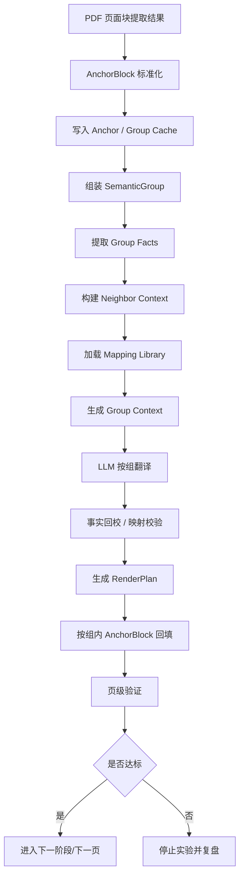
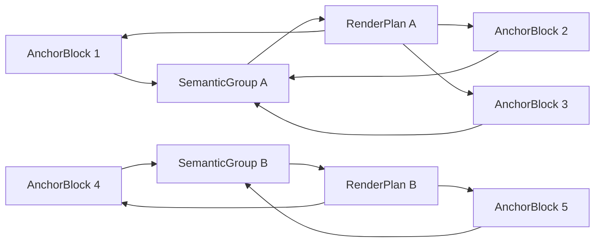
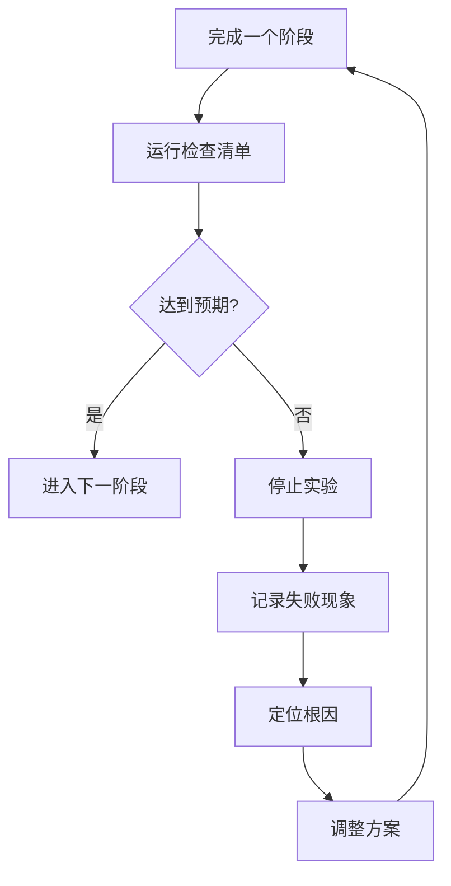

# Spike 12 设计稿：Anchor Block + Semantic Group + Render Plan

## 1. 目标

本轮技术穿刺不再继续围绕“单块翻译 + 局部补规则”微调，而是验证一条新的主链路：

- 保留原始 `block` 作为版面锚点
- 在锚点之上构建 `semantic group`
- 先按组翻译，再按组内原始锚点回填
- 组内允许重排，不允许改变组的阅读顺序

本轮只做实验设计与验收标准定义，不启动实现。

---

## 2. 核心判断

### 2.1 要回答的问题

1. 先按组翻译、再按锚点回填，是否能明显提升翻译准确性
2. 在提升翻译准确性的同时，是否能保持当前版面回填能力不明显退化
3. 当前最突出的问题，是否主要来自“翻译单元过碎”，而不是提示词不足
4. 财务事实错误、narrative/table 混判、渲染 shrink 失控，是否必须优先由工程层解决，而不是继续堆 prompt

### 2.2 核心假设

- 假设 A：翻译单元由 `single block` 提升为 `semantic group` 后，断句、尾句残缺、金额误挂接、股息总额误写等问题会明显减少
- 假设 B：只要保留原始 `block anchor` 与 `slot`，就仍然可以维持坐标级回填能力
- 假设 C：真正要解耦的是：
  - `翻译单元`
  - `渲染单元`
- 假设 D：数字、金额、日期、股息口径、财务指标等关键事实若不先锁定，只靠按组翻译仍不足以稳定达标
- 假设 E：Prompt 只应负责表达与少量必要上下文，工程层应负责事实保护、分类、映射与渲染决策

### 2.3 根因导向的设计原则

本轮方案必须显式响应 `docs/问题反馈/问题3.md` 中已确认的根因，而不是只在提示词层继续补规则：

- 工程层优先解决：
  - 关键事实锁定与回校
  - narrative / table / heading 分类重构
  - 组级回填与 shrink 风险控制
  - block/group/render 中间结果可复用与可审计
- Prompt 层只保留：
  - 当前组正文
  - 相邻必要上下文
  - 明确术语 / 映射结果
  - 必要风格要求

### 2.4 非目标

- 本轮不解决全量页的最终交付
- 本轮不切到 Word 主链路
- 本轮不引入本体
- 本轮不做多智能体编排
- 本轮不追求一次性解决所有金额、术语和风格问题

---

## 3. 已沉淀能力与可复用方案

本文件不仅是 Spike 12 设计稿，也作为“已验证能力沉淀记录”。

### 3.1 截至 Spike 11 已达成的能力

- [x] PDF 原生文本块提取
- [x] 基于页面块的原位抹字与回填
- [x] 行级 slot 提取与按 slot 回填
- [x] 基于版面规则的第一版跨块合并
- [x] 术语表、公司记忆、文档背景注入
- [x] 提示词与 API 日志落盘
- [x] 对人工参考页的自动评估

### 3.2 已验证可复用的方案

- 方案 A：保留原始块坐标与样式，不直接破坏页面几何
- 方案 B：翻译前注入企业背景与术语，优于纯通用翻译
- 方案 C：对标题、表格标签、术语做工程化控制，优于完全依赖提示词
- 方案 D：回填时保留 slot 概念，优于只按 block 级 textbox 写回

### 3.3 当前仍未解决的核心问题

- [ ] 数字密集尾句未稳定并组
- [ ] 组内残句与金额挂接错误
- [ ] 股息总额与末期股息串位
- [ ] PDF 可抽取文本仍会混入侧边栏噪声
- [ ] 版面与语义尚未完全解耦

### 3.4 Spike 12 结束后要补充的沉淀内容

- 新增达成项
- 新增失败结论
- 新增可复用规则
- 明确哪些方案进入主线，哪些只保留为穿刺结论

---

## 4. 新方案概要

### 4.1 核心对象

- `Page`
  - 页级上下文与阅读顺序容器
- `AnchorBlock`
  - 原始 PDF 文本块
  - 保留页码、bbox、字体、颜色、原文、阅读顺序
- `SemanticGroup`
  - 若干 `AnchorBlock` 组成的翻译单元
  - 负责语义完整性
- `RenderPlan`
  - 规定译文如何回填到该组对应的原始锚点集合

### 4.2 基本原则

- 原始块不丢
- 坐标不丢
- 阅读顺序不变
- 允许组内重排，不允许跨组乱排
- 先按组翻译，再按块回填
- 组装、翻译、回填、验收都要可落盘、可追溯

### 4.3 双分支架构：学习分支与翻译执行分支

Spike 12 必须明确拆成两条分支，而不是把“抽取学习”和“翻译执行”写成一条串行流水线。

#### A. 学习资产分支（离线 / 慢速 / 可积累）
目标不是直接翻当前文档，而是沉淀长期可复用资产：

- `company_memory`
- `glossary_seed`
- `phrase_map`
- `entity_map`
- `financial_metric_map`
- `style_policy`
- `section_archetypes`
- `page_archetypes`
- `mapping_candidates`

输入来源：
- `样本/` 中历史中英文样本
- 历史实验结果
- 人工参考译文
- 多年份年报

产出定位：
> 长期资产库，不直接等于当前文档译文。

#### B. 翻译执行分支（在线 / 当前任务导向 / 必须稳定）
目标是完成当前文档翻译：

- `AnchorBlock` 抽取
- `SemanticGroup` 组装
- 当前文档背景抽取
- 当前文档 facts 锁定
- 从学习资产库命中 mapping / memory / style
- group translation
- render plan
- refill
- quality checks

产出定位：
> 当前任务的翻译结果与回填结果。

#### C. 两个分支的汇合点

两条分支不是并列独立到底，而是在翻译执行前汇合：

- 学习分支产出资产库
- 翻译执行分支加载资产库并做命中
- 命中结果进入 `MappingLibraryHit` 与 `NeighborContext`

结论：

> 学习分支负责“以后怎么更好翻”，翻译执行分支负责“这次怎么稳定翻对”。

### 4.4 新增设计层：缓存层、事实锁定层、mapping 命中层

为了真正对齐根因，Spike 12 在 `AnchorBlock / SemanticGroup / RenderPlan` 之外，还需要显式补三层：

#### A. TranslationCacheStore（工程主层）
先用文件，不强制上数据库；后续可平滑切换到 SQLite / 主系统表。

建议缓存以下对象：
- `AnchorBlock`
- `SemanticGroup`
- `GroupFacts`
- `NeighborContext`
- `DocumentBackgroundRich`
- `MappingLibraryHit`
- `RenderPlan`

#### B. FactLock Layer（工程强约束层）
负责：
- 提取金额、百分比、日期、股息口径、财务指标
- 在翻译前锁定关键事实
- 在翻译后做自动回校
- 不一致则重试或阻断

#### C. Mapping Hit Layer（学习资产到执行链路的接口层）
负责：
- 从双语样本 / glossary / company memory 中给出高置信命中
- 把“推荐表达”与“禁止改写事实”分开
- 避免把大量背景文本直接塞进 prompt


## 5. 关键流程





### 5.1 工程层与 Prompt 层职责边界

#### 工程层负责

- `AnchorBlock / SemanticGroup / RenderPlan` IR 标准化与缓存
- 事实抽取、锁定、回校
- narrative / table / heading / label 分类
- 全文背景结构抽取与压缩
- 相邻段落与页内组顺序确定
- 双语映射库命中与候选注入
- 回填策略选择、shrink 阈值、失败阻断

#### Prompt 层负责

- 在给定组正文、相邻上下文、术语映射、事实锁定结果的前提下生成目标语言表达
- 不负责自行决定事实值
- 不负责自行决定组边界
- 不负责自行决定最终回填坐标

---

## 6. 中间数据模型

建议本轮实验先落 `JSON`，但必须按“可缓存、可复用、可追溯”方式设计；不急着上数据库，但也不能只做一次性内存结构。

### 6.0 缓存与落盘策略

本轮至少要把以下中间结果落盘，支持跨轮复用、对照与失败复盘：

- `anchor_blocks.json`
- `semantic_groups.json`
- `group_facts.json`
- `neighbor_context.json`
- `document_background_rich.json`
- `mapping_hits.json`
- `render_plans.json`

每个文件至少记录：

- `source_pdf`
- `page_range`
- `pipeline_version`
- `created_at`
- `upstream_hash`
- `items`

目标不是先上数据库，而是先确保：

- 同一页不必每轮都重新抽取结构
- 同一组的分组理由、事实锁定、映射命中可以复查
- 阶段失败时可以精确回放到 group 级

### 6.1 AnchorBlock

```json
{
  "block_id": "p19_b20",
  "page_no": 19,
  "reading_order": 20,
  "bbox": [68.01, 429.21, 245.79, 441.16],
  "role": "body",
  "block_type": "body",
  "source_text": "19.97億美元後，自由盈餘為134.73億美元。",
  "style": {},
  "slots": [],
  "column_id": "c1",
  "section_hint": "financial_review",
  "source_hash": "..."
}
```

### 6.2 SemanticGroup

```json
{
  "group_id": "p19_g05",
  "page_no": 19,
  "block_ids": ["p19_b18", "p19_b19", "p19_b20"],
  "source_text_joined": "...",
  "group_reason": {
    "same_column": true,
    "same_paragraph_flow": true,
    "tail_numeric_clause": true
  },
  "prev_group_id": "p19_g04",
  "next_group_id": "p19_g06",
  "group_type": "financial_narrative"
}
```

### 6.3 GroupFacts

```json
{
  "group_id": "p19_g05",
  "locked_facts": [
    {
      "fact_type": "amount",
      "source_span": "19.97億美元",
      "normalized_value": 19.97,
      "unit": "億美元",
      "target_render_constraint": "must_preserve_scale"
    },
    {
      "fact_type": "amount",
      "source_span": "134.73億美元",
      "normalized_value": 134.73,
      "unit": "億美元",
      "target_render_constraint": "must_preserve_scale"
    }
  ],
  "validation_rules": ["amount_scale_match", "dividend_scope_match"]
}
```

### 6.4 NeighborContext

```json
{
  "group_id": "p19_g05",
  "prev_group_summary": "上一段在说明派息总额与政策背景",
  "current_group_focus": "末句延续自由盈余与金额说明",
  "next_group_summary": "下一段切换到另一项经营结果",
  "window_policy": "prev_1_next_1_same_column_first"
}
```

### 6.5 DocumentBackgroundRich

```json
{
  "document_id": "AIA_2021_report",
  "page_dimensions": {
    "width": 595.0,
    "height": 842.0
  },
  "sections": [
    {
      "section_id": "sec_financial_review",
      "title": "financial review",
      "page_span": [19, 20]
    }
  ],
  "regions": [
    {
      "page_no": 19,
      "region_role": "sidebar",
      "bbox": [0, 0, 60, 842]
    }
  ],
  "reading_columns": [
    {
      "page_no": 19,
      "columns": 1
    }
  ]
}
```

### 6.6 MappingLibraryHit

```json
{
  "group_id": "p19_g05",
  "hits": [
    {
      "source_pattern": "自由盈餘",
      "target_pattern": "free surplus",
      "evidence_source": "bilingual_corpus",
      "confidence": 0.93,
      "usage_mode": "preferred_phrase"
    }
  ]
}
```

### 6.7 RenderPlan

```json
{
  "group_id": "p19_g05",
  "target_block_ids": ["p19_b18", "p19_b19", "p19_b20"],
  "layout_mode": "group_slots",
  "allocation_strategy": "sequential_slots",
  "keep_reading_order": true,
  "shrink_threshold": 0.75,
  "fallback_policy": "fail_if_fact_ok_but_layout_bad"
}
```
---

## 7. 实验范围

### 7.1 第一批样本页

仍然使用当前已建立人工对照基础的页：

- `10`
- `13`
- `19`
- `20`

### 7.2 重点观察页

- 第 `19` 页
  - 重点看 `p19_b18/p19_b19/p19_b20`
  - 重点看股息金额、自由盈余尾句、断句问题
- 第 `20` 页
  - 重点看表格标签、正文组、块内缩放

### 7.3 必须保留的对照基线

- `v07`
- `v10`
- `v11`

---

## 8. 分阶段实验设计

## 8.1 阶段 0：冻结基线与缓存边界

### 要做什么

- 固定当前对照页
- 固定当前对照结果
- 固定当前评估方法
- 固定中间产物命名、落盘格式与版本字段

### 产出

- baseline 清单
- 页面样本清单
- 关键问题清单
- cache / artifact 清单

### 达标标准

- 后续每一轮实验都能和同一批基线对比
- 同一页的 IR、group、facts、render plan 可按版本回放

### 不达标就停

- 若基线页、基线结果、评估方法仍在变动，本轮实验不开始
- 若中间结果仍不可复用、不可追溯，也不进入阶段 1

---

## 8.2 阶段 1：建立 Anchor IR 与 Rich Background IR

### 要做什么

- 把当前页面块提取结果标准化为 `AnchorBlock`
- 为每个 `AnchorBlock` 补齐：
  - 原始 bbox
  - 角色
  - block_type
  - style
  - slots
  - 原文
  - 阅读顺序
- 提取全文 / 页级背景结构，不再只保留 prompt 用摘要：
  - page dimensions
  - section span
  - column / region
  - sidebar / header / footer / table area hints

### 目标效果

- 后续分组、翻译、回填都基于统一 IR
- 背景信息不再只是 prompt 文本，而是可参与分类与过滤的结构化输入

### 验收标准

- 页面内 `AnchorBlock` 数量与原始块一致
- 任意一个块都能追溯回原始 PDF 坐标
- 任意一个块都能追溯到原始 `source_text`
- 任意一个背景区域都能说明其页码、bbox、role

### 不达标就停

- 若 IR 丢块、错序、无法追溯原始坐标，则停止，不进入阶段 2
- 若背景结构仍无法用于区分页边栏 / 正文 / 页眉页脚，则停止，不进入阶段 2

---

## 8.3 阶段 2：组装 Semantic Group 与 Neighbor Context

### 要做什么

- 不再只依赖“普通正文相邻合并”
- 新增“尾句续接”判断
- 为每个组生成前后邻接上下文摘要
- 重点处理：
  - 数字密集但仍属于正文尾句
  - 被断开的金额短句
  - 同段落残句
  - 与前后段落存在承接关系的组

### 新增规则方向

- 规则 1：若前块不以完整语义结束，后块即使数字密集，也允许候选并组
- 规则 2：若后块很短，但开头明显承接前文，如“19.97億美元後…”，应允许并组
- 规则 3：若后块与前块同栏、同字号、垂直连续，则数字密集不应直接一票否决
- 规则 4：相邻上下文只取 `prev_1 + current + next_1`，优先同栏，不把整页全文直接塞进 prompt

### 目标效果

- `p19_b18 + p19_b19 + p19_b20` 应组成同一组
- 组级 prompt 可拿到必要前后文，但不会被无关背景淹没

### 验收标准

- 第 19 页尾句组成功并入
- 新规则不明显误伤表格、侧栏、页眉页脚
- 每个组都能解释“为什么这样分组”
- 每个组都能追溯相邻上下文来源

### 不达标就停

- 若 `p19_b20` 仍无法并组，或大量把表格数字块误并入正文，则停止，不进入阶段 3
- 若相邻上下文引入了明显噪声，导致 prompt 变重，则停止，不进入阶段 3

---

## 8.4 阶段 3：建立 GroupFacts / MappingLibrary，再按组翻译

### 要做什么

- 在翻译前先为每个 `group` 提取并锁定关键事实：
  - 金额
  - 百分比
  - 日期
  - 股息口径
  - 财务指标
- 命中术语表之外的双语样本映射库：
  - 短语
  - 财务表达
  - 高置信度固定译法
- 模型输入改为 `group`
- 保留 `group -> block_ids` 映射
- 要求输出顺序不变
- 暂不让模型决定回填位置

### 目标效果

- 同一句话不再被拆成两个互相不完整的翻译结果
- 数字与修饰语挂接更稳定
- prompt 不再承担事实保护主责

### 验收标准

- 第 19 页关键句不再出现：
  - `regarding dividend payments`
  - `US$19.97 billion` 这类挂错尺度或残句
- 股息总额与末期股息不再互相串位
- 翻译结果能通过 group facts 回校
- mapping library 命中可解释，不与 glossary 冲突

### 不达标就停

- 若关键句仍然残缺，说明问题不只是分组，而是需要进一步做组内结构约束；此时停止，不进入阶段 4
- 若事实锁定后仍频繁违背金额 / 口径，说明输出协议还不够硬；此时停止，不进入阶段 4

---

## 8.5 阶段 4：生成 Render Plan 并回填

### 要做什么

- 翻译按组完成后，不直接把整段暴力写回单块
- 而是：
  - 读取组内所有 anchor slots
  - 按阅读顺序分配译文
  - 在组内做重新排版
  - 按 block / group type 选择更细的渲染策略
- 对 shrink 建立明确失败阈值，不再默认“能塞进去就算过”

### 目标效果

- 提升翻译准确性，同时保持原始页面视觉结构
- shrink 成为可控指标，而不是默认兜底策略

### 验收标准

- 组内回填不跨组串位
- 关键页没有明显新炸版
- 版面指标不明显差于 `v11`
- 标题 / label / narrative / table cell 的渲染策略可区分

### 不达标就停

- 若翻译质量提升但版面显著恶化，则停止，优先复盘 RenderPlan，而不是继续扩页
- 若大量结果只能靠极端 shrink 才能落版，则停止，不进入阶段 5

---

## 8.6 阶段 5：页级质量验收

### 要做什么

- 与人工英文参考页对比
- 与现有 `v11` 对比
- 做文本与视觉双验收
- 明确区分：
  - 工程失败
  - prompt 表达失败
  - 模型上限失败

### 验收指标

- 内容指标
  - `token_f1`
  - `content_f1`
  - `sequence_ratio`
  - `number_recall`
- 结构指标
  - 关键句断裂数
  - 金额尺度错误数
  - 股息金额串位数
  - 侧边栏噪声污染数
  - narrative/table 误分类数
- 版面指标
  - `avg_font_ratio`
  - `compact_used`
  - 是否出现新 overflow
  - shrink 低于阈值的组数

### 达标标准

- 相比 `v11`：
  - 内容指标整体不下降
  - 金额尺度错误减少
  - 断句问题减少
  - narrative/table 误分类减少
  - 版面指标无明显退化

### 不达标就停

- 若准确性未提升，或布局明显退化，则停止，不做页数扩展

---

## 9. 过程控制：达不到预期就停下来反思

本轮实验必须采用“阶段门”方式，而不是一口气跑完全链路。



### 执行要求

- 每完成一个阶段，都必须先验收
- 未通过不得进入下一阶段
- 若出现核心假设被证伪，不继续硬推
- 必须记录：
  - 失败页
  - 失败组
  - 失败句
  - 失败原因归类

---

## 10. 检查清单

## 10.1 设计执行检查清单

- [ ] 已冻结基线页与基线版本
- [ ] 已定义 AnchorBlock IR
- [ ] 已定义 SemanticGroup IR
- [ ] 已定义 RenderPlan IR
- [ ] 已定义阶段门与停止条件
- [ ] 已定义关键页与关键问题
- [ ] 已定义文本与版面双验收指标

## 10.2 阶段验收检查清单

- [ ] 阶段 1：IR 可追溯到原始块
- [ ] 阶段 2：关键尾句成功并组
- [ ] 阶段 3：关键句翻译不再残缺
- [ ] 阶段 4：组内回填无明显炸版
- [ ] 阶段 5：指标相对 `v11` 不下降

## 10.3 失败复盘检查清单

- [ ] 是否是分组错误
- [ ] 是否是金额/数字挂接错误
- [ ] 是否是术语约束不足
- [ ] 是否是 RenderPlan 分配错误
- [ ] 是否是 PDF 文本抽取噪声污染

---

## 11. 本轮通过标准

本轮 Spike 12 通过，不要求“全面可交付”，只要求证明下列判断至少部分成立：

1. `group translation` 比 `block translation` 更准确
2. `anchor-based render` 仍然可以保持当前版面能力
3. 第 19 页这类“尾句金额块”问题可以被系统性缓解，而不是靠单点手工修补

---

## 12. 本轮失败也算有价值的情况

即使本轮未通过，只要能明确下列任一结论，也算有效穿刺：

- 仅靠规则分组不足，必须引入页级/组级轻分析
- 仅靠按组翻译不足，必须加入组内结构约束输出
- 仅靠 PDF 锚点回填不足，后续必须引入 DOCX/OOXML 结构层

---

## 13. 建议的实验顺序

建议严格按以下顺序推进：

1. 只做 IR，不做翻译
2. 只做分组，不做回填
3. 只做按组翻译，不做全页扩展
4. 只做关键页回填
5. 通过后再扩到 `10/13/19/20`

不建议：

- 一上来改完整链路
- 一上来跑 20 页
- 一边改分组一边改提示词一边改回填

---

## 14. 阶段状态记录位

用于在实验过程中持续记录“哪些已经达成，哪些没有达成”。

| 阶段 | 目标 | 当前状态 | 结论 | 后续动作 |
| --- | --- | --- | --- | --- |
| 阶段 0 | 冻结基线 | 待开始 | - | - |
| 阶段 1 | 建立 Anchor IR | 待开始 | - | - |
| 阶段 2 | 尾句并组 | 待开始 | - | - |
| 阶段 3 | 按组翻译 | 待开始 | - | - |
| 阶段 4 | 按组回填 | 待开始 | - | - |
| 阶段 5 | 页级验收 | 待开始 | - | - |

---

## 15. 审阅结论位

待你确认以下三点后，再启动 Spike 12 实验：

- 是否接受 `AnchorBlock + SemanticGroup + RenderPlan` 作为主实验思路
- 是否接受“阶段门验收，不达标就停”的执行方式
- 是否接受先用 `10/13/19/20` 作为第一批实验页
