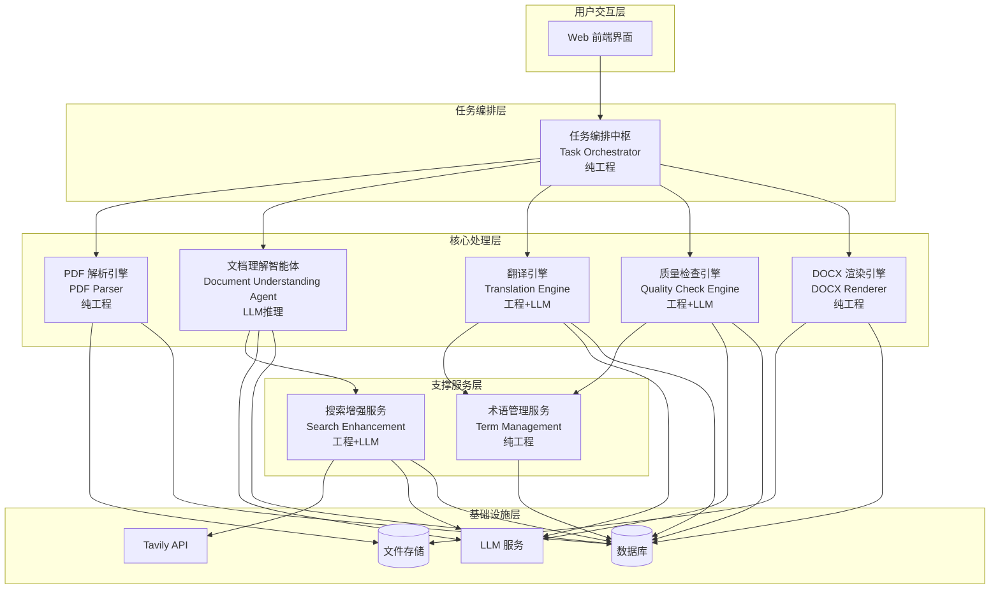
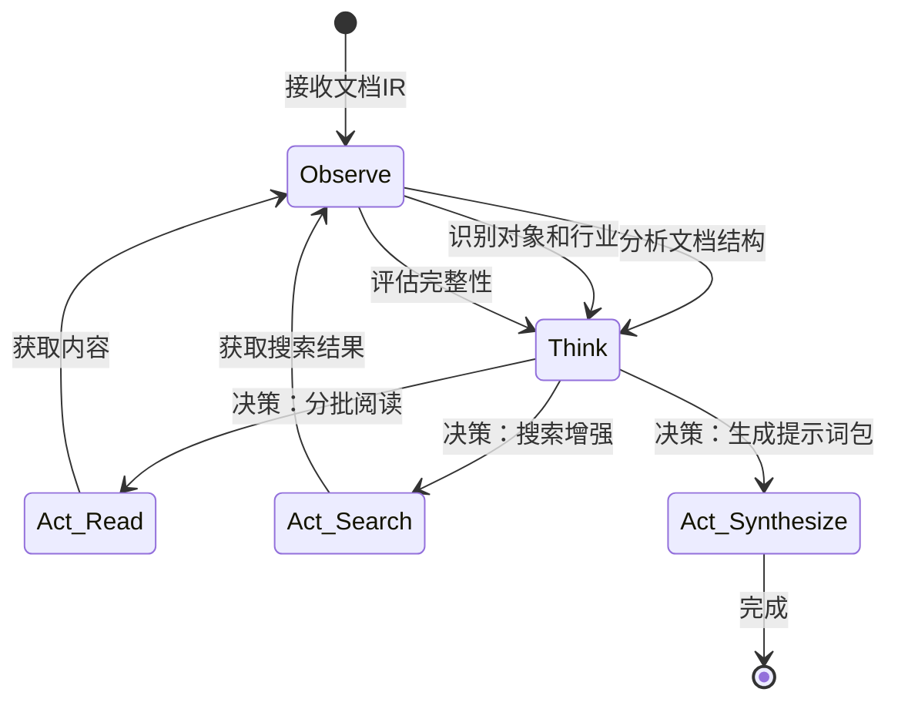
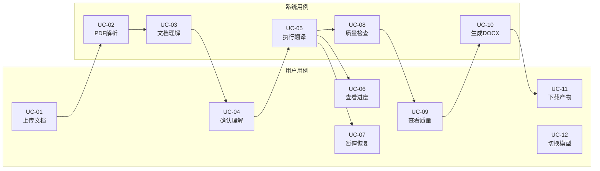
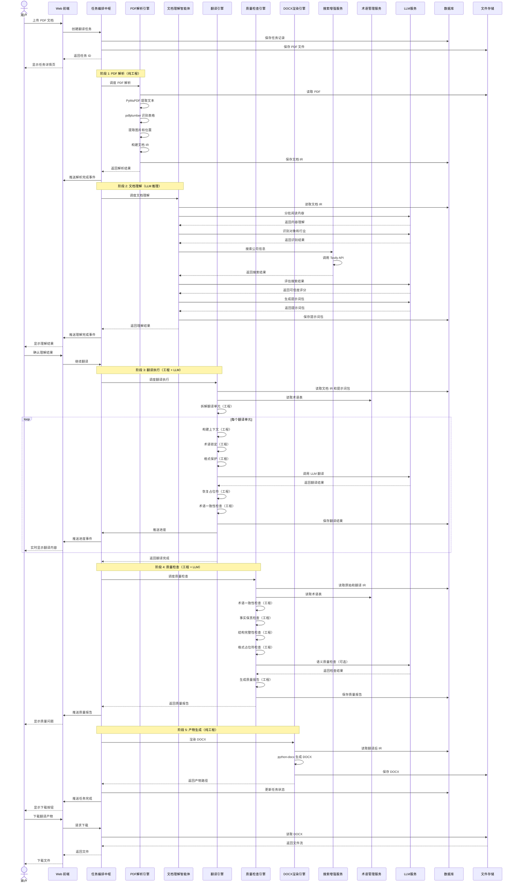
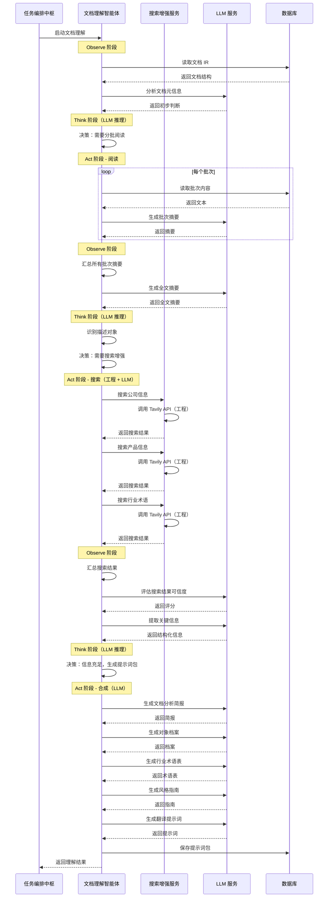
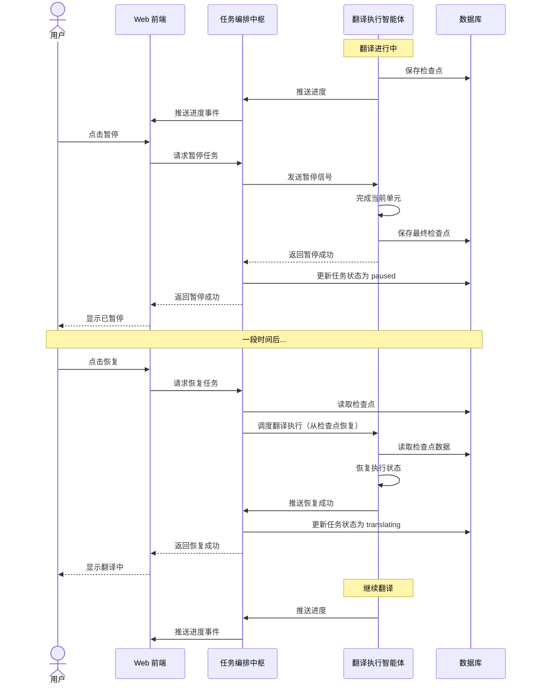
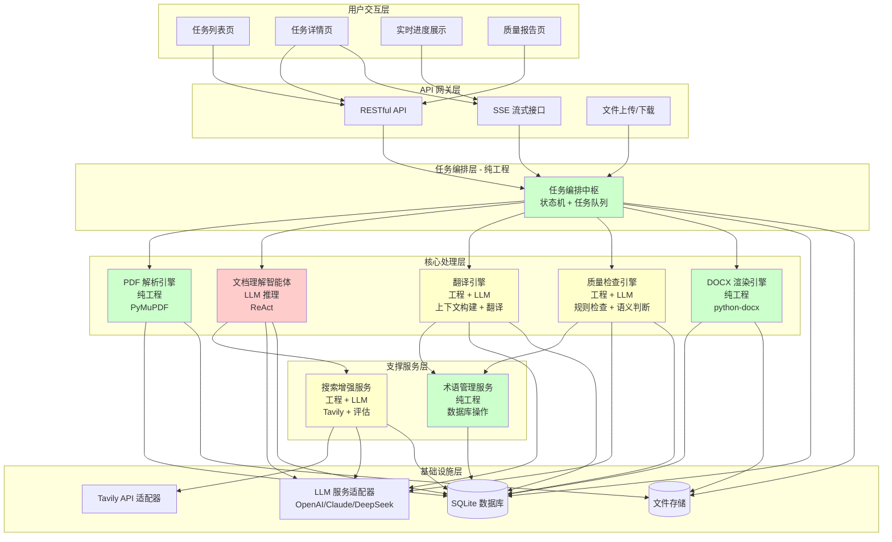
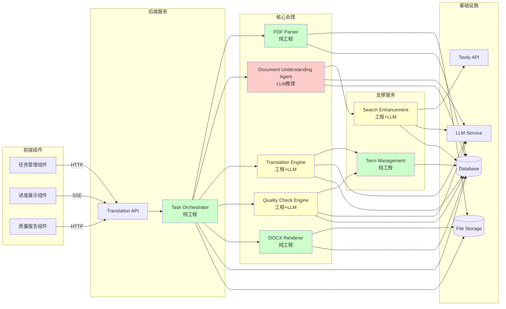
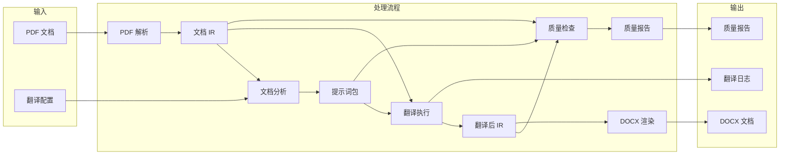
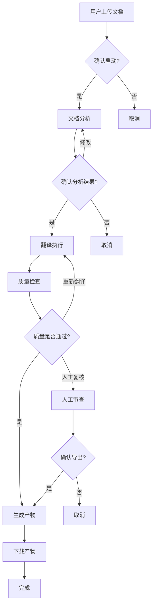

# AI 翻译系统 MVP 需求设计文档 v1.0

## 1. 文档目标

本文档基于系统工程和 MBSE 思想，定义基于智能体的 AI 翻译系统 MVP 版本的核心能力需求。采用模块化分解方法，聚焦：

- 系统能力边界与核心价值
- 模块组成与职责划分
- 输入输出与调用关系
- 用例矩阵与时序验证
- 可验证的关键测试场景

**MVP 范围约束**：
- 仅支持 PDF 文档翻译（中英互译）
- 基于智能体的任务规划与执行
- 实时可视化翻译过程
- 支持任务中断与恢复
- 支持 LLM 模型替换
- 人机协同决策模式

---

## 2. 系统命名

**系统中文名**：AI Native 文档翻译系统  
**系统英文名**：AI Native Document Translation System  
**系统代号**：AIDTS

---

## 3. 系统总体定位

### 3.1 核心价值主张

本系统不是通用翻译工具，而是面向企业级文档翻译场景的 AI Native 解决方案，核心差异化价值：

1. **智能体驱动**：基于 ReAct Agent 的文档理解、任务规划与执行
2. **企业背景注入**：通过外部搜索增强，注入企业信息、行业术语、对象档案
3. **版式强保真**：保持 PDF 原始布局、表格、图片、页眉页脚
4. **过程可视化**：实时展示智能体工作过程、翻译进度、质量检查
5. **人机协同**：人做决策、AI 做规划与执行，关键节点人工确认
6. **可中断恢复**：长时任务支持暂停、恢复、断点续跑

### 3.2 目标用户

- 企业文档管理人员
- 翻译项目经理
- 技术文档工程师
- 需要处理大量企业文档的专业人士

### 3.3 典型应用场景

- 企业年报中英互译
- 产品白皮书翻译
- 技术文档本地化
- 合规文件翻译
- 用户手册翻译

---

## 4. 系统能力边界

### 4.1 MVP 阶段支持能力

**文档格式**：
- ✅ 数字 PDF（可提取文本的 PDF）
- ❌ 扫描 PDF（留待后续 OCR 支持）
- ❌ DOCX（后续扩展）

**翻译方向**：
- ✅ 英译中
- ✅ 中译英

**核心能力**：
- ✅ PDF 结构化解析（页面、段落、表格、图片、页眉页脚）
- ✅ 智能体驱动的文档分析与提示词构建
- ✅ 外部搜索增强（Tavily）
- ✅ 企业背景与术语注入
- ✅ 分段翻译与质量检查
- ✅ DOCX 格式输出（保持原始布局）
- ✅ 实时进度可视化
- ✅ 任务暂停/恢复/重试
- ✅ LLM 模型可配置切换

**明确不支持**：
- ❌ 扫描 PDF OCR
- ❌ 直接输出 PDF（仅输出 DOCX）
- ❌ 术语库自动学习（留待 Phase 2）
- ❌ 翻译记忆库（留待 Phase 2）
- ❌ 多文档批量处理
- ❌ 在线协同编辑

### 4.2 质量保证边界

**自动质量检查**：
- ✅ 术语一致性检查
- ✅ 数字/单位保真检查
- ✅ 结构完整性检查
- ✅ 格式占位符检查
- ✅ 首页专项检查

**人工介入点**：
- ✅ 任务启动前确认
- ✅ 文档分析结果确认
- ✅ 质量问题人工复核
- ❌ 逐段人工审校（不在 MVP 范围）

---

## 5. 系统模块组成

**设计原则**：
- 智能体只用于需要推理和决策的场景（文档理解、翻译策略、质量判断）
- 确定性任务使用工程化方案（PDF 解析、格式保护、数字检查、文档渲染）
- 降低调试成本，提高系统可靠性和性能

基于高内聚低耦合原则，系统划分为 8 个核心模块：

### 5.1 模块总览

**设计原则**：智能体只用于需要推理和决策的场景，确定性任务使用工程化方案



### 5.2 模块一：任务编排中枢（Task Orchestrator）

**实现方式**：纯工程化（状态机 + 任务队列）

**模块定位**：系统核心调度器，负责任务生命周期管理、模块协调、人机交互

**核心能力**：
1. **任务接收与解析**
   - 接收用户上传的 PDF 文档
   - 解析翻译参数（源语言、目标语言、模型选择）
   - 创建翻译任务实例
   - 实现方式：FastAPI 接口 + Pydantic 模型验证

2. **任务规划能力**
   - 将翻译任务拆解为：PDF 解析 → 文档理解 → 翻译执行 → 质量检查 → 产物生成
   - 生成任务执行计划与依赖关系
   - 实现方式：有向无环图（DAG）+ 依赖检查

3. **模块调度能力**
   - 按计划顺序调度各个模块
   - 管理模块间的数据传递
   - 处理模块执行失败与重试
   - 实现方式：任务队列 + 重试机制

4. **任务状态管理**
   - 维护任务状态机：pending → parsing → understanding → translating → checking → rendering → completed/failed
   - 支持任务暂停、恢复、取消
   - 记录任务执行日志与检查点
   - 实现方式：状态机模式 + SQLite 持久化

5. **进度可视化**
   - 实时推送任务进度到前端
   - 展示当前执行阶段、完成百分比、处理内容
   - 实现方式：SSE（Server-Sent Events）流式推送

6. **人工介入管理**
   - 在关键节点请求人工确认（文档理解结果、质量问题）
   - 支持人工修改计划、调整参数
   - 记录人工决策历史
   - 实现方式：事件驱动 + 回调机制

**输入**：
- 用户上传的 PDF 文件
- 翻译配置（源语言、目标语言、模型选择）
- 人工确认指令

**输出**：
- 任务执行计划
- 任务状态更新
- 进度推送事件
- 最终翻译产物

**与其他模块关系**：
- 调用 PDF 解析引擎解析文档
- 调用文档理解智能体理解内容
- 调用翻译引擎执行翻译
- 调用质量检查引擎进行质检
- 调用 DOCX 渲染引擎生成产物
- 通过数据库持久化任务状态
- 通过文件存储管理文档产物

### 5.3 模块二：PDF 解析引擎（PDF Parser）

**实现方式**：纯工程化（PyMuPDF + pdfplumber）

**模块定位**：负责 PDF 文档的结构化解析，生成文档中间表示（Document IR）

**核心能力**：
1. **PDF 文本提取**
   - 提取页面文本块
   - 识别文本坐标和字体信息
   - 推断阅读顺序
   - 实现方式：PyMuPDF 的 get_text("dict") 方法

2. **表格识别与提取**
   - 识别表格边界
   - 提取表格结构（行、列、合并单元格）
   - 提取单元格内容
   - 实现方式：pdfplumber 的 extract_tables() 方法

3. **图片提取**
   - 提取图片对象
   - 记录图片位置和尺寸
   - 保存图片文件
   - 实现方式：PyMuPDF 的 get_images() 方法

4. **页眉页脚识别**
   - 基于位置规则识别页眉页脚
   - 提取页眉页脚内容
   - 实现方式：坐标阈值判断（top < 50 或 bottom > page_height - 50）

5. **文档 IR 构建**
   - 构建统一的文档中间表示
   - 结构：Document → Page → Node
   - Node 类型：paragraph, heading, table_cell, image, header, footer
   - 实现方式：Python dataclass + JSON 序列化

**输入**：
- PDF 文件路径

**输出**：
- 文档 IR（JSON 格式）
- 提取的图片文件

**与其他模块关系**：
- 被任务编排中枢调用
- 输出文档 IR 供文档理解智能体使用
- 通过文件存储保存图片

**关键技术点**：
- 不使用 LLM，纯规则和算法
- 性能目标：≤ 5 秒/页
- 可靠性高，结果可预测

### 5.4 模块三：文档理解智能体（Document Understanding Agent）

**实现方式**：LLM 推理（基于 ReAct 架构）

**模块定位**：唯一需要推理的智能体，负责理解文档内容、搜索企业背景、生成翻译策略

**核心能力**：
1. **文档内容理解**（需要 LLM 推理）
   - 分批阅读文档内容（支持长文档）
   - 识别文档类型（年报、白皮书、技术文档、合规文件）
   - 识别描述对象（公司、产品、系统、平台）
   - 识别目标受众（技术人员、管理层、普通用户）
   - 识别文档风格（正式、客观、营销、法务）
   - 生成文档摘要

2. **搜索策略决策**（需要 LLM 推理）
   - 基于识别的对象生成搜索计划
   - 决定搜索哪些关键词
   - 评估搜索结果的可信度
   - 决定是否需要追加搜索

3. **翻译策略生成**（需要 LLM 推理）
   - 识别不可翻译项（公司名、产品名、代码、路径）
   - 决定公司名翻译策略（保留/翻译/首次注释）
   - 生成风格指南（语气、标点、格式规则）
   - 生成翻译注意事项

4. **提示词包构建**（需要 LLM 推理）
   - 生成文档分析简报（Document Analysis Brief）
   - 生成对象档案（Object Dossier）
   - 生成行业术语表（Industry Glossary）
   - 生成翻译任务提示词（Task Prompt）
   - 持久化提示词包（Prompt Bundle）

**ReAct 工作流**：


**输入**：
- 文档 IR（来自 PDF 解析引擎）
- 翻译方向（源语言、目标语言）

**输出**：
- 文档分析简报（JSON）
- 对象档案（JSON）
- 行业术语表（JSON）
- 风格指南（JSON）
- 提示词包（Prompt Bundle）

**与其他模块关系**：
- 接收 PDF 解析引擎的文档 IR
- 调用搜索增强服务进行外部搜索
- 输出提示词包供翻译引擎使用

**关键技术点**：
- 这是唯一使用 ReAct 架构的智能体
- 需要多轮 LLM 调用（阅读、推理、搜索、合成）
- 成本较高，但必要（需要理解和决策）

### 5.5 模块四：翻译引擎（Translation Engine）

**实现方式**：工程化 + LLM 调用

**模块定位**：负责实际翻译执行，结合工程化的上下文构建和 LLM 翻译

**核心能力**：
1. **翻译任务分解**（纯工程）
   - 将文档 IR 拆解为可翻译单元
   - 识别翻译优先级（封面优先、关键页面优先）
   - 生成翻译批次计划
   - 实现方式：遍历文档 IR + 优先级排序

2. **上下文构建**（纯工程）
   - 注入文档分析简报
   - 注入对象档案与术语表
   - 注入邻近段落上下文
   - 拼接完整的翻译 prompt
   - 实现方式：字符串模板 + 上下文窗口管理

3. **术语锁定**（纯工程）
   - 锁定不可翻译项（公司名、产品名、代码）
   - 替换为占位符（如 `{{TERM_001}}`）
   - 翻译后恢复占位符
   - 实现方式：正则表达式 + 占位符映射表

4. **格式保护**（纯工程）
   - 保护数字、日期、单位、编号
   - 保护 Markdown 格式标记
   - 保护表格结构
   - 实现方式：正则表达式 + 占位符

5. **LLM 翻译调用**（LLM）
   - 调用 LLM 进行实际翻译
   - 支持重试机制
   - 记录翻译日志
   - 实现方式：统一 LLM 适配器

6. **术语一致性检查**（纯工程）
   - 检查翻译结果是否使用了术语表
   - 检查同一术语是否一致
   - 不一致时重新翻译
   - 实现方式：字符串匹配 + 规则引擎

7. **进度报告**（纯工程）
   - 实时报告翻译进度
   - 推送当前翻译内容到前端
   - 实现方式：事件发布

**输入**：
- 文档 IR
- 提示词包
- 翻译配置

**输出**：
- 翻译后的文档 IR
- 翻译日志
- 进度事件

**与其他模块关系**：
- 接收文档理解智能体的提示词包
- 调用术语管理服务获取术语表
- 调用 LLM 服务执行翻译
- 输出翻译结果供质量检查引擎检查

**关键技术点**：
- 大部分是工程化实现，只有实际翻译调用 LLM
- 术语锁定和格式保护不依赖 LLM
- 性能目标：≤ 10 秒/段

### 5.6 模块五：质量检查引擎（Quality Check Engine）

**实现方式**：工程化 + LLM 判断

**模块定位**：自动化质量检查，结合规则检查和语义判断

**核心能力**：
1. **术语一致性检查**（纯工程）
   - 检查同一术语是否有多种译法
   - 检查是否违反术语表约束
   - 检查公司名、产品名翻译策略
   - 实现方式：字符串匹配 + 规则引擎

2. **事实保真检查**（纯工程）
   - 检查数字是否改变
   - 检查单位是否丢失
   - 检查日期格式是否正确
   - 检查编号是否保留
   - 实现方式：正则表达式 + 字符串比对

3. **结构完整性检查**（纯工程）
   - 检查段落数量是否一致
   - 检查表格结构是否完整
   - 检查格式标记是否配对
   - 实现方式：结构比对 + 计数检查

4. **格式占位符检查**（纯工程）
   - 检查占位符是否全部恢复
   - 检查 Markdown 标记是否完整
   - 实现方式：占位符映射表检查

5. **语义质量检查**（LLM 判断）
   - 检查是否有明显漏译
   - 检查是否有明显误译
   - 检查否定词是否正确翻译
   - 实现方式：LLM 调用（仅在规则检查通过后）

6. **首页专项检查**（纯工程 + LLM）
   - 对封面、标题、副标题进行严格检查
   - 检查公司名、版本号、日期
   - 实现方式：规则检查 + LLM 复核

7. **质量报告生成**（纯工程）
   - 生成质量问题清单（critical/warning/info）
   - 标记阻断性问题
   - 生成质量评分
   - 实现方式：问题聚合 + 评分算法

**输入**：
- 原始文档 IR
- 翻译后文档 IR
- 提示词包

**输出**：
- 质量问题清单
- 质量评分
- 是否允许导出的决策

**与其他模块关系**：
- 接收翻译引擎的翻译结果
- 调用术语管理服务获取术语表
- 调用 LLM 服务进行语义检查（可选）
- 输出质量报告供任务编排中枢决策

**关键技术点**：
- 80% 的检查是纯工程化规则
- 只有语义检查需要 LLM
- 性能目标：≤ 1 分钟（100 页）

### 5.7 模块六：DOCX 渲染引擎（DOCX Renderer）

**实现方式**：纯工程化（python-docx）

**模块定位**：负责将翻译后的文档 IR 渲染为 DOCX 文件

**核心能力**：
1. **文档结构渲染**（纯工程）
   - 创建 DOCX 文档对象
   - 按页面顺序渲染内容
   - 保持章节结构
   - 实现方式：python-docx Document API

2. **段落样式保持**（纯工程）
   - 保持字体、字号、颜色
   - 保持对齐方式、缩进
   - 保持行距、段间距
   - 实现方式：python-docx Paragraph.style

3. **表格渲染**（纯工程）
   - 创建表格结构
   - 设置单元格合并
   - 保持表格样式
   - 实现方式：python-docx Table API

4. **图片插入**（纯工程）
   - 插入图片到指定位置
   - 保持图片尺寸
   - 实现方式：python-docx add_picture()

5. **页眉页脚渲染**（纯工程）
   - 设置页眉页脚内容
   - 保持页眉页脚样式
   - 实现方式：python-docx Section.header/footer

**输入**：
- 翻译后的文档 IR
- 提取的图片文件

**输出**：
- DOCX 文件

**与其他模块关系**：
- 被任务编排中枢调用
- 读取翻译后的文档 IR
- 通过文件存储保存 DOCX

**关键技术点**：
- 完全不使用 LLM
- 纯工程化实现，结果可预测
- 性能目标：≤ 3 秒/页

### 5.8 模块七：搜索增强服务（Search Enhancement Service）

**实现方式**：工程化 + LLM 评估

**模块定位**：负责外部搜索和结果处理

**核心能力**：
1. **搜索执行**（纯工程）
   - 调用 Tavily Search API
   - 支持搜索参数配置
   - 实现方式：HTTP 请求 + JSON 解析

2. **结果处理**（纯工程）
   - 提取标题、摘要、URL
   - 去重和归一化
   - 实现方式：字符串处理 + 集合去重

3. **可信度评分**（工程 + LLM）
   - 基于来源类型评分（官网 > 标准组织 > 一般网页）
   - 基于时效性评分
   - LLM 评估内容相关性
   - 实现方式：规则评分 + LLM 辅助

4. **搜索缓存**（纯工程）
   - 缓存搜索结果避免重复调用
   - 支持缓存过期策略
   - 实现方式：SQLite + TTL

5. **知识提取**（LLM）
   - 从搜索结果提取公司信息
   - 从搜索结果提取产品信息
   - 从搜索结果提取行业术语
   - 实现方式：LLM 调用

**输入**：
- 搜索查询
- 搜索参数

**输出**：
- 搜索结果（标题、摘要、URL、评分）
- 提取的知识对象

**与其他模块关系**：
- 被文档理解智能体调用
- 通过数据库缓存搜索结果

**关键技术点**：
- 搜索执行是纯工程
- 结果评估和知识提取需要 LLM

### 5.9 模块八：术语管理服务（Term Management Service）

**实现方式**：纯工程化

**模块定位**：负责术语表的存储、查询和管理

**核心能力**：
1. **术语存储**（纯工程）
   - 存储术语对（源语言 → 目标语言）
   - 存储术语类别和策略
   - 实现方式：SQLite 表

2. **术语查询**（纯工程）
   - 按源语言查询术语
   - 按类别过滤术语
   - 实现方式：SQL 查询

3. **术语匹配**（纯工程）
   - 在文本中匹配术语
   - 支持模糊匹配
   - 实现方式：正则表达式 + Trie 树

4. **术语版本管理**（纯工程）
   - 支持术语表版本化
   - 支持术语历史记录
   - 实现方式：版本号 + 历史表

**输入**：
- 术语查询请求
- 术语添加/更新请求

**输出**：
- 术语列表
- 匹配结果

**与其他模块关系**：
- 被翻译引擎调用
- 被质量检查引擎调用
- 通过数据库持久化术语

**关键技术点**：
- 完全不使用 LLM
- 纯数据库操作，性能高

5. **翻译执行**
   - 调用 LLM 进行翻译
   - 支持重试机制
   - 记录翻译日志（输入、输出、模型、耗时）

6. **进度报告**
   - 实时报告翻译进度
   - 推送当前翻译内容到前端展示

**输入**：
- 文档 IR（中间表示）
- 提示词包
- 翻译配置

**输出**：
- 翻译后的文档 IR
- 翻译日志
- 进度事件

**与其他模块关系**：
- 接收文档分析智能体的提示词包
- 调用翻译服务引擎执行翻译
- 输出翻译结果供质量检查智能体检查

## 6. 核心用例设计

### 6.1 用例总览

系统支持以下核心用例：

| 用例编号 | 用例名称 | 主要参与者 | 涉及模块 | 优先级 |
|---------|---------|-----------|---------|--------|
| UC-01 | 上传文档并创建翻译任务 | 用户 | M1 | P0 |
| UC-02 | PDF 解析 | 系统 | M1, M2 | P0 |
| UC-03 | 文档理解与搜索增强 | 系统 | M1, M3, M7 | P0 |
| UC-04 | 确认文档理解结果 | 用户 | M1, M3 | P1 |
| UC-05 | 执行翻译任务 | 系统 | M1, M4, M8 | P0 |
| UC-06 | 实时查看翻译进度 | 用户 | M1 | P0 |
| UC-07 | 暂停/恢复翻译任务 | 用户 | M1 | P1 |
| UC-08 | 质量检查 | 系统 | M1, M5, M8 | P0 |
| UC-09 | 查看质量报告 | 用户 | M1, M5 | P0 |
| UC-10 | 生成 DOCX 产物 | 系统 | M1, M6 | P0 |
| UC-11 | 下载翻译产物 | 用户 | M1 | P0 |
| UC-12 | 切换 LLM 模型 | 用户 | M1, M4 | P1 |

**模块说明**：
- M1: 任务编排中枢
- M2: PDF 解析引擎
- M3: 文档理解智能体
- M4: 翻译引擎
- M5: 质量检查引擎
- M6: DOCX 渲染引擎
- M7: 搜索增强服务
- M8: 术语管理服务

### 6.2 用例矩阵




### 6.3 核心用例详细描述

#### UC-01: 上传文档并创建翻译任务

**用例描述**：用户上传 PDF 文档，配置翻译参数，系统创建翻译任务

**前置条件**：
- 用户已登录系统
- 准备好待翻译的 PDF 文档

**主流程**：
1. 用户点击"新建翻译任务"
2. 用户上传 PDF 文件
3. 系统验证文件格式（仅支持 PDF）
4. 用户选择翻译方向（英译中/中译英）
5. 用户选择 LLM 模型
6. 用户点击"开始翻译"
7. 系统创建翻译任务
8. 系统返回任务 ID 并跳转到任务详情页

**异常流程**：
- 3a. 文件格式不支持 → 提示错误，返回步骤 2
- 3b. 文件为扫描 PDF → 提示不支持，返回步骤 2
- 7a. 创建任务失败 → 提示错误信息

**后置条件**：
- 翻译任务已创建，状态为 pending
- 任务已进入执行队列

#### UC-02: PDF 解析

**用例描述**：PDF 解析引擎自动解析 PDF 文档结构，生成文档 IR

**实现方式**：纯工程化（PyMuPDF + pdfplumber）

**前置条件**：
- 翻译任务已创建
- PDF 文件已上传

**主流程**：
1. 任务编排中枢调度 PDF 解析引擎
2. 解析引擎使用 PyMuPDF 提取文本块
3. 解析引擎使用 pdfplumber 识别表格
4. 解析引擎提取图片和位置信息
5. 解析引擎识别页眉页脚（基于坐标规则）
6. 解析引擎构建文档 IR（Document → Page → Node）
7. 解析引擎保存文档 IR 到数据库
8. 解析引擎返回解析结果

**异常流程**：
- 2a. PDF 文件损坏 → 任务失败
- 3a. 表格识别失败 → 降级为文本块处理

**后置条件**：
- 文档 IR 已生成并持久化
- 任务状态更新为 parsed

**关键技术点**：
- 不使用 LLM，纯规则和算法
- 性能：≤ 5 秒/页

#### UC-03: 文档理解与搜索增强

**用例描述**：文档理解智能体理解文档内容，搜索企业背景，生成提示词包

**实现方式**：LLM 推理（ReAct 架构）

**前置条件**：
- PDF 解析已完成
- 文档 IR 已生成

**主流程**：
1. 任务编排中枢调度文档理解智能体
2. 智能体读取文档 IR
3. 智能体分批阅读文档内容（LLM 调用）
4. 智能体识别文档类型、对象、行业、受众（LLM 推理）
5. 智能体生成搜索计划（LLM 决策）
6. 智能体调用搜索增强服务
7. 搜索服务调用 Tavily API 搜索公司、产品、术语信息
8. 智能体评估搜索结果可信度（LLM 判断）
9. 智能体生成对象档案和行业术语表（LLM 合成）
10. 智能体生成翻译策略和风格指南（LLM 决策）
11. 智能体构建提示词包
12. 智能体保存提示词包到数据库
13. 智能体返回理解结果

**异常流程**：
- 7a. Tavily 搜索失败 → 任务失败
- 8a. 搜索结果可信度过低 → 任务失败

**后置条件**：
- 文档分析简报已生成
- 提示词包已持久化
- 任务状态更新为 understood

**关键技术点**：
- 这是唯一使用 ReAct 架构的智能体
- 需要多轮 LLM 调用
- 成本较高但必要

#### UC-05: 执行翻译任务

**用例描述**：翻译引擎按批次翻译文档内容

**实现方式**：工程化 + LLM 调用

**前置条件**：
- 文档理解已完成
- 提示词包已生成

**主流程**：
1. 任务编排中枢调度翻译引擎
2. 翻译引擎读取文档 IR 和提示词包
3. 翻译引擎将文档拆解为翻译单元（纯工程）
4. 翻译引擎按优先级排序（封面优先）（纯工程）
5. 对每个翻译单元：
   - 5.1 构建上下文（注入简报、术语表、邻近段落）（纯工程）
   - 5.2 术语锁定（替换为占位符）（纯工程）
   - 5.3 格式保护（数字、日期、单位）（纯工程）
   - 5.4 调用 LLM 翻译（LLM）
   - 5.5 恢复占位符（纯工程）
   - 5.6 术语一致性检查（纯工程）
   - 5.7 更新文档 IR（纯工程）
   - 5.8 推送进度事件（纯工程）
6. 翻译引擎返回翻译结果

**异常流程**：
- 5.4a. LLM 调用失败 → 重试 3 次
- 5.4b. 重试仍失败 → 标记该单元失败，继续下一个
- 5.6a. 术语一致性检查失败 → 重新翻译

**后置条件**：
- 文档 IR 已更新为翻译后内容
- 任务状态更新为 translated
- 翻译日志已记录

**关键技术点**：
- 大部分是工程化实现
- 只有实际翻译调用 LLM
- 性能：≤ 10 秒/段

#### UC-08: 质量检查

**用例描述**：质量检查引擎自动检查翻译质量，生成质量报告

**实现方式**：工程化 + LLM 判断

**前置条件**：
- 翻译已完成
- 翻译后文档 IR 已生成

**主流程**：
1. 任务编排中枢调度质量检查引擎
2. 检查引擎执行术语一致性检查（纯工程，字符串匹配）
3. 检查引擎执行事实保真检查（纯工程，正则表达式）
4. 检查引擎执行结构完整性检查（纯工程，结构比对）
5. 检查引擎执行格式占位符检查（纯工程，映射表检查）
6. 检查引擎执行首页专项检查（纯工程 + LLM）
7. 检查引擎执行语义质量检查（LLM，仅在规则检查通过后）
8. 检查引擎生成质量问题清单（纯工程）
9. 检查引擎计算质量评分（纯工程）
10. 检查引擎判断是否允许导出（纯工程）
11. 检查引擎返回质量报告

**异常流程**：
- 10a. 存在阻断性问题 → 标记任务需要人工复核

**后置条件**：
- 质量报告已生成
- 任务状态更新为 checked
- 导出权限已设置

**关键技术点**：
- 80% 的检查是纯工程化规则
- 只有语义检查需要 LLM
- 性能：≤ 1 分钟（100 页）

#### UC-10: 生成 DOCX 产物

**用例描述**：DOCX 渲染引擎将翻译后的文档 IR 渲染为 DOCX 文件

**实现方式**：纯工程化（python-docx）

**前置条件**：
- 质量检查已完成
- 允许导出

**主流程**：
1. 任务编排中枢调度 DOCX 渲染引擎
2. 渲染引擎读取翻译后的文档 IR
3. 渲染引擎创建 DOCX 文档对象
4. 渲染引擎按页面顺序渲染内容
5. 渲染引擎保持段落样式（字体、对齐、缩进）
6. 渲染引擎渲染表格结构
7. 渲染引擎插入图片
8. 渲染引擎设置页眉页脚
9. 渲染引擎保存 DOCX 文件
10. 渲染引擎返回文件路径

**异常流程**：
- 9a. 文件保存失败 → 任务失败

**后置条件**：
- DOCX 文件已生成
- 任务状态更新为 completed

**关键技术点**：
- 完全不使用 LLM
- 纯工程化实现
- 性能：≤ 3 秒/页

---

## 7. 核心时序图

### 7.1 完整翻译流程时序图



### 7.2 文档理解智能体 ReAct 循环时序图

**说明**：这是唯一使用 ReAct 架构的智能体，负责需要推理和决策的任务



### 7.3 任务暂停与恢复时序图



---

## 8. 系统架构设计

### 8.1 分层架构图

**设计原则**：智能体只用于推理决策，确定性任务用工程化方案



**颜色说明**：
- 🔴 红色：需要 LLM 推理（文档理解智能体）
- 🟡 黄色：工程 + LLM（翻译引擎、质量检查引擎、搜索增强服务）
- 🟢 绿色：纯工程化（PDF 解析、DOCX 渲染、术语管理、任务编排）

### 8.2 组件交互图

**说明**：标注每个组件的实现方式（纯工程/工程+LLM/LLM推理）



**实现方式说明**：
- 🔴 **LLM 推理**（1 个）：文档理解智能体 - 需要多轮推理和决策
- 🟡 **工程 + LLM**（3 个）：翻译引擎、质量检查引擎、搜索增强服务 - 大部分工程化，少量 LLM 调用
- 🟢 **纯工程**（4 个）：PDF 解析、DOCX 渲染、术语管理、任务编排 - 完全不用 LLM


### 8.3 数据流图



---

## 9. 关键测试用例

### 9.1 测试用例总览

| 用例编号 | 测试场景 | 验收标准 | 优先级 |
|---------|---------|---------|--------|
| TC-01 | PDF 解析准确性 | 段落、表格、图片、页眉页脚正确识别 | P0 |
| TC-02 | 文档分析完整性 | 文档类型、对象、行业、术语正确识别 | P0 |
| TC-03 | 搜索增强有效性 | Tavily 搜索返回可信结果 | P0 |
| TC-04 | 翻译质量 | 术语一致、格式保护、语义准确 | P0 |
| TC-05 | 质量检查覆盖率 | 所有质量规则正确执行 | P0 |
| TC-06 | DOCX 渲染保真度 | 样式、表格、图片、页眉页脚保持 | P0 |
| TC-07 | 任务暂停恢复 | 暂停后可从检查点恢复 | P1 |
| TC-08 | 进度实时推送 | 前端实时显示翻译进度 | P1 |
| TC-09 | 模型切换 | 支持运行时切换 LLM 模型 | P1 |
| TC-10 | 并发任务处理 | 支持多任务并发执行 | P2 |

### 9.2 核心测试用例详细描述

#### TC-01: PDF 解析准确性测试

**测试目标**：验证 PDF 解析引擎能够准确识别文档结构

**测试输入**：
- 包含标题、段落、表格、图片、页眉页脚的标准 PDF
- 多栏布局 PDF
- 包含复杂表格的 PDF

**测试步骤**：
1. 上传测试 PDF
2. 调用文档处理引擎解析
3. 检查生成的文档 IR

**验收标准**：
- 段落识别准确率 ≥ 95%
- 表格结构完整率 = 100%
- 图片位置准确率 ≥ 90%
- 页眉页脚识别准确率 ≥ 95%
- 阅读顺序正确率 ≥ 90%

#### TC-02: 文档分析完整性测试

**测试目标**：验证文档分析智能体能够准确理解文档

**测试输入**：
- 企业年报 PDF
- 产品白皮书 PDF
- 技术文档 PDF

**测试步骤**：
1. 创建翻译任务
2. 文档分析智能体执行分析
3. 检查生成的文档分析简报

**验收标准**：
- 文档类型识别准确率 = 100%
- 描述对象识别准确率 ≥ 90%
- 行业识别准确率 ≥ 85%
- 目标受众识别准确率 ≥ 80%
- 不可翻译项识别准确率 ≥ 95%

#### TC-03: 搜索增强有效性测试

**测试目标**：验证外部搜索能够获取可信的企业和术语信息

**测试输入**：
- 包含知名公司名的文档
- 包含行业术语的文档

**测试步骤**：
1. 文档分析智能体识别对象
2. 调用 Tavily 搜索
3. 检查搜索结果和可信度评分

**验收标准**：
- 搜索成功率 ≥ 95%
- 官方来源占比 ≥ 60%
- 可信度评分 ≥ 0.7
- 对象档案完整率 = 100%
- 行业术语表覆盖率 ≥ 80%

#### TC-04: 翻译质量测试

**测试目标**：验证翻译结果的质量

**测试输入**：
- 标准测试文档（包含术语、数字、格式）

**测试步骤**：
1. 执行完整翻译流程
2. 人工评估翻译质量
3. 检查术语一致性和格式保护

**验收标准**：
- 术语一致性 ≥ 95%
- 数字保真率 = 100%
- 格式保护率 = 100%
- 语义准确率 ≥ 90%
- 流畅度评分 ≥ 4/5

#### TC-06: DOCX 渲染保真度测试

**测试目标**：验证输出 DOCX 保持原始布局

**测试输入**：
- 翻译后的文档 IR

**测试步骤**：
1. 调用 DOCX 渲染引擎
2. 对比原始 PDF 和输出 DOCX
3. 检查样式、表格、图片

**验收标准**：
- 段落样式保持率 ≥ 90%
- 表格结构完整率 = 100%
- 图片位置准确率 ≥ 85%
- 页眉页脚保持率 ≥ 90%
- 整体布局相似度 ≥ 85%

#### TC-07: 任务暂停恢复测试

**测试目标**：验证任务可以暂停并从检查点恢复

**测试输入**：
- 长文档翻译任务

**测试步骤**：
1. 启动翻译任务
2. 翻译进行到 50% 时暂停
3. 等待 5 分钟
4. 恢复任务
5. 检查是否从检查点继续

**验收标准**：
- 暂停响应时间 ≤ 5 秒
- 检查点保存成功率 = 100%
- 恢复后继续翻译成功率 = 100%
- 无重复翻译
- 无遗漏翻译

---

## 10. 人机协同设计

### 10.1 人机协同原则

**人的职责**：
- 决策：确认翻译任务启动
- 决策：确认文档分析结果
- 决策：处理质量问题
- 决策：选择 LLM 模型
- 监督：查看翻译进度
- 干预：暂停/恢复/取消任务

**AI 的职责**：
- 规划：生成任务执行计划
- 执行：文档分析、搜索增强、翻译、质检
- 报告：实时推送进度和结果
- 建议：提供质量问题和改进建议

### 10.2 人工确认节点



### 10.3 实时可视化设计

**进度展示**：
- 当前阶段：analyzing / translating / checking / rendering
- 完成百分比：0-100%
- 当前处理内容：显示正在翻译的段落
- 预计剩余时间：基于历史速度估算

**智能体工作展示**：
- 文档分析智能体：显示正在分析的章节、搜索的关键词
- 翻译执行智能体：显示正在翻译的段落、使用的术语
- 质量检查智能体：显示检查的项目、发现的问题

**日志展示**：
- 时间戳
- 操作类型（解析、搜索、翻译、检查）
- 操作内容
- 操作结果

---

## 11. 技术约束与依赖

### 11.1 技术栈

**后端**：
- Python 3.10+
- FastAPI
- SQLite
- PyMuPDF (PDF 解析)
- python-docx (DOCX 生成)

**前端**：
- React 18+
- TypeScript
- Ant Design / Material-UI
- EventSource (SSE)

**LLM 服务**：
- OpenAI API
- Claude API
- DeepSeek API
- Ollama (本地)
- vLLM (本地)

**外部服务**：
- Tavily Search API

### 11.2 性能指标

| 指标 | 目标值 | 说明 |
|-----|--------|-----|
| PDF 解析速度 | ≤ 5 秒/页 | 标准数字 PDF |
| 文档分析时间 | ≤ 2 分钟 | 100 页文档 |
| 翻译速度 | ≤ 10 秒/段 | 包含 LLM 调用 |
| 质量检查时间 | ≤ 1 分钟 | 100 页文档 |
| DOCX 渲染速度 | ≤ 3 秒/页 | 标准布局 |
| 进度推送延迟 | ≤ 1 秒 | SSE 推送 |
| 并发任务数 | ≥ 5 | 同时处理 |

### 11.3 资源约束

**存储**：
- 单个 PDF 文件 ≤ 50MB
- 文档 IR ≤ 10MB
- 提示词包 ≤ 1MB
- 翻译日志 ≤ 5MB

**内存**：
- PDF 解析 ≤ 500MB
- 文档分析智能体 ≤ 1GB
- 翻译执行智能体 ≤ 2GB
- 质量检查智能体 ≤ 500MB

**网络**：
- Tavily API 调用 ≤ 100 次/任务
- LLM API 调用 ≤ 1000 次/任务

---

## 12. 风险与缓解措施

### 12.1 技术风险

| 风险 | 影响 | 概率 | 缓解措施 |
|-----|-----|-----|---------|
| PDF 解析失败 | 高 | 中 | 支持多种解析库，提供降级方案 |
| Tavily 搜索失败 | 高 | 低 | 任务失败，提示用户检查网络 |
| LLM 调用超时 | 中 | 中 | 重试机制，超时时间可配置 |
| 内存溢出 | 高 | 低 | 分批处理，限制文档大小 |
| 并发冲突 | 中 | 低 | 任务队列，数据库锁 |

### 12.2 质量风险

| 风险 | 影响 | 概率 | 缓解措施 |
|-----|-----|-----|---------|
| 术语不一致 | 高 | 中 | 术语一致性检查，强制使用术语表 |
| 数字错误 | 高 | 低 | 数字保真检查，阻断性规则 |
| 格式破坏 | 中 | 中 | 格式保护机制，结构完整性检查 |
| 语义偏差 | 中 | 中 | 质量检查智能体，人工复核 |
| 布局错乱 | 中 | 中 | DOCX 渲染测试，人工验收 |

### 12.3 业务风险

| 风险 | 影响 | 概率 | 缓解措施 |
|-----|-----|-----|---------|
| 用户期望过高 | 中 | 高 | 明确 MVP 范围，设置合理预期 |
| 翻译速度慢 | 中 | 中 | 优化批次大小，支持并发 |
| 成本过高 | 中 | 中 | 支持本地模型，优化 prompt |
| 数据安全 | 高 | 低 | 本地部署，数据加密 |

---

## 13. 后续演进路线

### 13.1 Phase 2 规划

**术语库自动学习**：
- 从双语对照文档学习术语
- 术语冲突检测与审计
- 术语库管理界面

**翻译记忆库**：
- 句段级双语对照存储
- 相似度匹配与复用
- TM 质量评分

**多文档批量处理**：
- 批量上传
- 批量翻译
- 批量导出

### 13.2 Phase 3 规划

**DOCX 输入支持**：
- DOCX 解析
- DOCX 到 DOCX 翻译

**扫描 PDF 支持**：
- OCR 集成
- 图片文字识别

**PDF 直接输出**：
- PDF 渲染引擎
- 坐标级回填

### 13.3 Phase 4 规划

**在线协同**：
- 多人协作翻译
- 实时评论与批注
- 版本对比

**高级质量控制**：
- 人工审校工作流
- 质量评分模型
- A/B 测试

---

## 14. 验收标准

### 14.1 功能验收

- [ ] 支持 PDF 上传并创建翻译任务
- [ ] 文档分析智能体正确识别文档类型、对象、行业
- [ ] Tavily 搜索成功获取企业和术语信息
- [ ] 翻译执行智能体完成分段翻译
- [ ] 术语一致性控制有效
- [ ] 质量检查智能体识别质量问题
- [ ] 输出 DOCX 保持原始布局
- [ ] 支持任务暂停与恢复
- [ ] 实时进度推送到前端
- [ ] 支持 LLM 模型切换

### 14.2 性能验收

- [ ] PDF 解析速度 ≤ 5 秒/页
- [ ] 文档分析时间 ≤ 2 分钟（100 页）
- [ ] 翻译速度 ≤ 10 秒/段
- [ ] 质量检查时间 ≤ 1 分钟（100 页）
- [ ] DOCX 渲染速度 ≤ 3 秒/页
- [ ] 进度推送延迟 ≤ 1 秒

### 14.3 质量验收

- [ ] 术语一致性 ≥ 95%
- [ ] 数字保真率 = 100%
- [ ] 格式保护率 = 100%
- [ ] 语义准确率 ≥ 90%
- [ ] DOCX 布局相似度 ≥ 85%

---

## 15. 附录

### 15.1 术语表

| 术语 | 英文 | 说明 |
|-----|-----|-----|
| 文档 IR | Document IR | 文档中间表示，统一的文档结构 |
| 提示词包 | Prompt Bundle | 包含文档分析、术语表、风格指南的提示词集合 |
| 对象档案 | Object Dossier | 描述对象的信息卡片 |
| 行业术语表 | Industry Glossary | 行业专业术语及其译法 |
| ReAct | ReAct | Reasoning and Acting，推理与行动循环 |
| SSE | Server-Sent Events | 服务器推送事件 |

### 15.2 参考文档

- `docs/设计/DESIGN.md` - 系统总体设计
- `docs/设计/翻译系统后台接口详细文档.md` - API 接口协议
- `docs/TRANSLATION_SPIKES.md` - 技术穿刺清单
- `spikes/13_lane_separated_render/` - 最新技术穿刺

### 15.3 变更历史

| 版本 | 日期 | 变更内容 | 作者 |
|-----|-----|---------|-----|
| v1.0 | 2026-04-17 | 初始版本，定义 MVP 需求 | System |

---

## 16. 工程化与智能体边界说明

### 16.1 设计原则

**核心原则**：智能体只用于需要推理和决策的场景，确定性任务使用工程化方案

**原因**：
1. **降低调试成本**：工程化方案结果可预测，出问题容易定位
2. **提高性能**：工程化方案执行速度快，不需要等待 LLM 响应
3. **降低成本**：减少 LLM 调用次数，降低 API 费用
4. **提高可靠性**：工程化方案不会产生幻觉，结果稳定

### 16.2 模块分类

#### 16.2.1 纯工程化模块（4 个）

**不使用 LLM，完全可预测**

| 模块 | 实现方式 | 原因 |
|-----|---------|-----|
| 任务编排中枢 | 状态机 + 任务队列 | 任务调度是确定性逻辑 |
| PDF 解析引擎 | PyMuPDF + pdfplumber | PDF 解析是确定性算法 |
| DOCX 渲染引擎 | python-docx | 文档渲染是确定性操作 |
| 术语管理服务 | SQLite 数据库 | 术语存储和查询是数据库操作 |

**性能优势**：
- PDF 解析：≤ 5 秒/页
- DOCX 渲染：≤ 3 秒/页
- 术语查询：< 100ms

#### 16.2.2 工程 + LLM 模块（3 个）

**大部分工程化，少量 LLM 调用**

| 模块 | 工程化部分 | LLM 部分 | 工程占比 |
|-----|-----------|---------|---------|
| 翻译引擎 | 上下文构建、术语锁定、格式保护、一致性检查 | 实际翻译 | 80% |
| 质量检查引擎 | 术语检查、数字检查、结构检查、格式检查 | 语义检查 | 80% |
| 搜索增强服务 | Tavily API 调用、结果处理、缓存 | 结果评估、知识提取 | 60% |

**设计要点**：
- 翻译引擎：术语锁定用正则表达式，不用 LLM 识别
- 质量检查引擎：数字检查用字符串比对，不用 LLM 判断
- 搜索增强服务：搜索执行是 HTTP 请求，不用 LLM 生成查询

#### 16.2.3 LLM 推理模块（1 个）

**需要多轮推理和决策**

| 模块 | 为什么需要 LLM | 无法工程化的原因 |
|-----|--------------|----------------|
| 文档理解智能体 | 理解文档类型、识别对象、决定搜索策略、生成翻译策略 | 需要语义理解和推理，无法用规则穷举 |

**ReAct 循环**：
1. **Observe**：读取文档内容
2. **Think**：推理文档类型和对象（需要 LLM）
3. **Act**：决定搜索什么（需要 LLM）
4. **Observe**：获取搜索结果
5. **Think**：评估结果可信度（需要 LLM）
6. **Act**：生成提示词包（需要 LLM）

### 16.3 为什么不用智能体做这些事

#### ❌ 不用智能体做 PDF 解析

**错误做法**：
```python
# 让智能体解析 PDF
agent.parse_pdf(pdf_path)
# 智能体调用 LLM 识别段落、表格、图片
```

**问题**：
- LLM 无法直接读取 PDF 二进制
- 即使转成图片，识别准确率不如专业库
- 成本高、速度慢、结果不稳定

**正确做法**：
```python
# 用 PyMuPDF 直接解析
doc = fitz.open(pdf_path)
for page in doc:
    text = page.get_text("dict")
    tables = extract_tables(page)
```

#### ❌ 不用智能体做术语锁定

**错误做法**：
```python
# 让智能体识别术语并锁定
agent.lock_terms(text, term_list)
# 智能体调用 LLM 找出文本中的术语
```

**问题**：
- 术语匹配是字符串操作，不需要理解
- LLM 可能漏掉或错误识别
- 每段都调用 LLM，成本高

**正确做法**：
```python
# 用正则表达式直接匹配
for term in term_list:
    text = re.sub(term, f"{{{{TERM_{id}}}}}", text)
```

#### ❌ 不用智能体做数字检查

**错误做法**：
```python
# 让智能体检查数字是否一致
agent.check_numbers(source, target)
# 智能体调用 LLM 比对数字
```

**问题**：
- 数字比对是精确匹配，不需要理解
- LLM 可能产生幻觉，把不同的数字判断为相同
- 完全不可靠

**正确做法**：
```python
# 用正则表达式提取数字，直接比对
source_numbers = re.findall(r'\d+\.?\d*', source)
target_numbers = re.findall(r'\d+\.?\d*', target)
assert source_numbers == target_numbers
```

#### ✅ 必须用智能体做文档理解

**为什么需要智能体**：
```python
# 这些任务需要语义理解和推理
agent.understand_document(doc_ir)
# - 这是什么类型的文档？（年报/白皮书/技术文档）
# - 文档在描述什么对象？（公司/产品/系统）
# - 目标受众是谁？（技术人员/管理层/普通用户）
# - 应该搜索什么关键词？（公司名/产品名/行业术语）
# - 公司名应该翻译还是保留？（需要根据上下文决策）
```

**无法工程化的原因**：
- 文档类型识别需要理解内容，不是简单的关键词匹配
- 对象识别需要理解指代关系（"该系统"指的是什么）
- 搜索策略需要推理（应该搜索"公司官网"还是"产品文档"）
- 翻译策略需要决策（这个公司名在这个上下文中应该怎么处理）

### 16.4 成本与性能对比

| 任务 | 工程化方案 | 智能体方案 | 成本差异 | 性能差异 |
|-----|-----------|-----------|---------|---------|
| PDF 解析 100 页 | $0（本地计算） | $5-10（LLM 调用） | 无穷大 | 10x 慢 |
| 术语锁定 1000 次 | $0（正则表达式） | $50-100（LLM 调用） | 无穷大 | 100x 慢 |
| 数字检查 1000 次 | $0（字符串比对） | $50-100（LLM 调用） | 无穷大 | 100x 慢 |
| 文档理解 1 次 | 无法实现 | $1-2（LLM 调用） | 必要成本 | 唯一方案 |

### 16.5 调试成本对比

| 场景 | 工程化方案 | 智能体方案 |
|-----|-----------|-----------|
| PDF 解析错误 | 查看日志，定位具体页面和块 | LLM 输出不可预测，难以定位 |
| 术语锁定失败 | 打印匹配结果，检查正则表达式 | LLM 可能漏掉或错误识别，难以复现 |
| 数字检查失败 | 打印源数字和目标数字，一目了然 | LLM 判断逻辑不透明，无法调试 |
| 文档理解错误 | 无法实现 | 查看 LLM 推理过程，调整 prompt |

### 16.6 最终架构总结

**8 个模块，只有 1 个是纯智能体**：

```
纯工程化（4 个）：
├── 任务编排中枢（状态机）
├── PDF 解析引擎（PyMuPDF）
├── DOCX 渲染引擎（python-docx）
└── 术语管理服务（SQLite）

工程 + LLM（3 个）：
├── 翻译引擎（80% 工程 + 20% LLM）
├── 质量检查引擎（80% 工程 + 20% LLM）
└── 搜索增强服务（60% 工程 + 40% LLM）

LLM 推理（1 个）：
└── 文档理解智能体（100% LLM，ReAct 架构）
```

**LLM 调用次数估算**（100 页文档）：
- 文档理解智能体：10-20 次（分批阅读 + 搜索 + 合成）
- 翻译引擎：500-1000 次（每段 1 次）
- 质量检查引擎：10-50 次（仅语义检查，可选）
- 搜索增强服务：5-10 次（结果评估 + 知识提取）

**总计**：525-1080 次 LLM 调用

**如果全用智能体**（错误做法）：
- PDF 解析智能体：100 次（每页 1 次）
- 术语锁定智能体：1000 次（每段 1 次）
- 数字检查智能体：1000 次（每段 1 次）
- 其他智能体：525-1080 次

**总计**：2625-3180 次 LLM 调用（**5 倍成本，10 倍时间，更低可靠性**）

---
