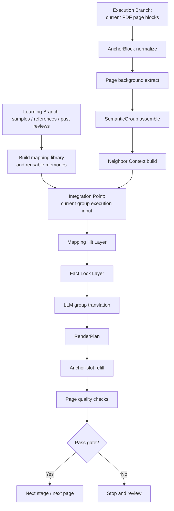
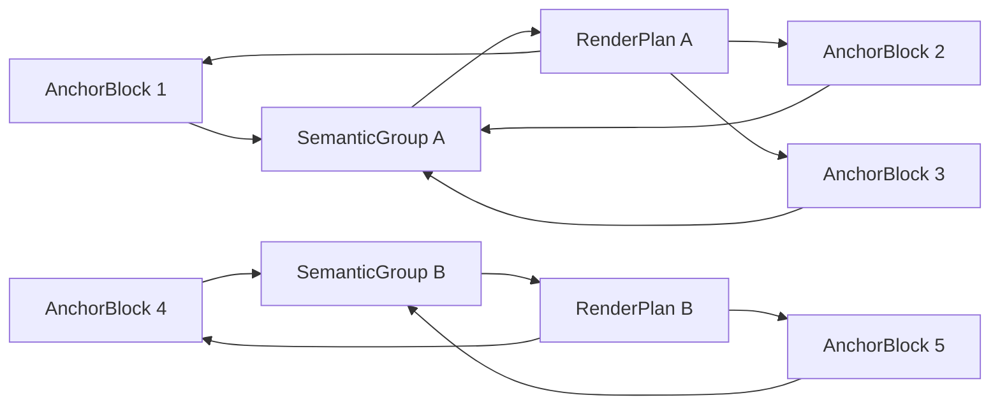
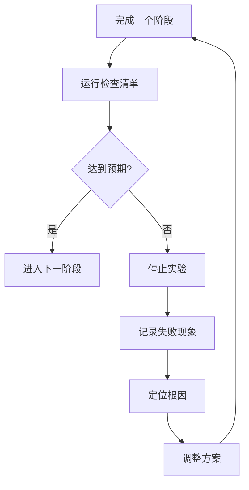

# Spike 12 设计稿：Anchor Block + Semantic Group + Render Plan

## 1. 目标

本轮技术穿刺不再继续围绕“单块翻译 + 局部补规则”微调，而是验证一条新的双分支主链路：

- 一条是 **learning branch**
  - 负责从样本、企业记忆、文档背景、术语资产中构建稳定可复用的上下文与 mapping 资产
- 一条是 **translation-execution branch**
  - 负责把当前 PDF 页面解析成锚点、分组、回填计划，并执行真正的组级翻译与渲染

在 translation-execution branch 内，核心执行思路仍然是：

- 保留原始 `block` 作为版面锚点
- 在锚点之上构建 `semantic group`
- 先按组翻译，再按组内原始锚点回填
- 组内允许重排，不允许改变组的阅读顺序
- 在保留 Spike 08/10/11 已验证正确能力的前提下，补齐 Spike 11 根因对应的工程层设计

同时，本轮设计需要向 `docs/DESIGN.md` 的主线靠拢，验证这条 PDF 实验链路是否可以沉淀为后续 `Document IR`、`Prompt Bundle`、checkpoint 与 artifact 体系的一部分，而不是一次性的脚本逻辑。

本轮只做实验设计与验收标准定义，不启动实现。

---

## 2. 核心判断

### 2.1 要回答的问题

1. 先按组翻译、再按锚点回填，是否能明显提升翻译准确性
2. 在提升翻译准确性的同时，是否能保持当前版面回填能力不明显退化
3. 当前最突出的问题，是否主要来自“翻译单元过碎”，而不是提示词不足
4. `AnchorBlock / SemanticGroup / RenderPlan` 能否作为 `docs/DESIGN.md:3065` 所述 `Document IR` 的 PDF 锚点级扩展
5. Spike 过程中产出的中间对象，能否自然映射到后续任务恢复、质量校验与产物存储模型
6. 是否应该把“资产生成/学习”与“翻译执行”显式拆成两条分支，而不是继续把它们混写在单条 prompt 流里
7. learning branch 产出的 mapping、背景、术语、事实约束，是否能以稳定接口接入 translation-execution branch

### 2.2 核心假设

- 假设 A：翻译单元由 `single block` 提升为 `semantic group` 后，断句、尾句残缺、金额误挂接、股息总额误写等问题会明显减少
- 假设 B：只要保留原始 `block anchor` 与 `slot`，就仍然可以维持坐标级回填能力
- 假设 C：真正要解耦的是：
  - `翻译单元`
  - `渲染单元`
- 假设 D：如果把组装、上下文、回填计划、中间评估都持久化下来，就能自然对齐总体设计里的 `translation_artifacts`、checkpoint 与质量复盘要求
- 假设 E：将 learning branch 与 translation-execution branch 分开后，可以减少 prompt 侧承担的工程职责，并让 mapping / glossary / background 资产更稳定复用

### 2.3 非目标

- 本轮不解决全量页的最终交付
- 本轮不切到 Word 主链路
- 本轮不引入本体
- 本轮不做多智能体编排
- 本轮不追求一次性解决所有金额、术语和风格问题
- 本轮不直接承诺成为产品一期主链路
- 本轮不处理、不回写、不翻译侧边栏导航类对象

---

## 3. 根因对齐与设计边界

### 3.1 Spike 11 根因与 Spike 12 对应关系

根据 `docs/问题反馈/问题3.md`，当前主要根因分为三类：

1. **工程化主问题**
   - 财务事实未锁定
   - narrative / table 分类错误
   - 页面回填成功不等于可交付
   - 特殊块没有专门渲染策略
2. **prompt 次问题**
   - prompt 承担了过多工程职责
   - 缺少邻接段上下文与稳定背景框架
3. **模型边界问题**
   - 只靠通用模型 + prompt，难稳定达到人工专业金融译文水平

Spike 12 的职责边界需要明确：

- **直接解决**：
  - 翻译单元过碎
  - 残句、尾句、金额挂接错误
  - 组级语义与块级回填的解耦
  - 中间对象不可追溯、不可复盘
- **部分缓解**：
  - prompt 负担过重
  - narrative 上下文不足
  - 术语与企业背景利用不足
- **不能单独解决**：
  - 数字/金额/股息口径错误
  - 所有财务事实保真问题
  - 所有 shrink 与特殊块渲染问题

结论：

> Spike 12 不是单靠“组更大”解决一切，而是要在保留已有正确能力的前提下，把“组翻译 + 锚点回填 + 持久化缓存 + 上下文补强”做成一条更稳的工程主链路，并为后续事实锁定层与渲染策略升级预留接口。

### 3.2 哪些已验证正确的能力必须保留

Spike 12 不能为了引入新设计，把前面已经证明有效的能力丢掉。必须明确保留：

- Spike 08：`semantic group` 与 slot 回填的基本能力
- Spike 10：企业背景、章节信息、术语注入优于纯通用翻译
- Spike 11：
  - 结构性 exact / line map 控制
  - 公司记忆与术语优先命中
  - prompt 与 API 日志落盘
  - 人工参考页自动评估

也就是说，Spike 12 的原则不是推倒重来，而是：

> **保留已验证正确能力，在其上替换翻译单元、补足缓存层、邻接上下文、背景抽取维度与 mapping 命中层。**

### 3.3 本轮对侧边栏的处理边界

本轮 MVP 明确对侧边栏做降级处理：

- 不处理
- 不回写
- 不翻译

这里的侧边栏，指页面边缘的竖排/窄栏导航对象，例如：

- `sidebar_nav`
- `running section rail`
- `page navigation rail`

本轮要求不是把它翻对，而是把它从正文主链路中隔离出去，避免影响：

- 正文分组
- 正文 prompt
- 正文评估
- 关键事实抽取

结论：

> Spike 12 当前主目标是打通“正文/表格正文区”的组翻译与锚点回填链路，不把侧边栏导航纳入本轮实现范围。

---

## 4. 与总体设计的关系

### 4.1 对齐点

Spike 12 应视为总体设计中“数字 PDF 高保真增强”的前置技术穿刺，主要对齐以下设计要求：

- `docs/DESIGN.md:3065`：`Document IR` 需要支持结构化节点与可追溯元数据
- `docs/DESIGN.md:3112`：运行时应保留 `node_id -> node` 映射，便于更新与检索
- `docs/DESIGN.md:3242`：需要设计并实现 `Document IR`
- `docs/DESIGN.md:3248`：翻译执行链路需要接入长任务运行时
- `docs/DESIGN.md:3249`：需要页级、批次级 checkpoint
- `docs/DESIGN.md:3250`：需要翻译质量校验器
- `docs/DESIGN.md:2837`：需要把中间产物作为 `translation_artifacts` 持久化，而不是仅输出最终文件

### 4.2 本轮贡献

若 Spike 12 成功，它对总体设计的价值不是“再多一个实验脚本”，而是帮助回答：

1. PDF 主链路是否需要锚点级 IR，而不是只保留页级平面块
2. 翻译编排器是否要把 `group translation` 作为基础单元
3. 回填器是否需要显式 `RenderPlan`，而不是隐式靠函数内部规则分配
4. checkpoint 是否应至少落到 page/group 两层，而不是只记录整页结果

### 4.3 失败也有价值

如果失败，也应明确归因到以下任一层：

- 仅靠规则分组不够，需要页级轻分析
- 仅靠按组翻译不够，需要结构化输出约束
- 仅靠 PDF 锚点回填不够，需要转向 DOCX / OOXML 结构层
- 当前样本的主要问题并不在翻译单元切分，而在抽取噪声或渲染策略

---

## 5. 已沉淀能力与可复用方案

本文件不仅是 Spike 12 设计稿，也作为“已验证能力沉淀记录”。

### 5.1 截至 Spike 11 已达成的能力

- [x] PDF 原生文本块提取
- [x] 基于页面块的原位抹字与回填
- [x] 行级 slot 提取与按 slot 回填
- [x] 基于版面规则的第一版跨块合并
- [x] 术语表、公司记忆、文档背景注入
- [x] 提示词与 API 日志落盘
- [x] 对人工参考页的自动评估

### 5.2 已验证可复用的方案

- 方案 A：保留原始块坐标与样式，不直接破坏页面几何
- 方案 B：翻译前注入企业背景与术语，优于纯通用翻译
- 方案 C：对标题、表格标签、术语做工程化控制，优于完全依赖提示词
- 方案 D：回填时保留 slot 概念，优于只按 block 级 textbox 写回

### 5.3 当前仍未解决的核心问题

- [ ] 数字密集尾句未稳定并组
- [ ] 组内残句与金额挂接错误
- [ ] 股息总额与末期股息串位
- [ ] PDF 可抽取文本仍会混入侧边栏噪声
- [ ] 版面与语义尚未完全解耦
- [ ] 中间结构未形成可恢复、可追溯的持久化对象

### 5.4 Spike 12 结束后要补充的沉淀内容

- 新增达成项
- 新增失败结论
- 新增可复用规则
- 新增中间对象定义
- 明确哪些方案进入主线，哪些只保留为穿刺结论

---

## 6. 新方案概要

### 6.1 核心对象

- `Page`
  - 页级上下文与阅读顺序容器
- `AnchorBlock`
  - 原始 PDF 文本块
  - 保留页码、bbox、字体、颜色、原文、阅读顺序
- `SemanticGroup`
  - 若干 `AnchorBlock` 组成的翻译单元
  - 负责语义完整性
- `RenderPlan`
  - 规定译文如何回填到该组对应的原始锚点集合

### 6.2 基本原则

- 原始块不丢
- 坐标不丢
- 阅读顺序不变
- 允许组内重排，不允许跨组乱排
- 先按组翻译，再按块回填
- 组装、翻译、回填、验收都要可落盘、可追溯

### 6.3 双分支架构：学习分支与翻译执行分支

Spike 12 必须明确拆成两条分支，而不是把“抽取学习”和“翻译执行”写成一条串行流水线。

#### A. 学习资产分支（离线 / 慢速 / 可积累）
目标不是直接翻当前文档，而是沉淀长期可复用资产：

- `company_memory`
- `glossary_seed`
- `phrase_map`
- `entity_map`
- `financial_metric_map`
- `style_policy`
- `section_archetypes`
- `page_archetypes`
- `mapping_candidates`

输入来源：
- `样本/` 中历史中英文样本
- 历史实验结果
- 人工参考译文
- 多年份年报

产出定位：
> 长期资产库，不直接等于当前文档译文。

#### B. 翻译执行分支（在线 / 当前任务导向 / 必须稳定）
目标是完成当前文档翻译：

- `AnchorBlock` 抽取
- `SemanticGroup` 组装
- 当前文档背景抽取
- 当前文档 facts 锁定
- 从学习资产库命中 mapping / memory / style
- group translation
- render plan
- refill
- quality checks

产出定位：
> 当前任务的翻译结果与回填结果。

#### C. 两个分支的汇合点

两条分支不是并列独立到底，而是在翻译执行前汇合：

- 学习分支产出资产库
- 翻译执行分支加载资产库并做命中
- 命中结果进入 `MappingHitRecord` 与 `GroupContextRecord`

结论：

> 学习分支负责“以后怎么更好翻”，翻译执行分支负责“这次怎么稳定翻对”。

### 6.4 新增设计层：缓存层、事实锁定层、mapping 命中层

为了真正对齐根因，Spike 12 在 `AnchorBlock / SemanticGroup / RenderPlan` 之外，还需要显式补三层：

#### A. TranslationCacheStore（工程主层）
先用文件，不强制上数据库；后续可平滑切换到 SQLite / 主系统表。

建议缓存以下对象：
- `AnchorBlockRecord`
- `SemanticGroupRecord`
- `GroupContextRecord`
- `DocumentBackgroundRecord`
- `MappingHitRecord`
- `RenderPlanRecord`
- `TranslationCandidateRecord`

建议目录结构：

```text
output/
  anchors/
  groups/
  context/
  mappings/
  render_plans/
  translations/
  eval/
```

作用：
- 支持复跑、复盘、diff
- 让 prompt/context/mapping 命中可以复用
- 为后续 checkpoint 与 artifact 存储对齐打基础

#### B. Fact Lock Layer（必须新增）
Spike 12 虽然以 group translation 为核心，但不能再把数字、金额、股息口径完全交给模型。

建议对以下内容做结构化抽取与锁定：
- 金额
- 百分比
- 年份/日期
- 股息口径（final dividend / total dividend）
- 财务指标值
- 单位与量级（million / billion）

作用：
- 直接对应 `问题3.md` 中“财务事实未工程化”的 P0 根因
- 这部分属于工程层，不属于 prompt 层

#### C. Mapping Hit Layer（预翻译命中层）
在真正调用模型之前，先用样本、公司记忆、glossary、patterns 对 group 做命中。

命中结果分三层：
- `exact_map`
- `term_map`
- `phrase_map` / `entity_map` / `financial_metric_map`

作用：
- 先命中稳定表达、企业固定用语、财务指标
- 命中结果进入 `MappingHitRecord`
- 后续再注入 prompt 或直接在工程层锁定

原则：
- mapping 库适合稳定短语、术语、对象名、指标名
- 不适合直接替代整段 narrative 生成

---

## 7. 关键流程

### 7.1 双分支与汇合流程

Spike 12 的完整流程应拆成两条分支，并在“当前任务翻译执行前”汇合。

#### 学习分支（Learning Branch）

```text
历史样本 / 人工参考译文 / 历史实验复盘
-> 术语归并
-> 对象名归并
-> 财务指标写法归并
-> 版式异常案例归并
-> mapping library / memory assets 版本化
```

学习分支负责回答：
- 哪些表达应该固定翻
- 哪些财务指标应优先缩写
- 哪些版式/块型属于高风险异常
- 哪些问题应交给工程层，而不是 prompt

#### 翻译执行分支（Translation Execution Branch）

```text
当前 PDF 页面块
-> AnchorBlock 标准化
-> SemanticGroup 组装
-> DocumentBackgroundRecord 抽取
-> Neighbor Context 构建
-> Mapping Library 命中
-> Fact Lock 抽取/锁定
-> Group Translation
-> RenderPlan
-> 回填
-> Quality Checks
```

翻译执行分支负责回答：
- 当前页怎么稳定翻对
- 当前组怎么稳定回填
- 当前失败发生在哪一层

#### 分支汇合点

```text
学习分支资产
+ 当前文档背景
+ 当前组邻接上下文
=> 当前组最终 context / mapping / fact-lock 输入
```

结论：

> 学习分支沉淀“长期可复用知识”，翻译执行分支处理“当前任务的稳定交付”。

### 7.2 更具体的抽取流：从页面块到可执行组

为了避免 Spike 12 继续停留在“有组、有 prompt、但抽取链路不透明”的状态，抽取流需要写得更具体。

#### Step 1：Page Block Harvest
从当前 PDF 页抽取原始页面块，至少保留：

- `page_no`
- `block_id`
- `bbox`
- `reading_order`
- `source_text`
- 原始字体/字号/颜色
- line segments / slots
- 页内区域标签
  - body
  - header
  - footer
  - sidebar
  - chart_label
  - table_like

说明：
- `sidebar` 类对象本轮只保留识别结果，用于隔离，不进入翻译与回填主链路

#### Step 2：AnchorBlock Normalize
把原始页面块规范化为 `AnchorBlockRecord`，补齐：

- `block_type`
- `role`
- `style`
- `slot_count`
- `char_count`
- `numeric_density`
- `is_narrative_candidate`
- `column_id`
- `region`
- `is_sidebar_excluded`
- `exclude_reason`

这一层的目标是：
- 先完成页面几何与文本块标准化
- 不在这一层做翻译判断
- 为后续分组与异常块剔除提供稳定输入
- 为侧边栏隔离提供稳定输入

#### Step 3：Page Background Extract
从当前页与文档背景中生成页级抽取结果：

- `page_section`
- `section_type`
- `page_topic`
- `page_entities`
- `page_risk_flags`
- `page_style_mode`

这里要明确：
- 文档级背景不应只保留一份模糊 JSON
- 页级抽取结果必须能说明“这页大概在讲什么、哪些对象最重要、哪些块高风险”

#### Step 4：SemanticGroup Assemble
在 `AnchorBlockRecord` 之上分组，至少显式判断：

- 同列连续
- 字号/样式相近
- 垂直间距连续
- 前块是否已语义闭合
- 后块是否尾句续接
- 是否被 sidebar / table / footer 规则拦截

本轮新增硬规则：

- `sidebar` 类对象直接排除，不参与 `SemanticGroup`

输出：
- `SemanticGroupRecord`
- `group_reason`
- `rejected_merge_candidates`

#### Step 5：Neighbor Context Build
在页内有序 group 序列上构建邻接上下文：

- `prev_group_text`
- `next_group_text`
- `prev_group_type`
- `next_group_type`
- `same_section_prev_next`

#### Step 6：Execution Inputs Finalize
把下面几类输入汇总成当前组执行输入：

- 学习分支资产命中结果
- 文档级背景
- 页级背景
- 邻接组上下文
- 当前组事实锁定结果

注意：

- `sidebar` 类对象不进入 `GroupContextRecord`
- `sidebar` 类对象不进入 `MappingHitRecord`
- `sidebar` 类对象不进入 `FactLockRecord`

最终形成：
- `GroupContextRecord`
- `MappingHitRecord`
- `FactLockRecord`

### 7.3 主流程补强

在现有 Anchor → Group → Translate → Render 主链路基础上，Spike 12 应补成下面这条流程：

1. 页面块提取
2. `AnchorBlock` 标准化
3. 页级背景抽取
4. `SemanticGroup` 组装
5. 生成 `DocumentBackgroundRecord`
6. 生成 `GroupContextRecord`
   - 包含当前组
   - 上一组只读上下文
   - 下一组只读上下文
7. 先跑 `Mapping Hit Layer`
8. 再跑 `Fact Lock Layer`
9. LLM 按组翻译
10. 生成 `RenderPlan`
11. 按组内 anchor / slot 回填
12. 做页级内容与版面双重验证

### 7.4 关于上一段 / 下一段上下文

用户提出“翻译时除了本次内容，还要体现上一个段落和下一个段落，但不参与翻译”，这一点应明确写入设计：

- `prev_group_text`：上一组截断文本或摘要
- `next_group_text`：下一组截断文本或摘要
- 只作为只读理解上下文
- 禁止模型把邻接组内容翻进当前组输出

该设计的作用不是替代工程分组，而是增强：
- 代词承接
- 句间因果
- CFO/CEO 叙述段过渡
- 尾句与下一句边界判断

### 7.5 关于“先组拼接，再回填原始块”

用户提出的方案方向是正确的，设计中应明确：

- 可以先把属于同一语义组的块拼接起来翻译
- 翻译后的组内内容顺序不能变
- PDF 上原始块允许组内重排
- 但组与组之间的阅读顺序不能变
- 回填目标不是“必须逐块逐字对应”，而是“保持页面阅读顺序、坐标稳定、视觉效果一致”

这意味着：

> 组是翻译语义单位，块是页面锚点单位，二者要解耦但不能脱钩。

### 7.6 关于侧边栏的 MVP 降级策略

侧边栏在本轮不作为翻译对象。

处理策略如下：

1. 识别并标记为 `sidebar excluded`
2. 不进入 `SemanticGroup`
3. 不进入组翻译 prompt
4. 不进入 `RenderPlan`
5. 不纳入正文质量指标

本轮只要求：

- 侧边栏不污染正文链路
- 侧边栏不影响事实锁定
- 侧边栏不干扰页级验收

不要求：

- 侧边栏内容被翻译
- 侧边栏内容被回写
- 侧边栏视觉与人工译文完全一致





---

## 8. 中间数据模型

建议本轮实验先落 `JSON`，不急着上数据库，但字段设计要尽量贴近总体设计后续可落库的方向。

### 8.1 AnchorBlock

```json
{
  "block_id": "p19_b20",
  "page_no": 19,
  "reading_order": 20,
  "bbox": [68.01, 429.21, 245.79, 441.16],
  "role": "body",
  "block_type": "body",
  "source_text": "19.97億美元後，自由盈餘為134.73億美元。",
  "style": {},
  "slots": [],
  "is_sidebar_excluded": false,
  "exclude_reason": null
}
```

### 8.2 SemanticGroup

```json
{
  "group_id": "p19_g05",
  "page_no": 19,
  "block_ids": ["p19_b18", "p19_b19", "p19_b20"],
  "source_text_joined": "...",
  "group_reason": {
    "same_column": true,
    "same_paragraph_flow": true,
    "tail_numeric_clause": true
  }
}
```

### 8.3 GroupContextRecord

```json
{
  "group_id": "p19_g05",
  "document_context": {},
  "page_context": {},
  "prev_group_text": "...",
  "next_group_text": "...",
  "matched_terms": [],
  "group_reason": {},
  "context_version": "spike12_v1"
}
```

### 8.4 RenderPlan

```json
{
  "group_id": "p19_g05",
  "target_block_ids": ["p19_b18", "p19_b19", "p19_b20"],
  "layout_mode": "group_slots",
  "allocation_strategy": "sequential_slots",
  "keep_reading_order": true
}
```

### 8.5 建议补充的运行态字段

为了后续对齐 checkpoint、artifact 和质量校验，建议实验中同步补充：

- `anchor_blocks.json`
  - `page_no`
  - `block_id`
  - `reading_order`
  - `style_hash` 或基础样式摘要
  - `slot_count`
  - `is_sidebar_excluded`
  - `exclude_reason`
- `semantic_groups.json`
  - `group_id`
  - `page_no`
  - `block_ids`
  - `neighbor_group_ids`
  - `group_reason`
- `render_plans.json`
  - `group_id`
  - `slot_count`
  - `allocation_strategy`
  - `selected_scale`
  - `fit_status`
- `group_context_records.json`
  - `group_id`
  - `prev_group_text`
  - `next_group_text`
  - `matched_terms`
  - `context_version`
- `translations.json`
  - `group_id`
  - `matched_terms`
  - `context_pack`
  - `translation_source`
  - `final_translation`
- `report.json`
  - 页级指标
  - 关键错误计数
  - 是否通过阶段门

这些对象后续都可以映射到总体设计中的 `translation_artifacts` 与 `translation_quality_checks`。

### 8.6 DocumentBackgroundRecord

为了回应“全文背景抽取哪些内容才真正有用”的问题，Spike 12 需要把全文背景抽取显式结构化，而不是只作为 loose prompt 文本。

建议最少抽取以下维度：

- `document_profile`
  - 公司名
  - 行业
  - 报告类型
  - 年份
  - 文风
  - 目标读者
- `section_map`
  - section 名称
  - section 类型
  - 页码范围
  - section 叙事目标
- `entity_map`
  - 公司/子公司/区域市场
  - 人名/职务
  - 产品/业务线
- `termbase`
  - 财务指标
  - 行业术语
  - 固定搭配
  - do-not-translate
- `style_policy`
  - 金额单位写法
  - 日期格式
  - 股息表述习惯
  - 缩写首次出现策略
- `risk_flags`
  - 高风险数字段
  - 高风险表格
  - 高风险标题/封面块

这部分可以复用 Spike 09 的“文档级一次理解 -> 组级标签 -> 上下文选择”框架，但必须补齐 schema。

### 8.7 MappingHitRecord

为了回应“从样本中学习，构建 mapping 库”的诉求，建议新增：

```json
{
  "group_id": "p19_g05",
  "hits": [
    {"source": "新業務價值", "target": "VONB", "source_layer": "financial_metric_map", "confidence": 0.98},
    {"source": "友邦保險", "target": "AIA", "source_layer": "company_memory", "confidence": 0.99}
  ],
  "misses": [],
  "mapping_version": "spike12_v1"
}
```

mapping 来源建议分层：
- `patterns`
- `glossary_seed`
- `company_memory`
- `sample_phrase_memory`
- `financial_metric_map`

注意边界：
- mapping 库适合稳定术语、对象名、固定表达
- 不适合直接替代整段 narrative 翻译

### 8.8 TranslationCandidateRecord

为了后续做质量比较和复盘，建议保留：

- 原始模型输出
- 规范化后输出
- compact 候选
- 命中 mapping 后的约束信息
- fact lock 校验结果

这样后续才能判断问题到底发生在：
- 模型生成
- 规范化
- compact
- 回填

### 8.9 两条分支的接口约定

为了避免后续实现时又回到“所有逻辑都塞进一次 prompt 组装”的旧路径，Spike 12 需要明确 learning branch 与 translation-execution branch 的接口。

#### learning branch -> translation-execution branch

最少提供以下输入：

- `mapping_library_version`
- `company_memory_version`
- `financial_metric_map_version`
- `style_policy_version`
- `document_background_schema_version`
- `prompt_bundle_subset_version`

以及对应内容：

- `exact_map`
- `term_map`
- `phrase_map`
- `entity_map`
- `financial_metric_map`
- `style_policy`
- `section_archetypes`
- `page_archetypes`

#### translation-execution branch -> learning branch

也应保留反向反馈材料，供后续学习分支吸收：

- 高频 miss 的 mapping 候选
- 重复出现的 compact 失败案例
- 高风险 group 样本
- 金额尺度错误案例
- 渲染失败 group 样本

结论：

> learning branch 不直接控制当前页怎么排版，但应持续提供更好的资产；translation-execution branch 不直接改写长期资产，但应产出高质量失败/命中样本回灌学习分支。

---

## 9. 实验范围

### 9.1 第一批样本页

仍然使用当前已建立人工对照基础的页：

- `10`
- `13`
- `19`
- `20`

### 9.2 重点观察页

- 第 `19` 页
  - 重点看 `p19_b18/p19_b19/p19_b20`
  - 重点看股息金额、自由盈余尾句、断句问题
- 第 `20` 页
  - 重点看表格标签、正文组、块内缩放

补充说明：

- 页面边缘竖排导航块，属于本轮明确排除对象

### 9.3 必须保留的对照基线

- `v07`
- `v10`
- `v11`

---

## 10. 分阶段实验设计

## 10.1 阶段 0：冻结基线

### 要做什么

- 固定当前对照页
- 固定当前对照结果
- 固定当前评估方法

### 产出

- baseline 清单
- 页面样本清单
- 关键问题清单
- 基线评估脚本与基线指标快照

### 达标标准

- 后续每一轮实验都能和同一批基线对比

### 不达标就停

- 若基线页、基线结果、评估方法仍在变动，本轮实验不开始

---

## 10.2 阶段 0.5：冻结学习资产与执行输入

### 要做什么

- 冻结 learning branch 对当前实验可见的输入资产
- 冻结 translation-execution branch 的关键执行配置
- 为每轮实验生成统一的 `asset_snapshot.json`

### 至少要冻结的对象

- `mapping_library_version`
- `company_memory_version`
- `financial_metric_map_version`
- `style_policy_version`
- `document_background_schema_version`
- `prompt_bundle_subset_version`
- `model`
- `max_output_tokens`
- `compact_threshold`
- `render_dpi`

### 产出

- `asset_snapshot.json`
- `execution_config_snapshot.json`

### 达标标准

- 同一轮 Spike 12 的所有结果都能追溯到同一份资产快照
- 后续效果变化可以明确归因到：
  - 结构/分组变化
  - 事实锁定变化
  - 回填变化
  而不是学习资产漂移

### 不达标就停

- 若资产版本、模型版本、关键执行参数没有冻结，则停止，不进入阶段 1

---

## 10.3 阶段 1：建立 Anchor IR

### 要做什么

- 把当前页面块提取结果标准化为 `AnchorBlock`
- 为每个 `AnchorBlock` 补齐：
  - 原始 bbox
  - 角色
  - block_type
  - style
  - slots
  - 原文
  - 阅读顺序
- 输出 `anchor_blocks.json`

### 目标效果

- 后续分组、翻译、回填都基于统一 IR
- 结构对象可以直接进入后续 artifact 体系

### 验收标准

- 页面内 `AnchorBlock` 数量与原始块一致
- 任意一个块都能追溯回原始 PDF 坐标
- 任意一个块都能追溯到原始 `source_text`
- `block_id -> anchor` 映射稳定可复用

### 不达标就停

- 若 IR 丢块、错序、无法追溯原始坐标，则停止，不进入阶段 2

---

## 10.4 阶段 2：组装 Semantic Group

### 要做什么

- 不再只依赖“普通正文相邻合并”
- 新增“尾句续接”判断
- 重点处理：
  - 数字密集但仍属于正文尾句
  - 被断开的金额短句
  - 同段落残句
- 输出 `semantic_groups.json`
- 建立固定反例回归集，验证哪些块绝不能误并

### 新增规则方向

- 规则 1：若前块不以完整语义结束，后块即使数字密集，也允许候选并组
- 规则 2：若后块很短，但开头明显承接前文，如“19.97億美元後…”，应允许并组
- 规则 3：若后块与前块同栏、同字号、垂直连续，则数字密集不应直接一票否决
- 规则 4：为每个组记录 `group_reason`，避免只能看到结果、看不到形成原因

### 反例回归集

至少固定以下“不可误并”对象：

- 表格行与表格标签
- 侧栏导航块
- 页眉页脚块
- 图表标签块
- 跨 section 的相邻正文块

### 目标效果

- `p19_b18 + p19_b19 + p19_b20` 应组成同一组

### 验收标准

- 第 19 页尾句组成功并入
- 新规则不明显误伤表格、侧栏、页眉页脚
- 每个组都能解释“为什么这样分组”
- 反例回归集不出现新增误并

### 不达标就停

- 若 `p19_b20` 仍无法并组，或反例回归集出现明显误并，则停止，不进入阶段 3

---

## 10.5 阶段 3：Fact Lock 与 Mapping Hit 验证

### 要做什么

- 在真正调用模型前，先完成：
  - `MappingHitRecord`
  - `FactLockRecord`
- 对当前 focus 页关键财务事实做结构化抽取与锁定
- 明确哪些约束属于工程层，不再交给 prompt 自行推断

### 重点锁定对象

- 金额
- 百分比
- 年份/日期
- 股息口径
  - `final dividend`
  - `total dividend`
- 财务指标值
- 单位与量级
  - `million`
  - `billion`

### 目标效果

- 在进入组翻译前，关键财务事实已有可校验约束
- 后续失败时能区分：
  - 事实抽取失败
  - 模型翻译失败
  - 回填失败

### 验收标准

- 第 19 页 focus 事实抽取正确：
  - `100.30 港仙 = final dividend`
  - `135.30 港仙 = total dividend`
  - `19.97 億美元 = US$1.997 billion / US$1,997 million`
- `MappingHitRecord` 与 `FactLockRecord` 均已落盘
- 事实锁定结果可直接追溯到源块与源句

### 不达标就停

- 若关键股息金额、量级、口径仍无法稳定抽取，则停止，不进入阶段 4

---

## 10.6 阶段 4：按组翻译

### 要做什么

- 模型输入改为 `group`
- 保留 `group -> block_ids` 映射
- 要求输出顺序不变
- 暂不让模型决定回填位置
- 在上下文中显式区分：
  - 当前组
  - 相邻组摘要
  - 文档级背景
  - 命中术语

### 目标效果

- 同一句话不再被拆成两个互相不完整的翻译结果
- 数字与修饰语挂接更稳定

### 验收标准

- 第 19 页关键句不再出现：
  - `regarding dividend payments`
  - `US$19.97 billion` 这类挂错尺度或残句
- 股息总额与末期股息不再互相串位
- 相比 `block translation`，关键问题数下降
- 侧边栏对象不进入组翻译输入

### 不达标就停

- 若关键句仍然残缺，说明问题不只是分组，而是需要进一步做组内结构约束；此时停止，不进入阶段 5

---

## 10.7 阶段 5：生成 Render Plan 并回填

### 要做什么

- 翻译按组完成后，不直接把整段暴力写回单块
- 而是：
  - 读取组内所有 anchor slots
  - 按阅读顺序分配译文
  - 在组内做重新排版
- 输出 `render_plans.json`

### 目标效果

- 提升翻译准确性，同时保持原始页面视觉结构
- 回填策略可复盘，而不是隐藏在内部函数里
- 不因侧边栏对象引入额外回填复杂度

### 验收标准

- 组内回填不跨组串位
- 关键页没有明显新炸版
- 版面指标不明显差于 `v11`
- 任意失败都能定位到具体 `group_id`
- 不生成任何侧边栏 `RenderPlan`

### 不达标就停

- 若翻译质量提升但版面显著恶化，则停止，优先复盘 `RenderPlan`，而不是继续扩页

---

## 10.8 阶段 6：页级质量验收

### 要做什么

- 与人工英文参考页对比
- 与现有 `v11` 对比
- 做文本与视觉双验收
- 输出 `report.json`

### 验收指标

- 内容指标
  - `token_f1`
  - `content_f1`
  - `sequence_ratio`
  - `number_recall`
- 结构指标
  - 关键句断裂数
  - 金额尺度错误数
  - 股息金额串位数
- 版面指标
  - `avg_font_ratio`
  - `compact_used`
  - 是否出现新 overflow

### 达标标准

- 相比 `v11`：
  - 内容指标整体不下降
  - 金额尺度错误减少
  - 断句问题减少
  - 版面指标无明显退化
- 且硬错误零容忍清单不得触发
- 侧边栏不进入正文链路，也不作为本轮翻译目标

### 不达标就停

- 若准确性未提升，或布局明显退化，则停止，不做页数扩展

---

## 11. 过程控制：达不到预期就停下来反思

本轮实验必须采用“阶段门”方式，而不是一口气跑完全链路。



### 执行要求

- 每完成一个阶段，都必须先验收
- 未通过不得进入下一阶段
- 若出现核心假设被证伪，不继续硬推
- 必须记录：
  - 失败页
  - 失败组
  - 失败句
  - 失败原因归类
- 每阶段都应保留中间 JSON 产物，方便后续接入 checkpoint 与 artifact store 思路

---

## 12. 检查清单

## 12.1 设计执行检查清单

- [ ] 已冻结基线页与基线版本
- [ ] 已冻结 learning branch 资产快照
- [ ] 已冻结 translation-execution branch 关键配置
- [ ] 已定义 AnchorBlock IR
- [ ] 已定义 SemanticGroup IR
- [ ] 已定义 GroupContextRecord IR
- [ ] 已定义 RenderPlan IR
- [ ] 已定义 FactLockRecord IR
- [ ] 已定义 MappingHitRecord IR
- [ ] 已定义 sidebar excluded 规则
- [ ] 已定义阶段门与停止条件
- [ ] 已定义关键页与关键问题
- [ ] 已定义文本与版面双验收指标
- [ ] 已定义中间产物清单
- [ ] 已定义硬错误零容忍清单

## 12.2 阶段验收检查清单

- [ ] 阶段 0.5：资产与执行配置已冻结
- [ ] 阶段 1：IR 可追溯到原始块
- [ ] 阶段 2：关键尾句成功并组，且反例集无明显误并
- [ ] 阶段 3：关键财务事实已锁定
- [ ] 阶段 4：关键句翻译不再残缺
- [ ] 阶段 5：组内回填无明显炸版
- [ ] 阶段 6：指标相对 `v11` 不下降，且硬错误未触发
- [ ] 侧边栏对象未进入主翻译/主回填链路

## 12.3 失败复盘检查清单

- [ ] 是否是分组错误
- [ ] 是否是金额/数字挂接错误
- [ ] 是否是 Fact Lock 抽取错误
- [ ] 是否是 Mapping Hit 缺失或命中错误
- [ ] 是否是术语约束不足
- [ ] 是否是 RenderPlan 分配错误
- [ ] 是否是侧边栏隔离失败
- [ ] 是否是当前 IR 粒度仍不足

## 12.4 金融硬错误零容忍清单

以下任一项触发，即视为本轮结果在对应阶段直接失败：

- [ ] 末期股息与全年股息串位
- [ ] 金额量级错误达到 10 倍级别
- [ ] 百分比、年份、日期与源文不一致
- [ ] 关键财务指标值与源文不一致
- [ ] focus 页出现未闭合残句导致关键事实悬空

---

## 13. 本轮通过标准

本轮 Spike 12 通过，不要求“全面可交付”，只要求证明下列判断至少部分成立：

1. `group translation` 比 `block translation` 更准确
2. `anchor-based render` 仍然可以保持当前版面能力
3. 第 19 页这类“尾句金额块”问题可以被系统性缓解，而不是靠单点手工修补
4. `AnchorBlock + SemanticGroup + RenderPlan` 适合作为 PDF 路线中间层继续沉淀
5. group 级 context record 值得进入主线 artifact / checkpoint 体系
6. 学习资产冻结后，实验结论仍然成立
7. Fact Lock 作为独立工程层是必要且有效的
8. 侧边栏对象被成功隔离，不再干扰正文实验结论

---

## 14. 本轮失败也算有价值的情况

即使本轮未通过，只要能明确下列任一结论，也算有效穿刺：

- 仅靠规则分组不足，必须引入页级/组级轻分析
- 仅靠按组翻译不足，必须加入组内结构约束输出
- 仅靠 PDF 锚点回填不足，后续必须引入 DOCX/OOXML 结构层
- 当前主问题不在 prompt，而在抽取噪声或布局约束

---

## 15. 建议的实验顺序

建议严格按以下顺序推进：

1. 先冻结基线与学习资产
2. 只做 IR，不做翻译
3. 只做分组，不做回填
4. 先验证 Fact Lock 与 Mapping Hit
5. 只做按组翻译，不做全页扩展
6. 只做关键页回填
7. 通过后再扩到 `10/13/19/20`

不建议：

- 一上来改完整链路
- 一上来跑 20 页
- 一边改分组一边改提示词一边改回填
- 同时引入多个新的不可控变量

---

## 16. 阶段状态记录位

用于在实验过程中持续记录“哪些已经达成，哪些没有达成”。

| 阶段 | 目标 | 当前状态 | 结论 | 后续动作 |
| --- | --- | --- | --- | --- |
| 阶段 0 | 冻结基线 | 待开始 | - | - |
| 阶段 0.5 | 冻结学习资产与执行输入 | 待开始 | - | - |
| 阶段 1 | 建立 Anchor IR | 待开始 | - | - |
| 阶段 2 | 尾句并组 | 待开始 | - | - |
| 阶段 3 | Fact Lock 与 Mapping Hit | 待开始 | - | - |
| 阶段 4 | 按组翻译 | 待开始 | - | - |
| 阶段 5 | 按组回填 | 待开始 | - | - |
| 阶段 6 | 页级验收 | 待开始 | - | - |

---

## 17. 审阅结论位

待确认以下四点后，再启动 Spike 12 实验：

- 是否接受 `AnchorBlock + SemanticGroup + RenderPlan + GroupContextRecord` 作为主实验思路
- 是否接受“阶段门验收，不达标就停”的执行方式
- 是否接受先用 `10/13/19/20` 作为第一批实验页
- 是否接受把中间 JSON 产物视为后续主线 `Document IR / artifact / checkpoint` 设计的前置验证材料

---

## 18. Spike 12 Run1 复盘补丁

本节不是补充实现方案，而是把 `focus_pages_10_13_19_20_run1` 已暴露出来的设计缺口显式写入文档，避免“阶段门通过，但结果并不符合预期”的问题再次发生。

### 18.1 已确认的设计偏差

1. **正文组翻译仍向模型暴露了原始 `blocks[]`**
   - 证据：
     - `output/focus_pages_10_13_19_20_run1/api_logs/p13_g08_translation.json`
     - `output/focus_pages_10_13_19_20_run1/prompt_exports/`
   - 现象：
     - prompt 同时携带了 `current_group.blocks` 与 `joined_source_text`
   - 结论：
     - 工程侧并没有真正吃掉跨块拼接职责
     - 模型仍能感知块边界，这不符合“先工程化构成段落，再做段落级翻译”的预期

2. **表格内容没有和正文内容彻底分通道**
   - 证据：
     - `output/focus_pages_10_13_19_20_run1/semantic_groups.json`
     - 页 20 的 `p20_g01 = p20_b16 + p20_b17`
   - 现象：
     - 表格行/表格说明仍可能进入正文分组逻辑
   - 结论：
     - Spike 12 只有“分组”，没有真正完成“lane routing”
     - 这会直接导致表格排版质量下降

3. **阶段门没有检查“翻译单元”和“回填单元”是否被真正解耦**
   - 现象：
     - 阶段 4 检查了关键句是否修复
     - 阶段 5 检查了是否炸版
     - 但没有检查：
       - 模型输入是否只剩 `group_text`
       - 是否生成了 `group -> fragment -> anchor` 映射
       - 是否允许且约束了组内 block 重构
   - 结论：
     - 验收项还停留在“结果像不像”，没有检查“机制是否符合设计”

4. **验收报告与总结报告缺少证据链和反思**
   - 证据：
     - `output/focus_pages_10_13_19_20_run1/acceptance_report.md`
     - `output/focus_pages_10_13_19_20_run1/summary_report.md`
   - 现象：
     - 只给出了阶段结论和平均指标
     - 没有明确列出：
       - 哪一页提升
       - 哪一页退化
       - 退化的根因
       - 对应证据文件
   - 结论：
     - 报告格式需要从“状态播报”改为“证据化验收 + 失败复盘”

### 18.2 Spike 12 Run1 不能再视为已满足的事项

以下事项在 Spike 12 Run1 中**不能**被视为已经达成：

- [ ] 正文翻译输入已工程化去块化
- [ ] 表格与正文已经彻底分通道
- [ ] group 翻译后已经形成稳定的 `fragment -> anchor` 回填映射
- [ ] 阶段门已经能发现“机制符合设计”与“结果符合预期”之间的偏差
- [ ] 验收/总结报告已经具备证据、反思和后续动作

### 18.3 进入下一轮前必须新增的检查项

下一轮设计至少必须补入以下检查点：

1. 正文 lane 的 prompt 中不得再出现 `blocks[].source_text`
2. 表格 lane 不得复用正文 lane 的合并与翻译逻辑
3. 每个正文组必须落盘：
   - `group_text`
   - `render_fragments`
   - `fragment_to_anchor_map`
4. 若触发组内 block 重构，必须落盘：
   - 原 group bbox
   - 重构后使用的 anchor/bbox
   - 是否越界
5. `acceptance_report.md` 必须包含：
   - 通过/失败结论
   - 具体失败页/组
   - 证据文件路径
   - 根因判断
   - 下一步动作
6. `summary_report.md` 必须包含：
   - 提升点
   - 退化点
   - 与预期不一致点
   - 本轮不应再沿用的假设
