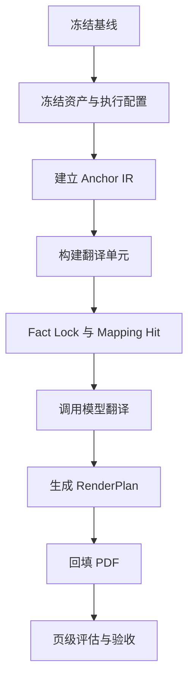
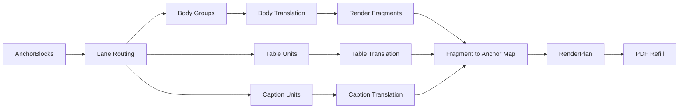

# Spike 13 设计稿：Lane Separated Translation + Anchor Reconstruction

## 1. 本轮目标

Spike 13 不再延续“所有可翻译块共用一条 group translation 链路”的方式，而是明确拆成多通道：

- `body lane`
- `table lane`
- `caption/label lane`
- `sidebar excluded lane`

本轮目标不是追求完美，而是打通一条更符合预期的 MVP 主链路，并直接跑前 `20` 页。

本轮必须同时满足两件事：

1. 正文翻译输入真正升级为“段落级 / 组级”，而不是继续把原始 `blocks[]` 暴露给模型
2. 翻译后的回填机制从“直接把组文本写回去”升级为“`group -> fragment -> anchor` 的显式渲染计划”

---

## 2. Spike 12 的输入缺口

Spike 12 已证明两件事：

- 跨块并组可以改善部分断句与事实挂接问题
- 侧边栏可以从主链路中隔离

但 Spike 12 也明确暴露出 4 个缺口：

1. 正文组翻译仍把 `blocks[]` 交给了模型
2. 表格仍会被误送入正文链路
3. `group` 和 `block` 的解耦没有在验收里被强检查
4. 报告缺少证据、失败页、反思和后续动作

Spike 13 的任务不是“再跑一轮”，而是把这 4 个缺口变成工程约束和检查点。

---

## 3. 继承自 Spike 12 的正确内容

Spike 13 不是推翻 Spike 12，而是在其正确基础上替换错误环节。以下内容必须显式继承，不能丢。

### 3.1 继承的主流程骨架

仍沿用 Spike 12 的总体流程：

Spike 13 只替换其中 3 个环节：

- `构建翻译单元`
  - 从单一路径分组，改成 `lane routing + lane-specific units`
- `调用模型翻译`
  - 从“正文也暴露 blocks[]”改成“正文只给 group_text”
- `生成 RenderPlan`
  - 从只看最终 block 输出，改成显式记录 `fragment -> anchor`

### 3.2 必须原样保留的正确机制

以下内容已经证明有效，Spike 13 必须保留：

1. 基线冻结
   - 固定输入 PDF、对照 PDF、评估脚本和问题反馈范围

2. 资产快照
   - 冻结 glossary、company memory、document background、执行配置

3. Anchor IR
   - 保留原始 `block_id / bbox / style / reading_order / source_text`

4. Group 级上下文
   - 保留 `page_sections / global_profile / mapping_hits / fact_locks / neighbor_context`

5. Fact Lock
   - 继续保留金额、股息、百分比、年份等高风险事实的工程锁定

6. Prompt / API 日志落盘
   - 继续保留 `prompt_exports/` 与 `api_logs/`

7. 阶段门执行
   - 继续执行“每一阶段先验收，不通过就停”

8. 侧边栏降级
   - 继续不翻译、不回填、不纳入正文主结论

### 3.3 继承但要增强的内容

以下内容不是被推翻，而是要增强：

- `SemanticGroup`
  - 继续保留，但只用于 `body lane`

- `RenderPlan`
  - 继续保留，但补充 `fragment -> anchor` 证据

- `summary_report.md / acceptance_report.md`
  - 继续保留，但从状态报告升级为证据化报告

结论：

> Spike 13 不是另起炉灶，而是保留 Spike 12 已经打通的主链路，把翻译单元、表格路由、回填证据和报告质量补齐。

---

## 4. 核心设计判断

### 4.1 翻译单元与渲染单元必须分离

- `SemanticGroup` 是翻译单元
- `AnchorBlock` 仍然是渲染锚点
- 二者之间必须新增：
  - `RenderFragment`
  - `FragmentAnchorMap`
  - `RenderPlan`

也就是说：

### 4.2 “group 更大”不是最终答案

正文做多 block 合并是必要的，但只应发生在 `body lane`。

以下对象不能复用正文策略：

- 表格表头
- 表格数据行
- 图表标签
- 图片说明
- 页眉页脚
- 侧边栏导航

### 4.3 允许组内重构 block，但必须受边界约束

当翻译后文本长度变化导致原始 block 容量不足时，允许在组内做有限的 block 重构，但必须满足：

- 不跨出该 group 的几何包围盒
- 不侵入其他 group
- 不侵入表格区、图片区、侧边栏区
- 不改变组的阅读顺序

---

## 5. 本轮范围与非目标

### 5.1 范围

- 输入：`样本/中文/AIA_2021_Annual_Report_zh.pdf`
- 对照：`样本/英文/AIA_2021_Annual_Report_en.pdf`
- 实验页：前 `20` 页
- 输出：
  - 翻译后的 PDF
  - 全量中间产物
  - 证据化验收报告
  - 反思总结报告

### 5.2 非目标

- 本轮不切 Word 主链路
- 本轮不处理侧边栏翻译
- 本轮不做图片 OCR 修复
- 本轮不承诺表格达到最终产品级 TableIR
- 本轮不做多智能体编排

表格本轮采用 `lane-separated MVP`：

- 先保证它不再污染正文链路
- 先保证表格区域的排版不比上一轮更差
- 先保住原有 cell/row 坐标与结构

---

## 6. Lane 设计

### 6.1 Lane 定义

1. `body`
   - 主体叙事正文
   - 允许多 block 合并为段落级 group

2. `table`
   - 表格表头
   - 表格数据行
   - 数字矩阵
   - 表格说明行

3. `caption_label`
   - 小标题
   - 图例
   - 短说明
   - 图表标签

4. `sidebar_excluded`
   - 侧边栏
   - 窄栏导航
   - 页边 rail

### 6.2 Lane 路由原则

- `body` 才允许做跨块并组
- `table` 不得进入 narrative merge
- `caption_label` 默认单块或微组，不进入长段落翻译
- `sidebar_excluded` 不翻译、不回填、不计入正文评估

### 6.3 表格路由的工程信号

表格路由不能只靠“数字密度”一个条件，至少同时看：

- 多行短行结构
- 横向宽度大但行高低
- 行内数字/百分比/括号密集
- 相邻块具有相同列宽、相同字号、稳定纵向间距
- 存在“表头 + 行项 + 数值列”结构

本轮至少要把页 `20` 的 `p20_b5` 到 `p20_b20` 稳定路由到 `table lane`。

---

## 7. IR 与中间产物

### 7.1 必须落盘的对象

- `anchor_blocks.json`
- `lane_records.json`
- `semantic_groups.json`
- `table_units.json`
- `caption_units.json`
- `mapping_hits.json`
- `fact_locks.json`
- `group_context_records.json`
- `render_fragments.json`
- `fragment_anchor_maps.json`
- `render_plans.json`
- `translations.json`
- `evaluation_report.json`
- `acceptance_report.md`
- `summary_report.md`

### 7.2 核心对象定义

#### `LaneRecord`

- `block_id`
- `page_no`
- `lane`
- `lane_reason`
- `source_signals`

#### `SemanticGroup`

- `group_id`
- `page_no`
- `lane = body`
- `block_ids`
- `group_text`
- `group_bbox`
- `group_reason`

#### `TableUnit`

- `unit_id`
- `page_no`
- `lane = table`
- `block_ids`
- `table_role`
  - `header`
  - `row`
  - `note`
- `source_text`
- `bbox`

#### `RenderFragment`

- `fragment_id`
- `group_id`
- `fragment_order`
- `text`
- `fragment_type`
  - `sentence`
  - `phrase`
  - `table_cell`
  - `label`

#### `FragmentAnchorMap`

- `fragment_id`
- `target_anchor_ids`
- `allocation_reason`
- `used_reconstruction`
- `within_group_bbox`

#### `RenderPlan`

- `unit_id`
- `lane`
- `source_anchor_ids`
- `render_fragments`
- `fragment_anchor_map`
- `layout_mode`
- `font_ratio`
- `overflow_count`
- `used_group_reconstruction`

---

## 8. 各通道执行逻辑

### 8.1 Body Lane

#### 输入给模型的内容

正文 lane 的 prompt 只允许出现：

- `group_text`
- `prev_group_summary`
- `next_group_summary`
- `page_sections`
- `global_profile`
- `mapping_hits`
- `fact_locks`

正文 lane 的 prompt 不允许再出现：

- `blocks[].source_text`
- `block_type` 列表
- 任何要求模型理解 PDF 切块边界的内容

#### 模型职责

- 只负责把 `group_text` 翻译成正式、稳定、可出版的年报英文
- 不负责决定回填到哪个 block
- 不负责为了版面主动删词、压缩、改写结构

#### 工程职责

- 多 block 合并
- 上下文组织
- 术语命中
- 事实锁定
- 翻译后 fragment 切分
- fragment 回填

### 8.2 Table Lane

#### MVP 目标

本轮不做复杂表格重建，但必须做到：

- 不再进入正文 narrative merge
- 不再按正文 prompt 翻译
- 不再按正文 reflow 回填

#### 输入给模型的内容

表格 lane 可以保留结构化输入，但必须是工程化结构，而不是散乱 block：

- `table_role`
- `ordered_units`
- `source_text`
- `mapping_hits`
- `fact_locks`

#### 回填策略

- 优先保持原 block / 原 cell bbox
- 优先单元格原位回填
- 不进行跨行重流
- 不与正文共享 fragment 切分策略

### 8.3 Caption / Label Lane

- 默认单块翻译
- 不并成长正文
- 保持短标签稳定表达

### 8.4 Sidebar Excluded Lane

- 不翻译
- 不回填
- 不计入正文/表格质量结论

---

## 9. 回填与组内重构

### 9.1 基本回填逻辑

正文 lane 的回填顺序：

1. 将译文切成 `RenderFragment`
2. 读取组内原始 anchor 列表
3. 依据阅读顺序逐个分配 fragment
4. 先尝试原位回填
5. 原位放不下时，才尝试组内重构

### 9.2 组内重构的允许动作

- 在同组 anchors 之间重新分配句段
- 微调字体比例
- 微调行距
- 在 group bbox 内生成额外的虚拟回填槽位

### 9.3 组内重构的禁止动作

- 跨组借位
- 侵入侧边栏
- 侵入表格或图片区
- 改变 group 的阅读顺序
- 因版面压力直接删改事实

### 9.4 本轮必须落盘的回填证据

每个正文组必须保存：

- 原 `group_bbox`
- 译文全文
- `render_fragments`
- `fragment_anchor_map`
- 是否使用组内重构
- 重构后是否仍在 `group_bbox` 内

---

## 10. Prompt 设计边界

### 10.1 System Prompt 只承担模型职责

system prompt 只保留模型必须知道的约束：

- 场景：上市保险公司年报
- 语言方向
- 正式出版文风
- 必须遵守 `mapping_hits`
- 必须遵守 `fact_locks`
- 不得跨组补写
- 不得承担版面回填职责

以下内容不应再塞给 system prompt：

- 逐项翻译是工程逻辑还是模型逻辑不清的描述
- 如何拼块
- 如何分配 block
- 如何缩放字体
- 如何回填版面

### 10.2 User Prompt 按 lane 提供最小必要结构

- `body lane`：只给 `group_text`
- `table lane`：给结构化 table unit
- `caption_label lane`：给短标签文本

---

## 11. 实验阶段与阶段门

## 11.1 阶段 0：冻结基线与范围

### 产出

- `baseline_snapshot.json`
- `pages_manifest.json`
- `known_issues.md`

### 必查项

- 前 20 页范围已固定
- 对照 PDF 已固定
- 评估脚本已固定
- 已列出当前重点问题页

### 不通过即停止

- 若页范围或对照基线还在变，不开始实验

## 11.2 阶段 1：Lane Routing

### 产出

- `lane_records.json`
- `lane_debug_samples.json`

### 必查项

- 页 20 表格区已进入 `table lane`
- 侧边栏已进入 `sidebar_excluded lane`
- 正文段落未误送入 `table lane`

### 证据要求

- 至少列出页 20 的关键 block：
  - `p20_b5` 到 `p20_b20`
- 每个关键 block 都要有：
  - `lane`
  - `lane_reason`
  - 几何/文本信号

### 不通过即停止

- 若页 20 表格区仍部分进入 `body lane`，停止

## 11.3 阶段 2：Body Group 构建

### 产出

- `semantic_groups.json`
- `body_group_debug.json`

### 必查项

- 正文组已形成段落级 `group_text`
- 不再把表格 block 混入正文组
- 组内 block 顺序与阅读顺序一致

### 关键机制检查

- 正文组必须有：
  - `group_text`
  - `group_bbox`
  - `block_ids`
  - `group_reason`

### 不通过即停止

- 若正文组仍依赖模型做跨块拼接，停止

## 11.4 阶段 3：Prompt 出口检查

### 产出

- `prompt_exports/`
- `api_logs/`
- `prompt_audit.json`

### 必查项

- 正文 prompt 不得出现 `blocks[].source_text`
- 正文 prompt 中必须存在 `group_text`
- 表格 prompt 必须是表格结构，不得复用正文模板

### 证据要求

- 随机抽检至少：
  - 2 个正文组
  - 2 个表格单元
  - 2 个短标签单元

### 不通过即停止

- 若正文 prompt 仍出现原始块文本数组，停止

## 11.5 阶段 4：翻译与回填

### 产出

- `translations.json`
- `render_fragments.json`
- `fragment_anchor_maps.json`
- `render_plans.json`

### 必查项

- 每个正文组都生成 `RenderFragment`
- 每个 fragment 都能追溯到 target anchor
- 无跨组回填
- 若触发组内重构，必须有边界检查记录

### 不通过即停止

- 若存在“翻得出来但填不回去”的组，停止

## 11.6 阶段 5：前 20 页整体验收

### 产出

- `translated_en.pdf`
- `evaluation_report.json`
- `acceptance_report.md`
- `summary_report.md`

### 必查项

- 正文准确性不低于上一轮
- 表格排版不低于上一轮
- 硬错误零容忍项不触发
- 报告中必须写出退化页和退化原因

### 不通过即停止

- 若报告仍只有平均指标、没有证据和反思，视为未完成

---

## 12. 硬错误零容忍

以下任一项触发，即本轮失败：

- 末期股息与全年股息串位
- 金额量级错 10 倍
- 百分比、年份、日期与源文不一致
- 表格数据被正文链路重排
- 正文回填跨组串位
- 组内重构越出 `group_bbox`

---

## 13. 报告要求

## 13.1 `acceptance_report.md` 必须包含

- 总体是否通过
- 每阶段是否通过
- 失败页/失败组清单
- 对应证据文件路径
- 硬错误清单
- 是否允许进入下一轮

## 13.2 `summary_report.md` 必须包含

- 本轮真正提升了什么
- 本轮真正退化了什么
- 哪些结论与设计预期不一致
- 哪些假设被证伪
- 下一轮只应继续保留哪些机制

## 13.3 报告禁止事项

- 只给“通过/不通过”结论
- 只给平均指标不写页级差异
- 没有证据文件路径
- 没有反思和下一步动作

---

## 14. 前 20 页验收重点

前 20 页的验收不做平均化掩盖，至少要单独看：

- 页 10：正文与标签混排页
- 页 13：跨块正文页
- 页 19：事实锁定敏感页
- 页 20：表格 + 正文混合页

本轮必须在报告里单列这 4 页的判断和证据。

---

## 15. 本轮通过标准

Spike 13 通过，不要求最终产品化，但至少要求：

1. 正文 prompt 已真正升级为段落级输入
2. 表格已不再进入正文 lane
3. 已生成 `group -> fragment -> anchor` 的显式回填映射
4. 回填支持受约束的组内 block 重构
5. 前 20 页报告已具备证据、退化说明和反思

若只做到“又跑出一个 PDF”，但以上 5 点有任一点缺失，则本轮不算通过。
