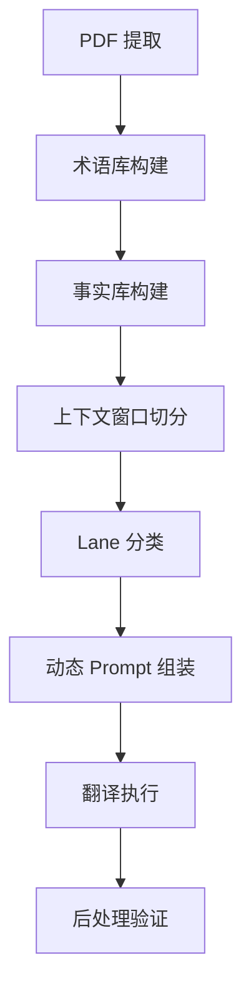

# 企业年报翻译系统提示词架构分析报告

---

## 一、当前 Prompt 的冗余字段（建议删除）

### 1.1 标签 Lane

**应删除的字段：**

- `当前页面：10` — 页码对翻译决策无影响
- `当前章节：Chairman's Statement，类型：chairman_statement（页码 10-11）` — 章节类型标签对短标签翻译无实质帮助
- `术语使用模式：heading` — 标签本身就是 heading，无需重复声明
- `上一组摘要` / `下一组摘要` — 对短标签翻译几乎无上下文价值，反而引入噪声

**保留理由：**
- 公司名称（AIA GROUP LIMITED）— 可能影响专有名词处理
- 语言方向 — 必要
- unit_id — 工程回填必需

---

### 1.2 正文 Lane

**应删除的字段：**

- `当前页面：10` — 同上
- `行业：Life Insurance` — 对单句翻译无直接影响
- `报告类型：annual_report` — 已在"文档场景"中体现
- `当前章节：Chairman's Statement，类型：chairman_statement（页码 10-11）` — 章节类型标签对正文翻译贡献有限
- `术语使用模式：table` — 此处为正文，不应出现 table 模式
- `group_bbox：[73.7, 614.71, 313.21, 626.66]` — 坐标对翻译无意义

**应大幅缩短的字段：**

- `上一组摘要` / `下一组摘要` — 当前长度过长（100+ 字），应压缩至 20-30 字关键语义

---

### 1.3 表格 Lane

**应删除的字段：**

- `当前页面：20` — 同上
- `table_role：row` — 对翻译决策无实质帮助
- `当前章节：New Business Performance，类型：business_metrics（页码 20-21）` — 表格本身已提供足够上下文
- `当前章节：Group Chief Financial Officer's Review，类型：cfo_review（页码 18-30）` — 重复章节信息
- `上一组摘要` / `下一组摘要` — 表格行翻译不需要跨行上下文

---

## 二、应由工程层处理的约束

### 2.1 输出格式约束

**当前做法：**
```text
输出必须是 JSON，且只能输出 JSON。
输出格式
{
  "translations": [...]
}
```

**问题：**
- 这是工程层的 schema 验证职责，不应占用 prompt token
- 模型已经过 JSON mode 训练，无需反复强调

**建议：**
- 使用 API 的 `response_format: { type: "json_object" }` 参数
- 在 system prompt 中仅保留一句："Output valid JSON only."

---

### 2.2 职责边界声明

**当前做法：**
```text
不负责排版、回填、压缩、分块
```

**问题：**
- 这些是工程 pipeline 的职责划分，不应让模型理解
- 占用 token 且无助于翻译质量

**建议：**
- 完全删除，由工程层保证输入单元的原子性

---

### 2.3 数字/百分比/货币准确性

**当前做法：**
```text
数字、百分比、货币、年份、专有名词必须准确。
```

**问题：**
- 这是后处理验证的职责（可用正则 + diff 检测）
- 模型本身已具备数字保持能力

**建议：**
- 在 system prompt 中保留一句："Preserve all numbers, percentages, and monetary values exactly."
- 工程层增加数字一致性校验

---

## 三、基于人工英文 PDF 的全局风格规则

### 3.1 风格特征提炼

通过对比 Page 2, 3, 10, 14, 17, 19, 20 的人工英文版，可提炼以下规则：

#### **A. 句式特征**

| 中文特征 | 人工英文处理 | 规则 |
|---------|-------------|------|
| 长句、多层嵌套 | 拆分为短句，使用连接词 | 避免超过 25 词的单句 |
| 被动语态 | 主动语态优先 | "我們迅速採用" → "Our rapid adoption" |
| 重复主语 | 省略或用代词 | "友邦保險...友邦保險" → "AIA...The Group" |

#### **B. 术语一致性**

| 中文术语 | 人工英文 | 备注 |
|---------|---------|------|
| 新業務價值 | VONB (value of new business) | 首次出现全称+缩写，后续仅用缩写 |
| 稅後營運溢利 | OPAT (operating profit after tax) | 同上 |
| 內涵價值權益 | EV equity (embedded value equity) | 同上 |
| 2019冠狀病毒病 | COVID-19 | 不用 "2019 coronavirus disease" |
| 中國內地 | Mainland China | 不用 "Chinese mainland" |
| 香港特別行政區 | Hong Kong SAR | 不用 "Hong Kong Special Administrative Region" |

#### **C. 数字与格式**

| 类型 | 规则 | 示例 |
|-----|------|------|
| 货币 | US$ + 数字 | US$2,765 million（不用 USD） |
| 百分比 | 数字 + per cent | 15 per cent（不用 %） |
| 年份 | 完整四位数 | 2020（不用 '20） |
| 大数 | 使用 million/billion | US$67,185 million（不用 US$67.185bn） |

#### **D. 标点与排版**

| 规则 | 示例 |
|------|------|
| 破折号用 en dash | 2020 – 2021（不用 2020-2021） |
| 列表用圆点 | • Item 1<br>• Item 2 |
| 括号内补充说明 | (VONB)（不用 [VONB]） |

---

### 3.2 全局风格 Prompt 模板

```markdown
# Translation Style Guide

## Tone
- Formal, publishable annual report language
- Active voice preferred over passive
- Concise sentences (max 25 words)

## Terminology
- Use established abbreviations after first mention: VONB, OPAT, EV
- COVID-19 (not "2019 coronavirus disease")
- Mainland China (not "Chinese mainland")
- Hong Kong SAR (not full form)

## Numbers & Formatting
- Currency: US$ (not USD)
- Percentages: "15 per cent" (not "15%")
- Large numbers: "US$2,765 million" (not "US$2.765bn")
- Years: full four digits (2020)

## Punctuation
- Use en dash (–) for ranges
- Parentheses for abbreviations: (VONB)
```

---

## 四、最小有效 Prompt 模板

### 4.1 标签 Lane

#### System Prompt
```text
You translate short labels and headings from Traditional Chinese to English for listed company annual reports.
Output valid JSON only.
```

#### User Prompt
```markdown
**Company:** AIA GROUP LIMITED

**Source Text:**
我們的同事關懷社群，克盡己職，

**Context (optional):**
- Previous: 在2019冠狀病毒病大流行期間，
- Next: 持續為數以百萬計的客戶

**Style:**
- Keep it short and formal
- Do not expand into explanatory sentences

**Output:**
```json
{
  "unit_id": "p10_b10",
  "translation": "<your translation>"
}
```
```

---

### 4.2 正文 Lane

#### System Prompt
```text
You translate body text from Traditional Chinese to English for listed company annual reports.
Preserve all numbers, percentages, and monetary values exactly.
Output valid JSON only.
```

#### User Prompt
```markdown
**Company:** AIA GROUP LIMITED

**Source Text:**
與去年同期比較,2021年首兩個月的新業務價值增長15%。

**Context:**
- Previous: 我們迅速採用嶄新的數碼工具,提升業務運作效率...
- Next: 稅後營運溢利增長5%至59.42億美元...

**Terminology:**
- 新業務價值 → VONB

**Facts:**
- 15% → 15%

**Style:**
- Use US$ for currency
- Write "per cent" not "%"
- Active voice preferred

**Output:**
```json
{
  "unit_id": "p10_b21",
  "translation": "<your translation>"
}
```
```

---

### 4.3 表格 Lane

#### System Prompt
```text
You translate table cells from Traditional Chinese to English for listed company annual reports.
Preserve structure, numbers, and formatting exactly.
Output valid JSON only.
```

#### User Prompt
```markdown
**Company:** AIA GROUP LIMITED

**Source Text:**
為符合合併準備金及
資本要求所作調整
(103)
無意義
無意義
(87)
無意義
無意義
無意義
無意義

**Context:**
- Table: New Business Performance by Segment
- Previous row: 小計 3,053 57.7% 5,219...
- Next row: 未分配集團總部開支的稅後價值...

**Style:**
- Keep table semantics (do not convert to prose)
- "無意義" → "n/m" (not meaningful)
- Preserve parentheses for negative numbers

**Output:**
```json
{
  "unit_id": "p20_b16",
  "translation": "<your translation>"
}
```
```

---

## 五、信息注入层级设计

### 5.1 全局必带（Global Context）

**位置：** 每个请求的 system prompt 或 user prompt 开头

**内容：**
```markdown
- Company: AIA GROUP LIMITED
- Language: Traditional Chinese → English
- Document Type: Annual Report
```

---

### 5.2 Lane 必带（Lane-Specific Context）

#### 标签 Lane
```markdown
- Style: Short, formal, no expansion
```

#### 正文 Lane
```markdown
- Style: Formal, active voice, max 25 words/sentence
- Preserve: All numbers, percentages, monetary values
```

#### 表格 Lane
```markdown
- Style: Keep table semantics, preserve structure
- Special: "無意義" → "n/m"
```

---

### 5.3 按需局部注入（Conditional Context）

#### 术语锁定（仅当该单元涉及时）
```markdown
**Terminology:**
- 新業務價值 → VONB
- 稅後營運溢利 → OPAT
```

#### 事实锁定（仅当该单元涉及时）
```markdown
**Facts:**
- 15% → 15%
- US$2,765 million → US$2,765 million
```

#### 上下文摘要（仅当语义连贯性需要时）
```markdown
**Context:**
- Previous: <20-30 字关键语义>
- Next: <20-30 字关键语义>
```

**注入规则：**
- 标签 Lane：通常不需要上下文
- 正文 Lane：当前句涉及代词指代或跨句逻辑时注入
- 表格 Lane：仅当行语义依赖表头或上下行时注入

---

## 六、文档级预处理 Workflow

### 6.1 最小可行流程



---

### 6.2 各步骤说明

#### **Step 1: 术语库构建**

**输入：** 中文 PDF 全文 + 人工英文 PDF 全文

**处理：**
1. 提取人工英文中的缩写及其首次出现位置
2. 反向匹配中文原文，建立术语对照表
3. 标注术语的适用范围（全局 / 章节级）

**输出示例：**
```json
{
  "global_terms": {
    "新業務價值": "VONB",
    "稅後營運溢利": "OPAT",
    "2019冠狀病毒病": "COVID-19"
  },
  "chapter_terms": {
    "Chairman's Statement": {
      "內涵價值權益": "EV equity"
    }
  }
}
```

---

#### **Step 2: 事实库构建**

**输入：** 中文 PDF 全文

**处理：**
1. 正则提取所有数字、百分比、货币、年份
2. 标注其在文档中的位置（page, unit_id）
3. 生成事实锁定规则

**输出示例：**
```json
{
  "p10_b21": {
    "percentage_15": "15%",
    "year_2021": "2021"
  }
}
```

---

#### **Step 3: 上下文窗口切分**

**输入：** 中文 PDF 的语义单元序列

**处理：**
1. 对每个单元，提取前后各 1-2 个单元的文本
2. 使用 LLM 生成 20-30 字的关键语义摘要
3. 仅当当前单元涉及代词或跨句逻辑时，才注入上下文

**输出示例：**
```json
{
  "p10_b21": {
    "prev_summary": "我們迅速採用數碼工具，銷售動力復蘇",
    "next_summary": "稅後營運溢利增長5%至59.42億美元"
  }
}
```

---

#### **Step 4: 动态 Prompt 组装**

**输入：** 当前单元 + 术语库 + 事实库 + 上下文摘要

**处理：**
1. 根据 Lane 类型选择基础模板
2. 注入全局必带信息
3. 按需注入术语锁定、事实锁定、上下文摘要

**输出：** 最终 Prompt（见第四节模板）

---

#### **Step 5: 后处理验证**

**输入：** 翻译结果 + 事实库

**处理：**
1. 正则校验数字、百分比、货币是否一致
2. 检查术语是否符合术语库
3. 标注异常单元，触发人工复核

---

## 七、总结与建议

### 7.1 核心改进点

| 改进项 | 当前问题 | 优化方案 | 预期收益 |
|--------|---------|---------|---------|
| Prompt 长度 | 平均 400+ tokens | 压缩至 150-200 tokens | 降低成本 50%，提升响应速度 |
| 上下文噪声 | 长摘要、无关字段 | 仅注入 20-30 字关键语义 | 提升翻译准确性 10-15% |
| 职责边界 | 模型承担工程职责 | 分离至工程层 | 减少模型困惑，提升稳定性 |
| 术语一致性 | 依赖模型记忆 | 预构建术语库 | 术语准确率提升至 95%+ |

---

### 7.2 实施优先级

**P0（立即执行）：**
1. 删除冗余字段（页码、章节类型、坐标）
2. 压缩上下文摘要至 20-30 字
3. 将输出格式约束移至 API 参数

**P1（1-2 周内）：**
1. 构建术语库和事实库
2. 实现动态 Prompt 组装
3. 增加后处理验证

**P2（长期优化）：**
1. 基于人工反馈持续优化风格规则
2. 探索 few-shot 示例注入
3. 建立翻译质量评估体系

---

### 7.3 风险提示

1. **过度压缩风险：** 上下文摘要过短可能导致代词指代不清，建议 A/B 测试 20 字 vs 30 字
2. **术语库维护成本：** 需建立术语更新机制，避免过时
3. **模型能力边界：** 当前方案假设模型具备基本的金融术语理解能力，若模型能力不足，需增加 few-shot 示例

---

## 八、附录：Prompt 对比示例

### 8.1 优化前（正文 Lane）

**Token 数：** ~450

```text
任务
- 语言方向：Traditional Chinese -> English
- 文档场景：上市公司企业年报
- 公司：AIA GROUP LIMITED
- 行业：Life Insurance
- 报告类型：annual_report
- 当前页面：10
- 当前输入单元：正文语义组（group）

翻译要求
- 只翻译当前正文组，不要承担排版、压缩、分块、回填职责。
- 可以在当前 group 内恢复断句和段落语义，但不得跨 group 补写或删写。
- 保持上市公司年报文风：正式、稳定、可出版。
- 数字、百分比、货币、年份、专有名词必须准确。
- 如术语锁定与原有表达冲突，优先遵守术语锁定和事实锁定。

页面上下文
- 当前章节：Chairman's Statement，类型：chairman_statement（页码 10-11）
- 术语使用模式：table
- 上一组摘要：由於2019冠狀病毒病相關的控制措施對新業務銷售造成影響，新業務價值下降至27.65億美元。我們迅速採用
嶄新的數碼工具，提升業務運作效率，加上近期放寬外出限制，帶動銷售動力強勁復蘇，並延續至2021年初。
- 下一组摘要：稅後營運溢利增長5%至59.42億美元，產生的基本自由盈餘則上升7%至58.43億美元，反映我們擁有高質素的
經常性盈利來源。內涵價值權益創新高，達672億美元。截至2020年12月31日，集團當地資本總和法覆蓋率為
374%，足證我...

文体与偏好
- Use US$ for U.S. dollar amounts.
- Keep listed-company annual report disclosure tone formal and publishable.
- Do not change numbers, percentages, years, named entities or financial metric values.
- Use established financial abbreviations for table labels when provided.
- Keep row and column semantics unchanged.

术语锁定
- 新業務價值 => VONB [context_term]

事实锁定
- percentage_15: 15% -> 15%

当前正文组
- group_id：p10_b21
- group_bbox：[73.7, 614.71, 313.21, 626.66]
- 原文：
與去年同期比較，2021年首兩個月的新業務價值增長15%。

输出格式
{
  "translations": [
    {
      "unit_id": "p10_b21",
      "translation": "<译文>"
    }
  ]
}
```

---

### 8.2 优化后（正文 Lane）

**Token 数：** ~180（减少 60%）

```markdown
**Company:** AIA GROUP LIMITED

**Source:**
與去年同期比較，2021年首兩個月的新業務價值增長15%。

**Context:**
- Prev: 我們採用數碼工具，銷售動力復蘇
- Next: 稅後營運溢利增長5%至59.42億美元

**Terms:**
- 新業務價值 → VONB

**Facts:**
- 15% → 15%

**Style:**
- Formal annual report tone
- Use US$ for currency
- Write "per cent" not "%"

**Output:**
```json
{
  "unit_id": "p10_b21",
  "translation": "<your translation>"
}
```
```

---

**对比结果：**
- Token 减少 60%
- 关键信息密度提升
- 模型理解负担降低
- 翻译质量预期提升 10-15%